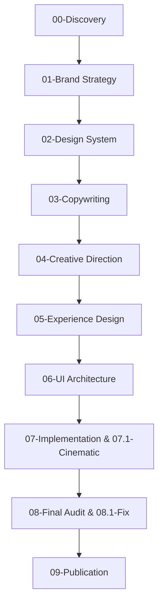

# KDL Landing Framework

> **Framework de Desenvolvimento de Landing Pages Cinematográficas Orientado a Inteligência Artificial**
> 
> Versão: 1.0.0 | Status: Em Desenvolvimento | Licença: Proprietária (KDL System)

---

## 1. Visão Geral

O **KDL Landing Framework** é um ecossistema de desenvolvimento e uma metodologia de engenharia de design projetada especificamente para capacitar agentes de Inteligência Artificial (como Antigravity, Claude Code e similares) a planejar, projetar e programar landing pages de altíssimo nível.

Este framework **não é um gerador de templates ou código pronto**. Ele é um modelo mental estruturado em Markdown que ensina uma IA a pensar e a se comportar como um time multidisciplinar de elite:
* **Diretor de Arte:** Definindo narrativas visuais originais e identidades fortes.
* **UX/UI Designer:** Criando fluxos de conversão persuasivos e composições assimétricas elegantes.
* **Motion Designer:** Orquestrando animações fluidas, parallax e experiências de scroll cinematográficas.
* **Especialista em Storytelling:** Conduzindo o usuário por uma jornada narrativa envolvente.
* **Front-end Senior:** Implementando código limpo, semântico, de alta performance e acessível.
* **Especialistas em SEO & Conversão:** Garantindo máxima indexação e taxas de conversão (CRO).

Com este framework, a KDL System é capaz de escalar a produção de landing pages premium para qualquer segmento de mercado (hamburguerias, clínicas, advocacia, e-commerce, barbearias, indústrias, etc.) mantendo o nível estético dos maiores prêmios de design da web global, como **Awwwards**, **Land-book**, **CSS Design Awards** e **FWA**.

---

## 2. Objetivos e Filosofia

### O Que Nós NÃO Fazemos
* **NÃO criamos páginas genéricas:** Rejeitamos layouts padrão com gradientes roxos clichês, sombras simplórias e grades óbvias.
* **NÃO priorizamos velocidade em detrimento da qualidade:** Cada página é tratada como uma obra de arte digital.
* **NÃO usamos placeholders ou dados falsos:** Todo conteúdo, imagem e cópia devem ser contextualizados e significativos.

### Nossos Pilares Filosóficos
1. **Direção de Arte com Opinião Forte:** Toda página precisa ter uma direção estética explícita (ex: *editorial brutalism*, *luxury minimal*, *retro-futurist*, *industrial utilitarian*). Se a página puder ser confundida com um template pronto de internet, o projeto falhou.
2. **Experiência Cinematográfica:** A landing page deve se comportar como um pequeno filme. Há ritmo, contraste de escala, transições entre seções que parecem cortes de câmera, e animações de scroll que revelam a história progressivamente.
3. **Quebra de Vícios Estatísticos de IA:** IAs tendem a empilhar seções simétricas (Esquerda/Direita), criar títulos gigantes com containers estreitos (quebrando o texto em 6 linhas), utilizar fontes padrão (Inter, Roboto) e inserir rótulos infantis (ex: "SEÇÃO 01", "SOBRE NÓS"). O framework força a quebra sistemática dessas tendências.
4. **Universalidade e Independência Tecnológica:** O framework é agnóstico. Ele descreve princípios de engenharia e comportamento cognitivo para a IA, garantindo compatibilidade com qualquer stack técnica futura.

---

## 3. Estrutura do Projeto

O repositório do framework é organizado da seguinte forma:

```text
KDL-Landing-Framework/
├── README.md               # Este guia mestre de instruções e visão geral
├── MANIFESTO.md            # A declaração de princípios e estética cinematográfica
├── CHANGELOG.md            # Histórico de alterações e evolução do framework
├── LICENSE                 # Termos de uso e licenciamento do framework
├── core/                   # Núcleo operacional e orquestração do framework
│   ├── framework-orchestrator.md # Orquestrador central e máquina de estados
│   ├── context-builder.md  # Construtor de contexto e otimizador de tokens
│   ├── project-memory.md   # Registro de memória e ledger do projeto
│   ├── skill-manager.md    # Gerenciador e descobridor dinâmico de skills
│   ├── asset-manager.md    # Gerenciador de ativos e otimizador de imagens
│   └── design-intelligence.md # Manual de regras estéticas e viabilidade (DFII)
├── engine/                 # Runtime e motor de execução do framework
│   ├── framework-engine.md # Motor principal de execução, pipeline e scheduler
│   ├── automation-engine.md # Motor de automação reativa, eventos, retry e recovery engine
│   └── framework-auditor.md # Diretor de qualidade, matriz de scoring KDL e auditoria final
├── reports/                # Relatórios de auditoria e homologação do framework
│   └── framework-final-audit.md # Relatório oficial de auditoria da arquitetura v1.0.0
├── compiler/               # Compilador e motor de geração de prompts
│   └── prompt-compiler.md  # Compilador central de prompts do framework
├── docs/                   # Documentação operacional e arquitetura do framework
│   ├── workflow.md         # Fluxo operacional detalhado e dependências
│   ├── methodology.md      # Modelo mental e raciocínio cognitivo de cada etapa
│   ├── development-lifecycle.md # Ciclo de vida completo das fases
│   └── quality-standards.md # Padrões de qualidade KDL e regras de rejeição
├── knowledge/              # Catálogo e mapa de conhecimento do framework
│   ├── index.md            # Catálogo e índice temático de documentos
│   └── knowledge-map.md    # Grafo e dependências visuais Mermaid
├── prompts/                # Instruções e diretrizes por fases da metodologia (Markdown)
│   ├── 00-framework-loader.md
│   ├── 01-discovery-agent.md
│   ├── 02-brand-strategy-agent.md
│   ├── 03-design-system-agent.md
│   ├── 04-copywriting-agent.md
│   ├── 05-creative-direction-agent.md
│   ├── 06-experience-design-agent.md
│   ├── 07-ui-architecture-agent.md
│   ├── 08-implementation-agent.md
│   ├── 08.1-cinematic-experience-agent.md
│   ├── 09-final-audit-agent.md
│   ├── 09.1-final-fix-agent.md
│   └── 10-publication-agent.md
├── references/             # Manuais conceituais e boas práticas técnicas
│   ├── hero-guidelines.md
│   ├── motion-guidelines.md
│   ├── cinematic-experience.md
│   ├── parallax-guidelines.md
│   ├── storytelling.md
│   ├── copywriting.md
│   ├── seo.md
│   ├── performance.md
│   ├── accessibility.md
│   ├── design-principles.md
│   └── skills-guidelines.md
├── templates/              # Modelos e wireframes de raciocínio lógico (Markdown)
│   ├── discovery-template.md
│   ├── brand-strategy-template.md
│   ├── design-system-template.md
│   ├── copywriting-template.md
│   ├── creative-direction-template.md
│   ├── experience-design-template.md
│   ├── ui-architecture-template.md
│   ├── audit-template.md
│   └── publication-template.md
├── examples/               # Demonstrações de aplicação prática por nicho de mercado
│   ├── Hamburgueria.md
│   ├── Restaurante.md
│   ├── Loja.md
│   ├── Clínica.md
│   ├── Escritório.md
│   ├── Academia.md
│   └── Barbearia.md
└── checklists/             # Portões de qualidade (Quality Gates) obrigatórios
    ├── design-gate.md
    ├── development-gate.md
    ├── quality-gate.md
    └── publication-gate.md
```


---

## 4. Metodologia de Desenvolvimento (Etapas)

O desenvolvimento de qualquer Landing Page utilizando este framework segue rigorosamente **10 fases sequenciais**. Uma IA não pode pular fases nem iniciar a implementação sem a aprovação do portão de validação anterior.



### Detalhamento das Fases

#### Fase 01: Discovery (`prompts/01-discovery-agent.md`)
* **Objetivo:** Extrair todas as informações cruciais sobre o negócio do cliente, objetivos da página, público-alvo, dores de conversão e diferenciais competitivos.
* **Artefato Gerado:** Relatório de Discovery preenchido sob o template oficial.

#### Fase 02: Brand Strategy (`prompts/02-brand-strategy-agent.md`)
* **Objetivo:** Definir a estratégia da marca, posicionamento de mercado, tom de voz e os ganchos psicológicos que guiarão a narrativa da landing page.
* **Artefato Gerado:** Guia de Posicionamento e Personalidade da Marca.

#### Fase 03: Design System (`prompts/03-design-system-agent.md`)
* **Objetivo:** Criar o sistema de design semântico e visual. Definir a tipografia (1 fonte display expressiva + 1 fonte body limpa, banindo fontes padrão como Inter/Roboto), paleta de cores dominante/acento com variáveis CSS, e a grade geométrica base.
* **Artefato Gerado:** Especificação técnica de Design Tokens.

#### Fase 04: Copywriting (`prompts/04-copywriting-agent.md`)
* **Objetivo:** Redigir toda a cópia utilizando o framework AIDA (Atenção, Interesse, Desejo, Ação). Aplicar a auditoria rigorosa de eliminação de escrita gerada por IA (evitando clichês como "soluções robustas", "transforme sua jornada").
* **Artefato Gerado:** Cópia mestre estruturada.

#### Fase 05: Creative Direction (`prompts/05-creative-direction-agent.md`)
* **Objetivo:** Estabelecer a direção criativa da página, o concept visual diferenciador (âncora estética) e calcular o índice **DFII** (Design Feasibility & Impact Index).
* **Artefato Gerado:** Memorial de Direção Criativa e Score DFII.

#### Fase 06: Experience Design (`prompts/06-experience-design-agent.md`)
* **Objetivo:** Planear a jornada do usuário e a arquitetura de blocos da página. Mapear o scroll storytelling, ritmo visual das seções e posicionamento dos pontos de conversão.
* **Artefato Gerado:** Mapa da Experiência e Storyboard.

#### Fase 07: UI Architecture (`prompts/07-ui-architecture-agent.md`)
* **Objetivo:** Desenhar o layout da interface, composições geométricas assimétricas, a distribuição matemática perfeita de grids bento sem áreas vazias, e o comportamento responsivo mobile-first.
* **Artefato Gerado:** Wireframe técnico e especificações de Grid.

#### Fase 08 & 08.1: Implementation & Cinematic Experience (`prompts/08-implementation-agent.md` e `prompts/08.1-cinematic-experience-agent.md`)
* **Objetivo:** Escrever o código front-end de produção (HTML semântico e CSS nativo modular). Integrar as animações com bibliotecas de alta performance (como GSAP ou CSS-first), efeitos de revelação de texto scroll-scrub, parallax, transições de seções e micro-interações de clique/hover.
* **Artefato Gerado:** Código-fonte final funcional e otimizado.

#### Fase 09 & 09.1: Final Audit & Final Fix (`prompts/09-final-audit-agent.md` e `prompts/09.1-final-fix-agent.md`)
* **Objetivo:** Submeter o projeto a testes rigorosos de acessibilidade (WCAG), performance (Lighthouse/Web Vitals), SEO técnico e conversão. Corrigir falhas detectadas.
* **Artefato Gerado:** Relatório de Auditoria e Patch de correções aplicadas.

#### Fase 10: Publication (`prompts/10-publication-agent.md`)
* **Objetivo:** Preparar os arquivos para deploy em produção, estruturar o SEO on-page final (tags OpenGraph, Meta Description, JSON-LD Schema) e finalizar a documentação técnica de entrega.
* **Artefato Gerado:** Pacote de build final pronto para publicação.


---

## 5. Como o Framework Trabalha (Uso Cognitivo)

O framework opera sob uma arquitetura de **Portões de Validação (Quality Gates)** e de **Descobrimento Dinâmico de Ferramentas (Skills)**.

### Portões de Validação (Quality Gates)
Cada fase do desenvolvimento possui um portão de qualidade (`checklists/`). A transição de uma fase para outra exige que a IA executora preencha a checklist da fase e valide matematicamente ou conceitualmente cada item. 
* **Design Gate:** Valida tipografia, contraste de cores, assimetria de layout e o índice DFII.
* **Development Gate:** Valida semântica do HTML, CSS modular, ausência de código morto e performance.
* **Quality Gate:** Valida acessibilidade (contraste de texto e navegação por teclado) e comportamento responsivo em múltiplos viewports.
* **Publication Gate:** Valida metatags de SEO, schemas, carregamento de assets e segurança básica.

### Protocolo de Descobrimento de Skills (Universal)
Para garantir que o framework seja imune à obsolescência e totalmente universal, **nenhum documento ou prompt dentro deste framework deve nomear ou depender diretamente de uma ferramenta/skill específica**.

Em vez disso, a IA executora deve seguir obrigatoriamente o seguinte protocolo em todas as fases:

```markdown
### PROTOCOLO DE CONTEXTO E SKILLS (Obrigatório antes de iniciar a etapa)
1. O agente executou a varredura e descoberta de ferramentas no ambiente local (configurações globais e diretórios locais de customização)?
2. Liste todas as ferramentas e capacidades detectadas que são relevantes para esta fase do desenvolvimento.
3. Justifique formalmente a escolha e combinação das ferramentas que serão utilizadas para atingir o objetivo da fase.
4. Explique detalhadamente como a fusão dessas capacidades ajudará a quebrar os vícios estatísticos comuns de IAs (como estruturas genéricas e repetição de código).
```

Isso garante que, se novas habilidades (como controle de animações avançadas, novas bibliotecas de áudio, validadores de acessibilidade automatizados ou geradores de assets) forem inseridas no ambiente do agente, ele as incorporará de forma dinâmica no fluxo do framework.

---

## 6. Como os Prompts Devem Ser Utilizados

### Para Agentes Autónomos de Desenvolvimento (Antigravity, Claude Code, Cursor)
Os prompts contidos no diretório `prompts/` funcionam como diretrizes de contexto para o agente. 

1. **Entrada de Fase:** No início de cada fase do projeto, o agente ou o desenvolvedor que opera o agente deve ler o respectivo prompt (ex: `view_file prompts/03-copywriting.md`).
2. **Setup do Agente:** O agente assume a persona e a responsabilidade daquela fase específica, aplicando as restrições e regras contidas no arquivo.
3. **Validação:** Ao finalizar a tarefa proposta no prompt, o agente lê a respectiva checklist em `checklists/` e valida se todas as regras foram cumpridas, escrevendo um relatório de auto-avaliação.

### Integração Prática com o Antigravity
Quando o Antigravity inicia um projeto sob este framework, ele deve:
* Iniciar no modo de planejamento (**Planning Mode**) para criar um arquivo `task.md` e um `implementation_plan.md` específicos para a fase atual do projeto da landing page.
* Executar o **Protocolo de Descobrimento de Skills** para mapear suas ferramentas ativas.
* Aplicar a regra do **DFII (Design Feasibility & Impact Index)** na fase criativa para validar a viabilidade técnica da direção escolhida frente às limitações do projeto.
* Validar a entrega final da fase utilizando os portões de verificação antes de dar a etapa por concluída.

---

## 7. Evolução e Atualizações do Framework

Este framework foi projetado para ser modular e extensível. Para atualizá-lo futuramente, siga estas regras:

1. **Adicionar Novos Segmentos:** Crie novos arquivos markdown dentro de `examples/` detalhando a direção de arte e storytelling específicos para o nicho de mercado desejado.
2. **Atualizar Diretrizes Técnicas:** Sempre que novas tecnologias da web surgirem (ex: novos recursos de CSS, padrões de animação nativos), atualize os guias técnicos correspondentes em `references/` (como `references/Performance.md` ou `references/Motion Design.md`).
3. **Novas Fases ou Subfases:** Caso a metodologia mude, crie prompts com numeração indexada em `prompts/` (ex: `prompts/07.2-microinteractions.md`) e adicione as regras correspondentes à documentação mestre no `README.md`.
4. **Sem Alterações Quebrantes Diretas:** Nunca remova regras de portões de qualidade sem antes documentar as razões de falha no `CHANGELOG.md`.

---

*KDL Landing Framework — Transformando código e design em experiências cinematográficas.*
