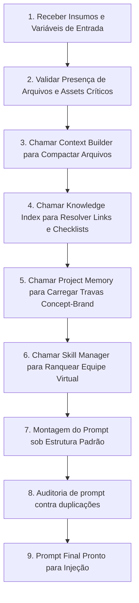
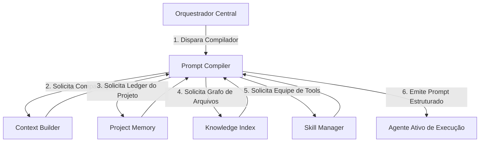

# Compilador de Prompts (Prompt Compiler)

> **KDL Landing Framework — Core Operacional**
> **Tipo:** Motor e Compilador de Prompts de Execução (Prompt Compiler Engine)
> **Mandato:** Ler variáveis de marcas, contexts compactados, inventários de skills ranqueadas e templates para gerar prompts estruturados e otimizados em Markdown para execução de agentes, eliminando a escrita manual de instruções.

---

## 1. Introdução

O **Prompt Compiler** é a fábrica de instruções e comandos do **KDL Landing Framework**. Sua missão é atuar como a ponte semântica entre as bases de dados persistentes do framework (Orquestrador, Contexto, Memória, Habilidades) e a mente cognitiva do agente ativo. Em vez de utilizar prompts manuais imprecisos, este compilador consome a Handoff Matrix e as travas de marcas da esteira para emitir prompts formais limpos e altamente focados, garantindo que o agente execute suas tarefas com absoluto alinhamento técnico e de design.

---

## 2. Conceitos Fundamentais

A engenharia de prompts dentro do ecossistema KDL rege-se pelos seguintes conceitos:

* **Prompt:** O conjunto unificado de diretrizes textuais passadas para orientar o comportamento da IA.
* **Prompt de Sistema (System Prompt):** Instruções de identidade e comportamento inalteráveis de longo prazo (ex: o manifesto e as regras morais de não-complacência).
* **Prompt Operacional:** As diretrizes específicas que definem as tarefas imediatas do agente em determinada fase do ciclo de vida.
* **Prompt Incremental:** Prompt gerado para atualizar ou corrigir seções atômicas de layouts ou textos sem reprocessar a página inteira.
* **Prompt Contextual:** Prompt estruturado que injeta unicamente as referências canônicas necessárias para validar a fase atual.
* **Prompt Especializado:** Instruções personalizadas direcionadas a um nicho técnico específico (ex: GSAP easing e física de scroll).
* **Prompt Composto:** Prompt construído pela combinação de contextos multidisciplinares (ex: combinando regras tipográficas de design com ganchos de copywriting).
* **Pipeline de Prompts:** O fluxo encadeado de geração e validação de prompts de ponta a ponta da esteira.
* **Prompt Canônico:** O modelo ideal e formalizado de prompt contendo todas as tags e delimitadores de qualidade KDL.

---

## 3. Descoberta Dinâmica de Skills (Orquestração de Prompts)

O compilador utiliza o protocolo de descoberta de habilidades locais do Skill Manager para justificar e utilizar dinamicamente as seguintes competências de engenharia:

* **Skills de Engenharia de Prompts e Raciocínio (`prompt-engineer`, `prompt-engineering-patterns`):**
  * *Justificativa:* Parametrizam e otimizam a arquitetura dos prompts, utilizando delimitadores semânticos de XML/Markdown para evitar perda de atenção cognitiva.
* **Skills de Gestão de Conhecimento e Links (`wiki-architect`, `wiki-builder`):**
  * *Justificativa:* Auxiliam a linkar as referências canônicas e checklists corretas do repositório no escopo do prompt compilado.
* **Skills de Compactação e Otimização de Tokens (`zipai-optimizer`, `zipai-optimizer`):**
  * *Justificativa:* Aplicam heurísticas de minificação e limpeza de espaços nos blocos de contexto injetados, reduzindo o custo financeiro e de latência das chamadas de API.

---

## 4. Arquitetura de Fluxo do Compilador

O Prompt Compiler compila as instruções de execução de agentes através de um pipeline estruturado de processamento:



---

## 5. Variáveis de Entrada e Validação Física

O compilador analisa a integridade de dados do repositório antes de autorizar o processamento de geração do prompt.

### Matriz de Validação de Insumos

1. **Nome do Cliente e Segmento:** Mandatórios em todas as fases para contextualização de negócios.
2. **Logotipo SVG do Cliente:** Verificação física obrigatória na Fase 01 (Discovery). Se o arquivo vetorial `.svg` estiver ausente, o build do prompt de Design System é cancelado pelo compilador.
3. **Mapeamento de Público-Alvo e Dores:** Se o relatório `discovery.md` não apresentar pelo menos 3 dores psicológicas claras do ICP, o compilador barra a geração do prompt do Copywriting Agent.
4. **Variáveis Cromáticas (Design Tokens):** Se a paleta 60-30-10 ou a família tipográfica não estiverem especificadas no `project-memory.md`, o compilador impede a geração do prompt de UI Architecture.

---

## 6. Estrutura Padrão de Prompt Compilado (Prompt Layout)

Todo prompt emitido pelo compilador segue rigorosamente a estrutura modular de Markdown abaixo:

```markdown
# [Mandato do Agente]

## 1. Objetivo Principal
[Declaração precisa e curta do que a IA ativa deve entregar nesta sessão]

## 2. Contexto Persistente do Projeto (Brand & Design Locks)
* **Cliente:** [Nome] | **Arquétipo:** [Voz]
* **Tokens Cromáticos:** [Paleta 60-30-10]
* **Escala Tipográfica Display/Body:** [CLAMP values]

## 3. Dados de Entrada Ativos (Context Compilado)
[Bloco de resumos compactados gerado pelo Context Builder correspondente à fase N-1]

## 4. Equipe Virtual de Skills Habilitadas
[Lista de ferramentas descobertas pelo Skill Manager com suas respectivas justificativas de uso]

## 5. Guias de Referências e Checklists Canônicos
* **Referência de Apoio:** [Link de referências/]
* **Checklist de Validação:** [Link de checklists/]

## 6. Critérios de Sucesso e Rejeição
[Mapeamento dos hard gates aplicáveis a esta fase]

## 7. Formato de Saída Esperado
[Especificação estrita do arquivo a ser gravado no repositório]
```

---

## 7. Modos de Compilação do Sistema

Para otimizar o processamento de acordo com a finalidade do loop operacional, o Prompt Compiler opera nos seguintes modos:

* **Modo Completo (Padrão de Pipeline):** Carrega o contexto clássico de handoff para execução normal de fase.
* **Modo Incremental (Ajuste Pontual):** Injeta apenas os tokens de uma seção Bento Grid específica para alteração atômica.
* **Modo Correção (Hotfix/Debug):** Utilizado após falhas em portões de auditoria. Injeta o bug report gerado e as linhas de código com erro para o desenvolvedor aplicar refatoração cirúrgica.
* **Modo Auditoria (QA Focus):** Injeta o código-fonte inteiro, as metas do Lighthouse/WCAG e a folha `quality-gate.md` para testes automatizados.
* **Modo Especialista (Motion/Copy):** Limita o contexto a timelines, atritos de Lenis e stagger, isolando a IA de ruídos de infraestrutura.

---

## 8. Integração de Sistemas do Core KDL

O Prompt Compiler atua de forma orquestrada com as outras engines core para consolidar o estado operacional do framework:



---

## 9. Boas Práticas de Compilação de Prompts

* **Delimitação de Dados (XML Tags):** Envolva os dados brutos de entrada em tags semânticas (ex: `<briefing_cliente>...</briefing_cliente>`) no corpo do prompt para garantir que a IA distinga instruções operacionais de conteúdos textuais.
* **Redução de Ruído:** Evite injetar checklists de publicação na fase de branding; o prompt deve conter apenas as diretrizes do portão correspondente à fase atual.

---

## 10. Anti-Patterns de Prompting

* ❌ **Prompts Genéricos (Complacência):** Gerar instruções abstratas do tipo "Escreva um CSS bonito para esta página". O prompt compilado deve apontar para os spans exatos da grade Bento especificados em `ui-architecture.md`.
* ❌ **Instruções Ad-hoc Desconectadas:** Permitir a geração de prompts que ignoram o tom verbal do arquétipo de marca travado no diário de bordo.

---

## 11. Exemplo de Prompt Compilado (Fase: UI Architecture)

Abaixo está exemplificada a saída física gerada pelo compilador para alimentar o **UI Architecture Agent**:

```markdown
# Agente de Engenharia de Layout (UI Architecture Agent)

## 1. Objetivo Principal
Criar a especificação geométrica detalhada da Bento Grid responsiva mobile-first para o cliente Premium Burger House, gravando o resultado em `docs/07-ui-architecture.md`.

## 2. Contexto Persistente do Projeto (Brand & Design Locks)
* **Arquétipo:** O Criador | **Tom:** Sócio, gastronômico.
* **Geometria de Logo:** Curvada, cantos arredondados R16.
* **Display Font Size H1:** clamp(2.5rem, 5vw, 4.5rem).

## 3. Dados de Entrada Ativos (Context Compilado)
<storyboard_scroll_experiencia>
- Hero: Dolly zoom na imagem do burger grelhando.
- Seção Blends: Scroll horizontal revelando 3 cards de blend Angus.
- Seção Diferenciais: Bento Grid contendo 4 caixas estáticas.
</storyboard_scroll_experiencia>

## 4. Equipe Virtual de Skills Habilitadas
* `local-bento-architect-tool` -> *Justificativa:* Ranqueda pelo Skill Manager para assegurar fechamento matemático de spans de grid.

## 5. Guias de Referências e Checklists Canônicos
* **Referência:** [parallax-guidelines.md](file:///c:/Framework/references/parallax-guidelines.md)
* **Checklist:** [design-gate.md](file:///c:/Framework/checklists/design-gate.md)

## 6. Critérios de Sucesso e Rejeição
* **Hard Gate:** O wireframe não pode conter células vazias e deve herdar cantos R16 da identidade visual da logo do cliente.

## 7. Formato de Saída Esperado
Gravar a distribuição de colunas (12 desktop, 4 mobile) no template estruturado de `ui-architecture.md`.
```

---

## 12. Conclusão

O **Prompt Compiler** é o garantidor de foco e alinhamento do KDL Landing Framework. Ao centralizar as injeções contextuais, travas de marca, dependências de ferramentas locais do Skill Manager e as checklists de portões em uma fábrica automatizada de instruções de Markdown estruturadas, ele elimina desvios estéticos, latências operacionais e custos de token excessivos, pavimentando o caminho para a geração de landing pages de alta precisão.

---

*KDL Landing Framework — Engenharia de prompts de alta fidelidade.*
