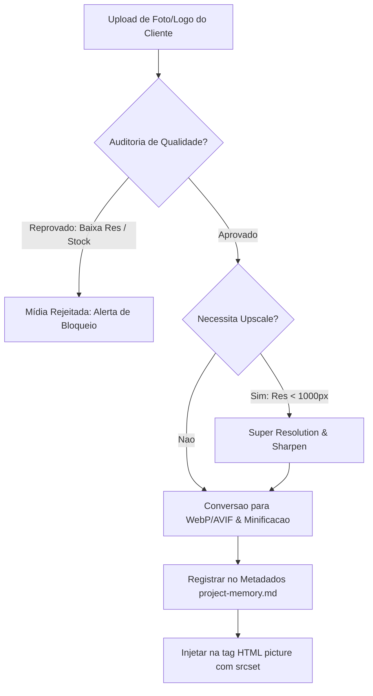
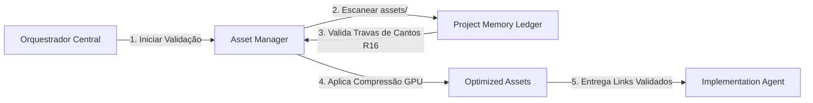

# Gerenciador de Ativos do Projeto (Asset Manager)

> **KDL Landing Framework — Core Operacional**
> **Tipo:** Sistema de Processamento e Auditoria de Ativos (Asset Manager Engine)
> **Mandato:** Mapear, validar, otimizar, versionar e auditar a qualidade técnica de todos os ativos digitais (imagens, logos, ícones, vídeos, fontes e favicons), impedindo o consumo de arquivos brutos ou em desconformidade estética e de performance.

---

## 1. Introdução

O **Asset Manager** é o guardião técnico de mídias do **KDL Landing Framework**. Sua responsabilidade é impor o protagonismo visual dos ativos reais do cliente e garantir orçamentos rigorosos de peso de arquivos. Nenhum agente de desenvolvimento está autorizado a consumir imagens diretamente do disco ou de URLs externas; toda mídia utilizada na landing page deve passar pelo pipeline de validação, tratamento por inteligência artificial (upscaling, redução de ruído, correções geométricas) e compressão semântica (conversão para WebP/AVIF) regido por este documento.

---

## 2. Conceitos Fundamentais

O gerenciamento de mídias no ecossistema KDL baseia-se nos seguintes conceitos:

* **Asset (Ativo):** Qualquer arquivo estático de mídia ou design importado para o repositório.
* **Asset Visual:** Imagens, ilustrações, texturas, ícones e esquemas cromáticos da página.
* **Asset Digital:** Documentos, fontes tipográficas (`.woff2`) ou manifestos de configuração Web.
* **Asset Oficial:** Ativos reais enviados diretamente pelo cliente ou capturados em sessões de foto reais.
* **Asset Temporário:** Imagens preliminares de layout ou mocks que são removidos antes da publicação.
* **Asset Derivado:** Arquivos gerados a partir do tratamento de um ativo oficial (ex: um WebP cortado e otimizado a partir de uma foto JPEG bruta).
* **Asset Rejeitado:** Mídias que falharam nos critérios de resolução, nitidez ou originalidade nos portões de qualidade.
* **Asset Validado:** Arquivos assinados digitalmente pelo pipeline de auditoria técnica.
* **Asset Versionado:** Ativos catalogados sob versão incremental para evitar quebra de links em cache de CDN.

---

## 3. Descoberta Dinâmica de Skills (Orquestração de Mídias)

O Asset Manager consulta dinamicamente as seguintes ferramentas locais para processar e comprimir os ativos do projeto:

* **Skills de Processamento e Compressão Cromática (`zipai-optimizer`, `optimization`):**
  * *Justificativa:* Aplicam otimização inteligente aos formatos de imagem, minificando o peso em bytes mantendo fidelidade visual de contraste.
* **Skills de Direção Visual e Design de Interface (`architect-review`, `design-principles`):**
  * *Justificativa:* Validam a adequação geométrica e a coerência de cantos arredondados baseados no logotipo SVG.
* **Skills de Garantia de Qualidade e Auditoria (`vibe-code-auditor`, `code-reviewer`):**
  * *Justificativa:* Executam varredura contra imagens duplicadas, pixeladas ou de banco de imagens genéricas óbvias.

---

## 4. Classificação de Categorias de Assets

Os arquivos de mídia do projeto são divididos e catalogados nas seguintes pastas oficiais:

```text
assets/
├── logo/        # Logotipo do cliente em SVG (versões clara, escura e monocromática)
├── images/      # Fotografias gerais, equipe, instalações do cliente (originais)
├── products/    # Imagens focadas no produto ou serviço comercializado
├── gallery/     # Galeria de fotos de suporte contextualizado
├── backgrounds/ # Gradientes, vinhetas, glows e glows radiais
├── videos/      # Trechos MP4 curtos otimizados para reprodução contínua (Hero bg)
├── icons/       # Conjunto de ícones vetoriais (.svg)
├── social/      # Imagens do Open Graph, Twitter Cards e Manifests
├── favicons/    # Ícones de navegador multiresolução (.ico, .png, manifest)
├── animations/  # Arquivos JSON Lottie de micro-interações
└── fonts/       # Famílias tipográficas convertidas em .woff2
```

---

## 5. Protocolo de Auditoria e Qualidade Visual

Toda imagem oficial inserida no diretório `assets/` é submetida a uma verificação de 12 pontos antes de ser convertida e otimizada:

1. **Resolução Mínima:** Imagens de tela cheia (Hero) devem possuir no mínimo 1920px de largura; cards de Bento Grid devem possuir no mínimo 800px.
2. **Nitidez (Sharpen):** Detecção de desfoque por sensor de câmera. Imagens borradas são rejeitadas.
3. **Ruído e Artefatos:** Fotos tiradas com ISO alto em ambientes escuros devem passar por algoritmo de redução de ruído.
4. **Recorte Geométrico:** Mídias não podem apresentar cortes secos que mutilem o produto ou a logo do cliente.
5. **Enquadramento e Foco:** O produto ou elemento principal de storytelling deve ocupar o quadrante central de visualização (F-Shape e Z-Shape).
6. **Fidelidade Cromática:** As cores da fotografia devem harmonizar com a paleta 60-30-10 definida no Design System, sem dessaturação acentuada ou estouro de saturação.
7. **Legibilidade:** Áreas de imagem que receberão sobreposição de texto em CSS devem apresentar contraste legível mínimo de 4.5:1 ou aplicação de vinheta/máscara escura nativa.

---

## 6. Protocolo Inteligente de Upscaling (AI Enhancement)

Quando o cliente enviar fotos reais em baixa resolução, o Asset Manager aplica o **Protocolo de Melhoria Inteligente** antes de liberar a mídia:

* **Super Resolution (2x ou 4x):** Multiplicação de pixels com interpolação baseada em textura para imagens de produto abaixo de 600px.
* **Sharpen & Noise Reduction:** Filtros focados para delinear bordas geométricas de objetos industriais ou embalagens.
* **Face Recovery:** Algoritmo ativado unicamente para fotos da equipe ou depoimentos de clientes para evitar deformações de feições.
* **Perspective & Lens Correction:** Correção automática de distorção de lentes ultra-wide comuns em fotos de celulares de interiores de lojas.

---

## 7. Protagonismo da Marca (Visual Sovereignty Rules)

O logotipo é a autoridade máxima de estilo e geometria. O Asset Manager impõe as seguintes regras físicas:

* **Formatos Obrigatórios:** O logotipo deve estar em formato vetorial nativo `.svg`. Logos rasterizadas (JPEG/PNG) são estritamente proibidas para exibição primária de cabeçalho.
* **Integração Geométrica:** O cabeçalho do logotipo deve ser o ponto de partida de proporções da grade (gutters e cantos). Se o logotipo possui cantos arredondados de 16px (R16), todos os cards do Bento Grid devem adotar exatamente border-radius de 16px.
* **Versatilidade de Visualização:** O diretório `assets/logo/` deve conter:
  * `logo-light.svg` (Exibição sobre fundo escuro).
  * `logo-dark.svg` (Exibição sobre fundo claro).
  * `logo-mono.svg` (Versão monocromática para rolagem de scroll invertida e rodapé).

---

## 8. Schema de Metadados de Assets (Versionamento Semântico)

Toda mídia integrada deve ser registrada no JSON do `project-memory.md` obedecendo à seguinte estrutura de metadados:

```json
{
  "assetId": "img-burger-hero",
  "fileName": "burger-premium-hero.webp",
  "sourcePath": "assets/images/foto-crua-hamburguer.jpg",
  "category": "products",
  "version": "1.0.0",
  "author": "Pedro Silva (Fotógrafo Cliente)",
  "license": "Uso exclusivo comercial Premium Burger House",
  "dimensions": {
    "width": 1920,
    "height": 1080
  },
  "fileSize": {
    "originalBytes": 3200000,
    "optimizedBytes": 112000
  },
  "status": "VALIDATED",
  "altText": "Hambúrguer artesanal Angus grelhado com fumaça e brasa ao fundo",
  "seoTitle": "Hamburguer Artesanal Grelhado Premium"
}
```

---

## 9. Portões Automáticos de Rejeição de Mídias (Audit Gates)

O compilador e o orquestrador bloqueiam o build do projeto se o Asset Manager registrar qualquer uma das ocorrências abaixo:

* ❌ **Imagens com Estética Clichê de IA:** Fotos de banco de imagens genéricas com visual plastificado e proporções humanas incorretas (ex: pessoas com 6 dedos).
* ❌ **Duplicação de Arquivos:** Imagens idênticas gravadas com nomes diferentes na mesma pasta.
* ❌ **Falta de Responsividade:** Imagens sem declaração de largura (`width`) e altura (`height`) nativas nas tags HTML (o que provoca deslocamento de layout - CLS > 0.0).

---

## 10. Otimização SEO e Web Performance de Mídias

Para manter LCP ≤ 2.0s e CLS = 0.0, as mídias da landing page são empacotadas seguindo as regras abaixo:

* **Formatos Modernos:** 100% das imagens fotográficas são convertidas para WebP (qualidade 80%) ou AVIF.
* **Markup Responsivo (Srcset & Sizes):** Imagens do Hero e de produtos devem ser implementadas usando a tag `<picture>` e atributos `srcset` para servir dimensões redimensionadas para telas mobile (320px a 768px).
* **Preload & Fetch Priority:** A imagem do Hero (LCP) deve receber atributo `fetchpriority="high"` e ser declarada em tag `<link rel="preload">` no cabeçalho do HTML. Mídias abaixo da dobra recebem obrigatoriamente `loading="lazy"`.

---

## 11. Especificações de Open Graph e Social Share

O Asset Manager compila e valida o arquivo de imagem de visualização social (`social-card.png`) sob as seguintes exigências de mercado:

* **Dimensões Exatas:** Proporção de 1200x630 pixels.
* **Peso Limite:** Peso máximo de 250KB para garantir carregamento instantâneo em pré-visualizações de WhatsApp e Telegram.
* **Foco da Cópia:** Deve conter o logotipo do cliente em contraste claro e a Proposta Única de Valor (UVP) sem cortes visuais.

---

## 12. Diagramas Mermaid do Pipeline de Assets

### A. Fluxo Geral de Ingestão e Validação



### B. Integração de Mídias no Core do Framework



---

## 13. Boas Práticas Operacionais

* **Priorize Ativos Reais:** Exija fotos reais do estabelecimento, produtos e pratos do cliente. O Manifesto KDL proíbe a substituição de fatos por banco de dados genéricos chato e frio.
* **SVG Inline para Ícones:** Implemente ícones e a logo principal via código SVG embutido no HTML para eliminar requisições HTTP adicionais e permitir animações de caminhos de traços via GSAP.

---

## 14. Anti-Patterns de Ativos

* ❌ **Assets Gigantes sem Compressão:** Injetar fotografias originais de câmeras DSLR (arquivos de 5MB a 12MB) direto no código de produção.
* ❌ **Falta de Geometria Coesa:** Adotar botões e cards quadrados com bordas retas quando o logotipo do cliente apresenta curvas suaves e arredondadas.

---

## 15. Conclusão

O **Asset Manager** é o pilar que garante o equilíbrio entre a beleza imersiva de uma landing page cinematográfica e a leveza técnica de carregamento exigida nos Core Web Vitals. Ao impor auditorias físicas estritas de resolução e originalidade, e aplicar algoritmos robustos de upscale e minificação, ele assegura que a marca do cliente seja apresentada com máxima soberania, nitidez e performance em qualquer dispositivo.

---

*KDL Landing Framework — A estética protegida pela engenharia de mídias.*
