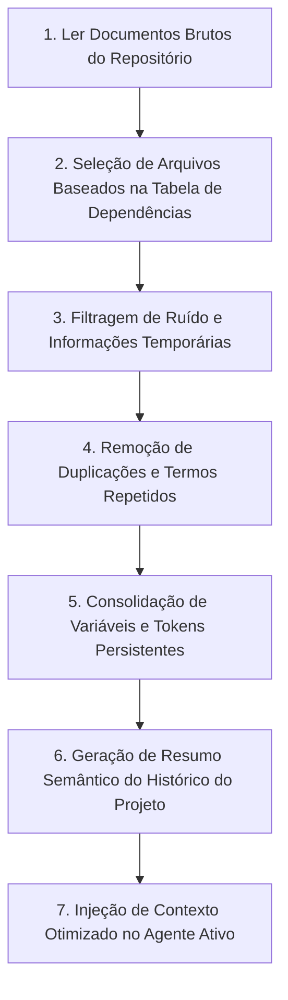
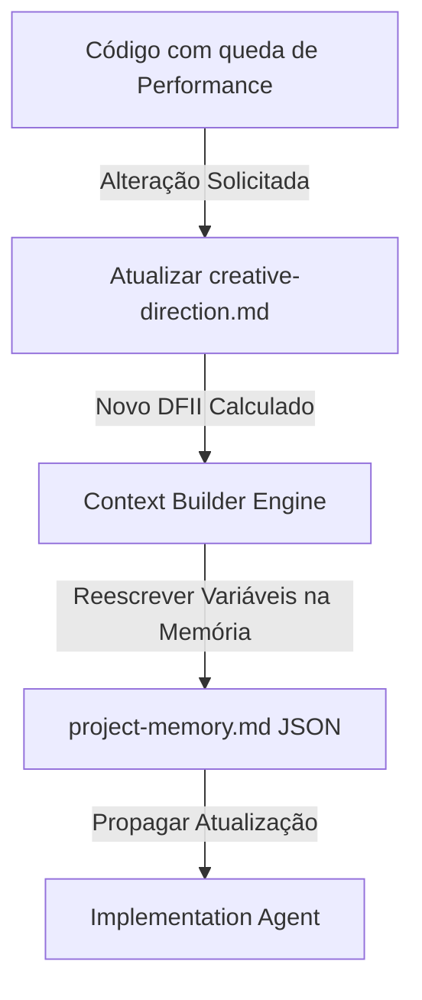

# Construtor e Otimizador de Contexto (Context Builder)

> **KDL Landing Framework — Core Operacional**
> **Tipo:** Motor de Engenharia e Gerenciamento de Contexto (Context Builder Engine)
> **Mandato:** Mapear, consolidar, otimizar e injetar o contexto adequado na memória de cada agente, evitando redundâncias, desperdício de tokens e inconsistências de dados.

---

## 1. Introdução

O **Context Builder** é o componente responsável por estruturar e delimitar as informações consumidas pelos agentes do KDL Landing Framework. Ele assegura que cada IA executora receba o volume ideal de dados para desempenhar sua função com foco cognitivo máximo. Ao filtrar de forma cirúrgica os artefatos de entrada, resumir históricos de decisões de design/marca e priorizar restrições técnicas, ele previne o estouro da janela de contexto e garante a continuidade de visão ao longo do ciclo de vida da landing page.

---

## 2. Conceitos Fundamentais

A engenharia de contexto no KDL Landing Framework obedece aos seguintes conceitos de gerenciamento de dados:

* **Contexto (Context):** O conjunto total de dados em Markdown, JSON e arquivos de mídia carregados no espaço de memória da IA.
* **Contexto Ativo (Active Context):** Os arquivos que o agente atual está ativamente editando, gerando ou utilizando para validação imediata (ex: para o Copywriting Agent, o contexto ativo é `copywriting.md` e a checklist correspondente).
* **Contexto Histórico (Historic Context):** O registro de entregas concluídas nas fases anteriores que já passaram pelos seus respectivos portões de qualidade (ex: `discovery.md`, `brand-strategy.md`).
* **Contexto Temporário (Temporary Context):** Mocks de testes, logs de depuração rápida ou respostas preliminares de pesquisa de concorrência que são descartadas após a aprovação da etapa.
* **Contexto Persistente (Persistent Context):** As restrições inegociáveis do projeto que guiam todas as etapas subsequentes (ex: o tom de voz do Brand Strategy, as variáveis tipográficas e de cor do Design System, e a Big Idea da Direção Criativa).
* **Contexto Compartilhado (Shared Context):** A área comum de dados operacionais que todos os agentes usam de forma simultânea (como a Handoff Matrix do Loader).
* **Contexto Incremental (Incremental Context):** Atualizações rápidas em seções ou mídias específicas do projeto sem carregar a documentação conceitual por inteiro.
* **Contexto Consolidado (Consolidated Context):** O documento final após filtragem, desduplicação e resumo que é injetado no prompt de sistema do agente ativo.

---

## 3. Descoberta Dinâmica de Skills (Orquestração de Contexto)

O Context Builder opera de forma integrada ao `core/framework-orchestrator.md` para selecionar e justificar dinamicamente as seguintes ferramentas e habilidades ativas:

* **Skills de Otimização e Compactação de Contexto (`zipai-optimizer`, `context-optimization`):**
  * *Justificativa:* Minificam a carga de arquivos JSON e de especificações de design, economizando tokens e otimizando o cache de prompts (prompt caching).
* **Skills de Gestão de Conhecimento e Memória (`context-management-context-save`, `context-management-context-restore`):**
  * *Justificativa:* Salvam o estado semântico de decisões e as restauram para o próximo agente da esteira, prevenindo desvios criativos.
* **Skills de Engenharia de Prompts (`prompt-engineer`, `prompt-engineering-patterns`):**
  * *Justificativa:* Estruturam as injeções contextuais no formato markdown de maior absorção cognitiva pelos modelos de linguagem.
* **Skills de Planejamento de Layout e Arquitetura (`architect-review`, `writing-plans`):**
  * *Justificativa:* Garantem que os resumos e as dependências de contexto respeitem a hierarquia técnica do projeto.

---

## 4. Tipos de Contexto do Projeto

As informações de desenvolvimento são divididas em 12 categorias semânticas:

1. **Contexto Global:** O arquivo de inicialização Handoff Matrix emitido pelo Loader.
2. **Contexto do Projeto:** Versão, status, data de entrega e metas registradas no `CHANGELOG.md` e `task.md`.
3. **Contexto da Marca:** Arquétipos de marca, missão, e promessa descritos em `brand-strategy.md`.
4. **Contexto Visual:** Paleta de cores, tipografia responsiva clamp e bordas detalhadas em `design-system.md`.
5. **Contexto Técnico:** Configurações de compilação, pacotes npm e ferramentas descritas em `package.json` e `vite.config.js`.
6. **Contexto de Motion:** Motion tokens, durações, timings e beziers físicas especificadas no `design-system.md` e `cinematic-experience.md`.
7. **Contexto de UX:** Mapa de rolagem de scroll, ritmo de seções (slow/fast) e micro-interações do `experience-design.md`.
8. **Contexto de Copywriting:** Headlines, parágrafos curtos e UX Writing de formulários de `copywriting.md`.
9. **Contexto de SEO:** Schemas JSON-LD estruturados, meta-tags e termos de indexação de busca.
10. **Contexto de Performance:** Orçamentos de nós DOM, framerates de 60fps de scroll e tempos limite de renderização.
11. **Contexto de Auditoria:** Relatório de pontuações Lighthouse e patches aplicados em `audit/final-audit-report.md`.
12. **Contexto de Publicação:** Parâmetros de cache do `vercel.json` e sitemaps do projeto.

---

## 5. Estratégias de Compilação de Contexto

O Context Builder ajusta a densidade das informações dependendo da complexidade do loop de execução atual:

* **Contexto Mínimo (Testes rápidos):** Injeta apenas os Design Tokens cromáticos e a headline ativa do Hero. Utilizado para verificar integridade de estilos de fonte locais.
* **Contexto Recomendado (Padrão de Fase):** Injeta o documento gerado na etapa `N-1`, o manifesto de design, e os tokens persistentes da marca.
* **Contexto Completo (Auditoria Final):** Injeta todo o histórico de decisões do projeto, o código-fonte final compilado e a checklist `quality-gate.md`.
* **Contexto Incremental (Ajustes Rápidos):** Injeta apenas a especificação de uma seção isolada da Bento Grid e a folha de estilos correspondente para alteração atômica.
* **Contexto Resumido (Compacto):** Converte relatórios complexos em listas de tópicos factuais por meio do algoritmo de desduplicação.
* **Contexto Especializado (Motion/Copy):** Carrega unicamente as orientações de GSAP e curvas físicas da biblioteca Lenis.

---

## 6. Regras de Carregamento de Contexto

Para garantir que os agentes permaneçam focados em suas tarefas específicas, o Context Builder impõe as seguintes regras estritas de carregamento e isolamento de dados:

1. **Isolamento de Redação vs. Design:** O Copywriting Agent **nunca** deve carregar as especificações estéticas da Direção Criativa (`creative-direction.md`), pois isso gera saturação cognitiva e conflitos de estilo. A copy deve se basear puramente no Brand Strategy e nos limites do Design System.
2. **Proibição de Carregamento de Código Prévio:** Durante a fase de UX e Arquitetura de UI, **nunca** carregue códigos HTML ou CSS de projetos anteriores, pois isso induz a IA a clonar a estrutura física em vez de projetar um layout original.
3. **Invalidamento de Cache (Invalidation):** Se o Brand Strategy sofrer alteração de versão (ex: mudança do arquétipo de "Herói" para "Sábio"), o Context Builder descarta imediatamente todos os resumos de contexto armazenados para as fases de Design System e Copywriting, forçando a re-geração dessas etapas a partir do novo estado persistente.

---

## 7. Tabela Geral de Dependências e Entregáveis de Contexto

A tabela abaixo rege de forma inegociável o que deve ser selecionado, filtrado e injetado para cada agente ativo da esteira:

| Agente Ativo | Documentos Obrigatórios (Entrada) | Documentos Opcionais | Templates KDL | Referências Técnicas | Checklists de Gate | Saída Esperada |
| :--- | :--- | :--- | :--- | :--- | :--- | :--- |
| **00. Loader** | `README.md`, `MANIFESTO.md` | `CHANGELOG.md` | N/A | `skills-guidelines.md` | N/A | Handoff Matrix |
| **01. Discovery**| Handoff Matrix do Loader | Briefing bruto | `discovery-template.md` | `storytelling.md` | N/A | `docs/01-discovery.md` |
| **02. Brand** | `docs/01-discovery.md` | Concorrentes | `brand-strategy-template.md` | `storytelling.md` | N/A | `docs/02-brand-strategy.md` |
| **03. Design** | `docs/02-brand-strategy.md` | Manual de Marca | `design-system-template.md` | `design-principles.md` | N/A | `docs/03-design-system.md` |
| **04. Copy** | `docs/02-brand-strategy.md`, `docs/03-design-system.md` | FAQ do Cliente | `copywriting-template.md` | `copywriting.md` | N/A | `docs/04-copywriting.md` |
| **05. Creative**| `docs/04-copywriting.md` | Inspirações | `creative-direction-template.md`| `hero-guidelines.md` | N/A | `docs/05-creative-direction.md`|
| **06. UX** | `docs/05-creative-direction.md` | Referências | `experience-design-template.md`| `motion-guidelines.md`| N/A | `docs/06-experience-design.md`|
| **07. UI** | `docs/06-experience-design.md` | Spacing grids | `ui-architecture-template.md` | `parallax-guidelines.md`| `design-gate.md` | `docs/07-ui-architecture.md` |
| **07.1. Motion**| `docs/07-ui-architecture.md` | Easing curves | `cinematic-experience-template.md`| `motion-guidelines.md`| N/A | `docs/07.1-cinematic-experience.md`|
| **08. Dev** | `docs/03-design-system.md`, `docs/04-copywriting.md`, `docs/07.1-cinematic-experience.md` | Assets locais | N/A (Código Direto) | `performance.md`, `accessibility.md` | `development-gate.md` | Código-fonte em `/src` |
| **08.1. QA** | Código-fonte, `docs/04-copywriting.md` | Relatórios Axe | `audit-template.md` | `seo.md`, `performance.md` | `quality-gate.md` | `audit/final-audit-report.md` |
| **09. DevOps** | Código auditado, `audit/final-audit-report.md` | Tokens DNS | `publication-template.md` | `seo.md` | `publication-gate.md` | `reports/publication-report.md` |

---

## 8. Pipeline de Construção de Contexto

O fluxo de processamento de dados do Context Builder obedece à seguinte sequência automatizada:



---

## 9. Estratégias de Otimização de Tokens

Para garantir máxima eficiência no consumo de tokens da API e velocidade de resposta da IA, as seguintes técnicas são aplicadas de forma obrigatória:

1. **Minificação de Variáveis CSS e JSON:** A folha de Design Tokens é convertida em um payload JSON condensado, eliminando espaços vazios e comentários redundantes.
2. **Priorização de Trava (Upstream Locks):** Elementos inalteráveis (como a paleta semântica ou o arquétipo) são mantidos em uma única declaração de cabeçalho curto. O restante do histórico do projeto é resumido recursivamente.
3. **Poda de Diretrizes Obsoletas (Guidelines Pruning):** Guias de referências (`references/`) que não possuem relação direta com a fase atual são completamente omitidos do contexto (ex: omitir o guia de SEO e robots na fase de redação da copy).

---

## 10. Persistência de Contexto e Atualização Dinâmica

### A. Contexto Persistente
O Context Builder monta um bloco de informações travadas que é herdado por todas as etapas após a aprovação das fases 01 e 02:

```markdown
[PERSISTENT CONTEXT LOCK]
- Client: Hamburgueria Artesanal Premium
- Brand Archetype: O Criador
- Tone of Voice: Sóbrio, sensorial, focado na matéria-prima
- Display Font: Playfair Display | Body Font: DM Sans
- Semantic Palette: 60% #0d0d0d (Bg) | 30% #f3f3f3 (Text) | 10% #e67e22 (Accent)
- Big Idea Visual: A fumaça e a brasa em movimento tridimensional
```

### B. Atualização Dinâmica (Ficha de Alteração de Contexto)
Se houver uma alteração na Direção Criativa durante a fase de código (ex: simplificar a transição do Hero para otimização de performance), o orquestrador aciona o Context Builder para reescrever as variáveis e propagar a alteração:



---

## 11. Boas Práticas de Engenharia de Contexto

* **Limpeza e Organização:** Salve os documentos de projeto em locais padronizados (como `/docs/projects/`), evitando espalhar notas de reuniões soltas no repositório.
* **Respeitar o Orçamento Tipográfico:** Certifique-se de que a folha de Design Tokens passada para o Copywriting e UI Architecture declare apenas as fontes Display e Body oficiais, evitando fontes secundárias ad-hoc.

---

## 12. Anti-Patterns de Contexto

* ❌ **Contexto Poluído (Prompt Bloat):** Injetar todos os 11 manuais de referências da pasta `references/` em todos os prompts dos agentes de planejamento. Isso causa perda de atenção e alucinação.
* ❌ **Ignorar Decisões de Design (Scope Drift):** Permitir que o programador implemente cores ou animações fora das especificações do Design System que foram travadas no Contexto Persistente.

---

## 13. Exemplo Prático de Carga de Contexto (Fase de Copywriting)

Abaixo está exemplificado o cabeçalho conceitual condensado pelo Context Builder para alimentar o **Copywriting Agent**:

```markdown
# Contexto Otimizado para Copywriting (KDL-RUN-90218)

## 1. Dados Persistentes da Marca (Brand Lock)
* **Arquétipo:** O Criador | **Tom:** Sóbrio, gastronômico.
* **Palavras Recomendadas:** [Nativo, artesanal, fogo, brasa, defumado]
* **Palavras Proibidas (AI-isms):** [Inovador, excelência, bem-vindo, soluções robustas]

## 2. Restrições Geométricas do Design System (Layout Lock)
* **Display Font Size H1:** clamp(2.5rem, 5vw, 4.5rem)
* **Limite de Caracteres H1 (Headline):** Máximo de 65 caracteres (para evitar quebras em 4 linhas no mobile).
* **CTA Principal:** Máximo de 25 caracteres.

## 3. Insumos do Discovery (Dores do ICP)
1. Medo de o hambúrguer chegar frio (Gatilho de reversão: Entrega expressa controlada por caixa térmica).
2. Desconfiança de ingredientes artificiais (Gatilho de reversão: Exibição visual de carne Angus certificada).
```

---

## 14. Conclusão

O **Context Builder** é a peça de precisão que viabiliza a orquestração do KDL Landing Framework. Ao separar rigorosamente os contextos ativos, persistentes e históricos de cada etapa, e aplicar técnicas severas de minificação de tokens e desduplicação, ele garante que os agentes executem suas responsabilidades com máxima performance técnica, total consistência conceitual e sem desperdício de recursos.

---

*KDL Landing Framework — Engenharia de contexto para mentes digitais de alto desempenho.*
