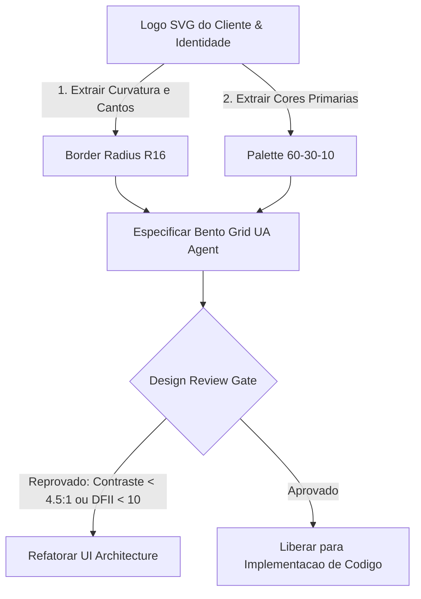
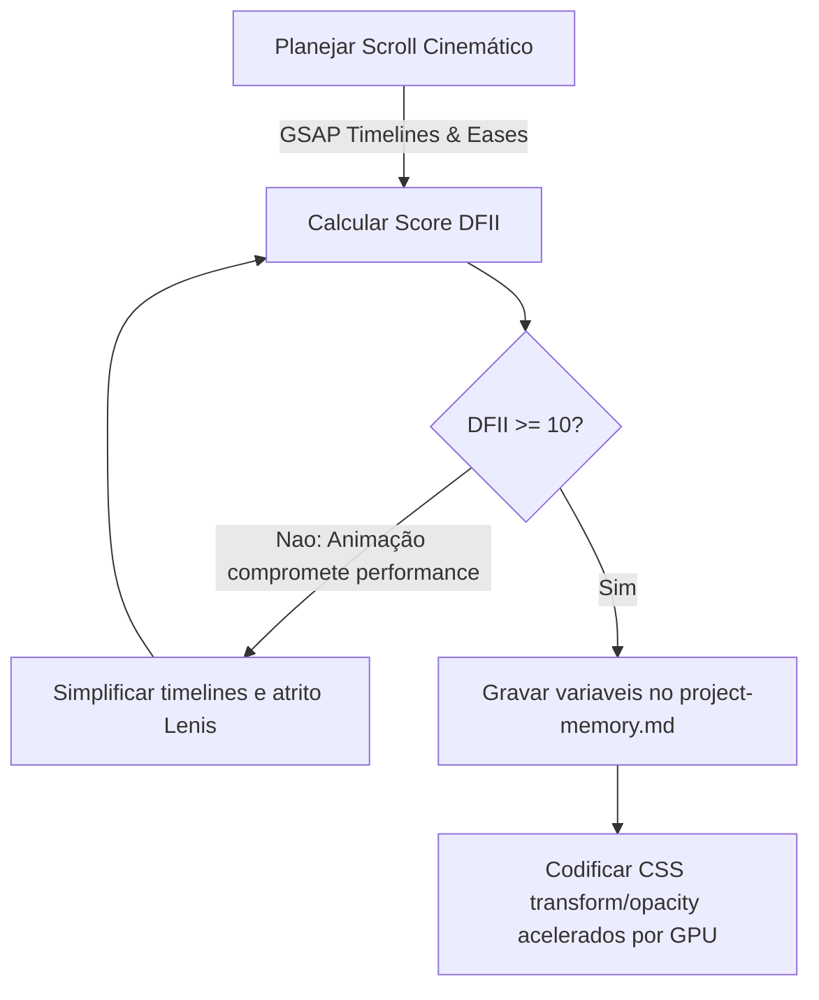

# Manual de Inteligência de Design (Design Intelligence)

> **KDL Landing Framework — Core Operacional**
> **Tipo:** Motor de Regras Estéticas e Dirección Artística (Design Intelligence Engine)
> **Mandato:** Definir as regras de direção de arte, diagramação Bento Grid, pacing de scroll cinemático, contrastes tipográficos matemáticos e o score de viabilidade de design (DFII), atuando como a autoridade máxima sobre a estética visual do framework.

---

## 1. Introdução

O **Design Intelligence** é a inteligência estética e o guardião da qualidade visual do **KDL Landing Framework**. Sua responsabilidade é garantir que todas as landing pages atinjam o nível de excelência comparável aos projetos premiados internacionalmente no Awwwards e FWA. Este documento atua como o manual de referência inegociável de direção de arte, movimento e hierarquia, garantindo que as IAs criativas não caiam na complacência de gerar interfaces modulares genéricas e chatas.

---

## 2. Filosofia KDL de Design Imersivo

O design de landing pages na KDL baseia-se nos seguintes pilares filosóficos:

* **Qualidade acima da Velocidade:** Proibir layouts apressados ou clonados. Cada pixel deve ser planejado sob a identidade geométrica do cliente.
* **Originalidade acima de Tendências:** Rejeitar designs que seguem modas passageiras sem conexão com a marca. O foco é a longevidade visual.
* **Experiência acima de Estética:** Uma interface bonita que confunde o usuário ou possui performance de carregamento ruim é um fracasso técnico. A estética deve servir à conversão e usabilidade.
* **Emoção acima de Quantidade:** Menos seções e mais impacto sensorial por meio de profundidade 3D, iluminação radial rústica e texturas físicas.
* **Marca acima de Efeitos:** Efeitos cinemáticos (como parallax ou dolly zoom) devem servir unicamente para reforçar a Proposta Única de Valor (UVP) da marca, nunca como decoração vazia.
* **Consistência acima de Criatividade Aleatória:** Toda animação e cor deve obedecer aos limites definidos nos tokens semânticos do Design System.

---

## 3. Descoberta Dinâmica de Skills (Orquestração Estética)

O Design Intelligence consome o protocolo de descoberta de habilidades locais do Skill Manager para orquestrar as seguintes inteligências no momento do processamento criativo:

* **Skills de Direção de Arte e Princípios de Design (`architect-review`, `design-principles`):**
  * *Justificativa:* Validam a grade Bento, o alinhamento de cantos arredondados baseados na logo (R16) e a composição tridimensional.
* **Skills de Engenharia de Movimento e Scroll (`motion-guidelines`, `cinematic-experience`):**
  * *Justificativa:* Parametrizam as easing curves (curvas de aceleração física) e a inércia do scroll da biblioteca Lenis/GSAP.
* **Skills de Acessibilidade e Contraste Cromático (`accessibility`):**
  * *Justificativa:* Garantem conformidade matemática com as regras de leitura e contraste (mínimo 4.5:1) da norma WCAG 2.2 AA.

---

## 4. Princípios Fundamentais de Composição

Toda tela KDL deve ser projetada sob os seguintes critérios de engenharia visual:

* **Hierarquia Visual:** O olhar do usuário deve ser guiado de forma sequencial: Headline (LCP) -> Subtítulo -> CTA Principal. O tamanho, o contraste de cor e o peso visual definem essa rota.
* **Assimetria Balanceada:** Quebrar a grade de layout quadrada e previsível, utilizando composições assimétricas onde o peso visual é equilibrado por espaços vazios (whitespace).
* **Whitespace (Espaço em Branco):** O espaço vazio é um elemento ativo de design. Ele permite que o cérebro do usuário respire e absorva a mensagem comercial, eliminando a poluição de informação.
* **Bento Grid Layout:** Distribuição geométrica das células da grade Bento obedecendo à proporção áurea de spans. Cada card deve possuir uma única finalidade (ex: uma estatística, um depoimento, uma foto real de detalhe de produto).
* **Profundidade e Camadas:** Utilização de planos de profundidade (background estático escuro, neblina intermediária, cards flutuantes na frente e partículas sutis suspensas em parallax descompassado).

---

## 5. Hero Experience (A Primeira Dobra)

A dobra inicial é o cinema digital da marca do cliente. Ela deve cativar o usuário nos primeiros 5 segundos de carregamento:

* **Logo Protagonista (Intro Cinemática):** O logotipo SVG não pode aparecer de forma estática instantânea. Ele deve carregar com uma animação de traçado suave (GSAP Stroke Draw) com duração de 1500ms a 2000ms.
* **Movie Intro (Corte de Câmera):** A primeira seção da página inicia com um zoom-out da imagem principal combinada com desfoque progressivo (focus blur scrubbing), simulando a abertura de uma lente de cinema.
* **Gradient Lighting & Glows:** Iluminação radial sutil (glow) posicionada atrás do texto principal ou dos cards Bento, utilizando opacidades baixas (0.15 a 0.25) para criar sensação de iluminação física real (atmosfera rústica).

---

## 6. Motion Design e Física de Scroll

O movimento no KDL framework deve parecer natural e obedecer a leis físicas de atrito e inércia:

* **Motion Hierarchy:** Elementos de leitura (textos, parágrafos) revelam-se com um sutil translate vertical e opacidade (stagger). Elementos de suporte (detalhes visuais) revelam-se por último.
* **GSAP Easing Curves:** Proibir o uso de animações lineares duras ou ease genéricos. Utilizar exclusivamente curvas de física rústica como `power3.out`, `expo.out` ou `back.out(1.2)` para CTA hovers.
* **Magnetic CTAs:** Botões de conversão primária devem possuir comportamento magnético, atraindo-se levemente na direção do cursor do mouse em um raio de 40px para criar engajamento tátil de clique.
* **Parallax Horizontal e Pinned Sections:** Seções de storytelling (ex: os diferenciais dos blends Angus) travam na tela (scroll pinning) enquanto o usuário rola, executando uma transição horizontal de cards antes de liberar a rolagem vertical.

---

## 7. Geometria do Design System e Identidade Visual

O layout herda e reflete os traços físicos derivados do logotipo original do cliente:

* **Bordas e Cantos (Border Radius):** Se o logotipo possui curvas proeminentes, os cards Bento e os botões devem adotar cantos arredondados (ex: `border-radius: 16px` para cards, `border-radius: 8px` para botões). Se o logotipo for puramente retilíneo e agressivo (industrial), os cantos devem ser de 0px a 4px.
* **A Regra de Cores 60-30-10:**
  * **60% (Cor Dominante):** A cor de fundo geral (preferencialmente dark mode profundo, como `#0d0d0f` ou `#121214`).
  * **30% (Cor Secundária):** Textos, outlines de divisórias e ícones de suporte (cores de alto contraste legível como `#f5f5f7` e `#a1a1aa`).
  * **10% (Cor de Destaque / Accent):** Reservada exclusivamente para botões de CTA primários e gatilhos de conversão. Não pode ser usada em títulos gerais para não diluir o foco visual.

---

## 8. Escala Tipográfica Fluida (Math Clamp)

A tipografia deve se reajustar de forma responsiva de 320px a 4K sem quebras visuais bruscas de mídia (media queries de quebra).

### Fórmulas Clamp Tipográficas
* **H1 Display Title:** `font-size: clamp(2.5rem, 5.5vw + 1rem, 5.5rem)`
* **H2 Section Title:** `font-size: clamp(1.8rem, 3.5vw + 0.8rem, 3.2rem)`
* **Body Text:** `font-size: clamp(0.95rem, 1.1vw + 0.2rem, 1.15rem)`
* **Line-height Budgets:** `line-height: 1.1` para H1/H2 (títulos display exigem altura de linha apertada para evitar dispersão visual); `line-height: 1.6` para blocos de leitura do body.
* **Font Count Limit:** No máximo duas famílias tipográficas carregadas no projeto (Display para títulos, Sans-Serif limpa para body).

---

## 9. Visual Storytelling (Ritmo de Seções)

A estrutura de conteúdo deve acompanhar a jornada emocional do usuário:

1. **Apresentação (Hero):** Impacto cinematográfico, logo ativo e Proposta Única de Valor (UVP) clara.
2. **Conexão (Storytelling):** Apresentação rústica real dos ingredientes, blends Angus ou o bastidor físico do cliente.
3. **Construção de Valor (Bento Grid):** Diferenciais comerciais tangíveis apresentados em grade geométrica equilibrada.
4. **Autoridade (Prova Social):** Depoimentos reais de clientes e fotos das instalações sem modelos corporativos falsos.
5. **Conversão (CTA):** Formulário ou botão magnético de WhatsApp livre de atritos.
6. **Encerramento (FAQ e Rodapé):** Sanar objeções remanescentes de preço e prazos de entrega.

---

## 10. Sistema de Avaliação Estética e Técnica (Score DFII Matrix)

O Design Intelligence estabelece o **Design Feasibility & Impact Index (DFII)** para validar a viabilidade técnica de efeitos visuais:

$$\text{DFII Score} = (\text{Visual Impact} \times 4) + (\text{Brand Cohesion} \times 3.5) - (\text{LCP Render Penalty} \times 2.5) - (\text{DOM Node Complexity} \times 2)$$

### Matriz de Pesos da Avaliação
* **Visual Impact (1 a 5):** Nível de imersão e deleite físico que a transição gera no usuário.
* **Brand Cohesion (1 a 5):** O alinhamento conceitual do efeito com o tom verbal e arquétipo da marca.
* **LCP Render Penalty (1 a 5):** O impacto negativo que a renderização do efeito causa no carregamento do Hero (ex: gradientes complexos em mesh animados por GPU têm penalidade alta).
* **DOM Node Complexity (1 a 5):** O número de elementos DIV adicionais que a estrutura tridimensional exige (limite máximo de 800 nós DOM no projeto).

> [!IMPORTANT]
> Se o **DFII Score** da Direção Criativa for inferior a **10**, o projeto é bloqueado no Design Gate e deve ser simplificado. O objetivo é evitar que a ganância criativa prejudique a performance em redes móveis 3G/4G.

---

## 11. Portões de Auditoria Visual (Design Review Checklist)

A transição entre a fase de planejamento de UI e a codificação física só é liberada se o Design Review validar as seguintes regras inegociáveis:

- [ ] A landing page possui no máximo duas famílias de fontes declaradas?
- [ ] O border-radius de todos os cards Bento e botões herda a geometria da curva da logo SVG?
- [ ] A relação de contraste cromático de leitura de todos os textos com o fundo é de no mínimo 4.5:1?
- [ ] O botão de CTA primário utiliza a cor de destaque (10% de peso) de forma isolada?
- [ ] Não há presença de fotos de modelos genéricos de banco corporativo clichê?
- [ ] Todas as animações de scroll possuem timings de entrada inferiores a 1000ms?
- [ ] O layout mobile (320px) reseta a Bento Grid para coluna única sem estourar as margens laterais?

---

## 12. Diagramas Mermaid do Pipeline de Design

### A. Fluxo de Direção de Arte e Validação de Estilo

### B. Integração de Engenharia de Animação (Motion & Performance)

---

## 13. Boas Práticas Estéticas

* **Trabalhe com o Invisível:** A neblina de fundo sutil, o grão de filme opaco (film grain) e os gradientes radiais escuros (glows de 15% de opacidade) criam riqueza e profundidade sem chamar a atenção direta do usuário. Eles constroem a atmosfera de cinema.
* **Scroll Pacing Coeso:** Alterne seções de alto impacto visual (imagens grandes em parallax) com seções limpas de leitura rápida, evitando fadiga de rolagem do usuário.

---

## 14. Anti-Patterns de Design

* ❌ **Geometria Desalinhada (Bento Fails):** Deixar lacunas ou cantos arredondados diferentes entre os cards da Bento Grid.
* ❌ **Uso Abusivo de Motion (Scroll Hijacking):** Bloquear a velocidade natural do mouse do usuário ou criar timelines de animação que impedem a leitura ágil de informações.

---

## 15. Conclusão

O **Design Intelligence** é a garantia de que as landing pages produzidas sob a metodologia KDL possuam o mesmo requinte, sofisticação e fluidez técnica de estúdios criativos de ponta. Ao ditar as escalas tipográficas fluidas clamps, impor a regra cromática 60-30-10 baseada na geometria do logotipo SVG do cliente e regular a complexidade de efeitos por meio do score matemático DFII, ele assegura a entrega de experiências digitais memoráveis e de alta conversão.

---

*KDL Landing Framework — A arte governada pela precisão.*
