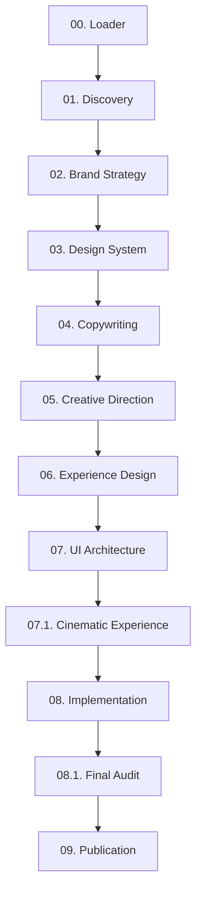
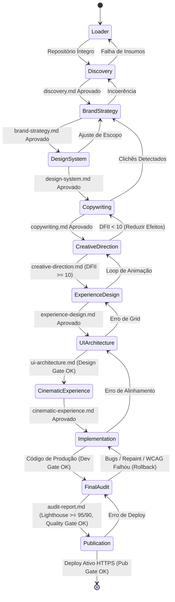
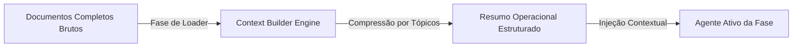
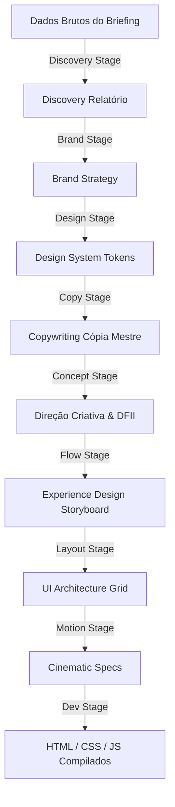
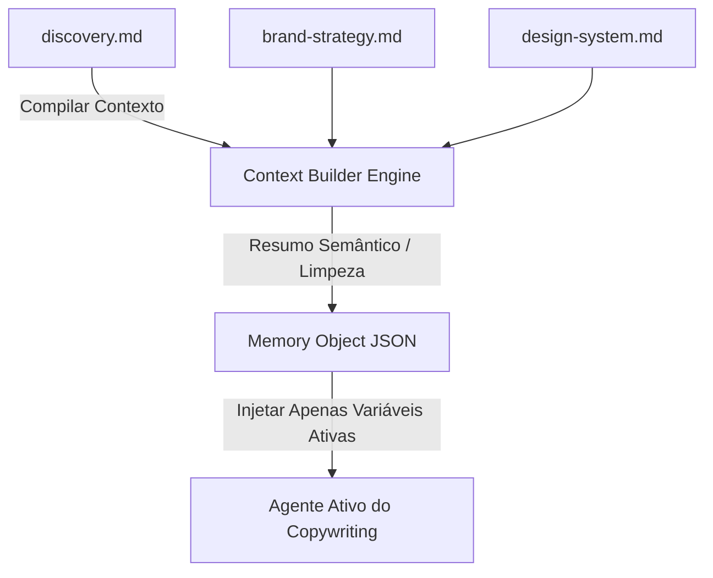
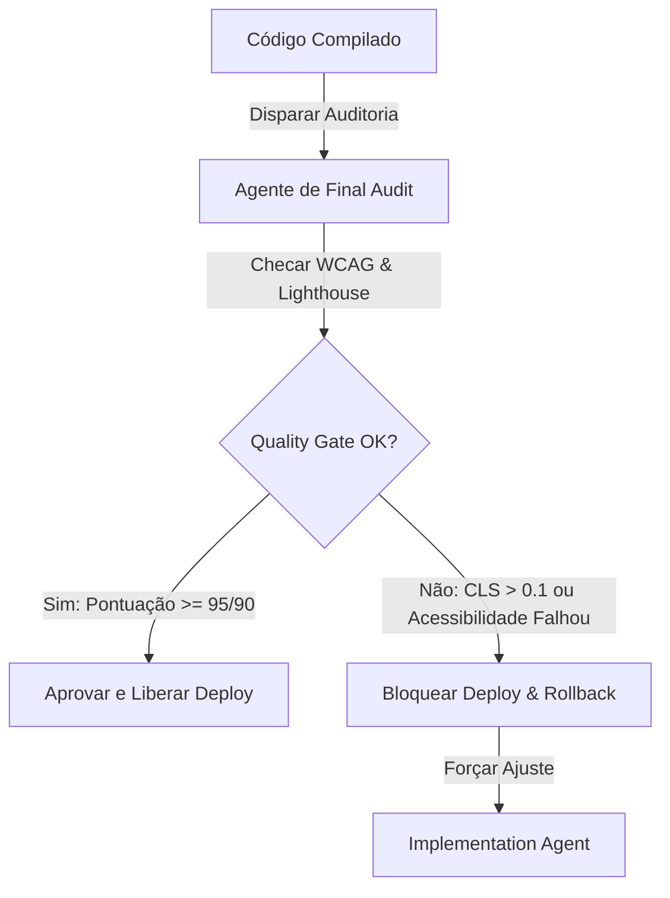

# Orquestrador Central do Framework (Framework Orchestrator)

> **KDL Landing Framework — Core Operacional**
> **Tipo:** Núcleo Operacional e Sistema de Orquestração (Kernel / Orchestrator Engine)
> **Mandato:** Controlar a máquina de estados, o contexto, a memória e a execução sequencial de todas as fases de desenvolvimento. Nenhum agente de desenvolvimento ou planejamento pode ser invocado diretamente; toda a execução operacional do framework é coordenada por este documento.

---

## 1. Introdução

O **Framework Orchestrator** é o Sistema Operacional e o cérebro central do **KDL Landing Framework**. Sua responsabilidade é garantir a integridade metodológica de ponta a ponta durante a criação de landing pages cinematográficas. Ele atua como o regente do ciclo de vida do projeto, fazendo a mediação entre os agentes especializados, gerenciando a passagem de contexto sem perda de informação (handoff), verificando dependências físicas no disco e impondo os portões de qualidade (Quality Gates) obrigatórios.

---

## 2. Arquitetura do Núcleo Operacional

Para garantir modularidade e blindagem cognitiva contra a complexidade, a camada core do KDL Landing Framework é estruturada nos seguintes componentes de inteligência:

```text
core/
├── framework-orchestrator.md  # Este arquivo: Motor de Orquestração e Controle de Estados
├── context-builder.md         # Compilador dinâmico de inputs e compressão de tokens
├── project-memory.md          # Registro semântico de decisões de design, assets e aprovações
├── skill-manager.md           # Gerenciador e descobridor dinâmico de ferramentas e skills locais
└── design-intelligence.md     # Motor matemático de cálculo do índice DFII e restrições WCAG
```

### Detalhamento dos Componentes Core Recomendados

1. **`core/framework-orchestrator.md` (Orchestrator Engine):** Gerencia a transição de fases, o controle de erros, a reexecução e os fluxos de rollback quando uma checklist de qualidade falha.
2. **`core/context-builder.md` (Context Builder):** Responsável por compilar as entradas de cada etapa e otimizar o tamanho da janela de contexto para a IA, gerando resumos estruturados dos artefatos anteriores para evitar saturação de tokens.
3. **`core/project-memory.md` (Project Memory):** Um diário de bordo estruturado em Markdown e JSON que registra decisões criativas, assets aprovados (logos, fotos reais), exceções de design system e motivos de reprovação em portões de validação.
4. **`core/skill-manager.md` (Skill Manager):** Roda o protocolo de descoberta de ferramentas do ambiente de desenvolvimento local, justificando e combinando capacidades.
5. **`core/design-intelligence.md` (Design Intelligence):** Centraliza a inteligência de regras matemáticas de estilo: fórmulas de contraste WCAG, escala tipográfica fluida e cálculo do score DFII (Design Feasibility & Impact Index).

---

## 3. Descoberta Dinâmica de Skills (Orquestração de Recursos)

O Orquestrador utiliza o **Protocolo Dinâmico de Descoberta de Skills** para mapear as capacidades locais no ambiente do operador antes de disparar o processamento das fases. 

### Inventário de Skills Mapeadas e Justificadas

* **Skills de Arquitetura e Engenharia de Layout (`architect-review`, `design-principles`):**
  * *Justificativa:* Garante que a distribuição espacial das seções, as proporções dos grids Bento e o ritmo de visualização obedeçam a regras geométricas sólidas, evitando estruturas quadradas genéricas.
* **Skills de Planejamento e Fluxo (`writing-plans`, `concise-planning`):**
  * *Justificativa:* Utilizadas pelo orquestrador para quebrar a execução de fases complexas em tarefas atômicas e listas de verificação granulares antes do início do desenvolvimento físico.
* **Skills de Gestão de Contexto e Memória (`context-management-*`):**
  * *Justificativa:* Cruciais para salvar e restaurar o estado da máquina operacional entre invocações de agentes diferentes, reduzindo a duplicação de tokens.
* **Skills de Auditoria e Garantia de Qualidade (`vibe-code-auditor`, `code-reviewer`, `performance`):**
  * *Justificativa:* Utilizadas nos portões de qualidade (Quality Gates) para inspecionar repaints de GPU, código morto, redundâncias de CSS, e validações de contraste WCAG.
* **Skills de Escrita Humana e Tom de Voz (`prompt-engineer`, `avoid-ai-writing`):**
  * *Justificativa:* Aplicadas na Fase de Copywriting para auditar e expurgar clichês robóticos e jargões inflados gerados de forma estatística por grandes modelos de linguagem.

---

## 4. Pipeline Operacional Oficial (12 Fases)

O ciclo de vida de desenvolvimento KDL é estruturado em uma esteira linear rígida de 12 etapas, partindo do escaneamento do ambiente até a publicação final em ambiente de produção:



---

## 5. Máquina de Estados Operacional

Abaixo estão descritas as regras de transição de estados, pré-condições, entradas/saídas e validações para cada uma das 12 fases do pipeline.



---

### Detalhamento dos Estados da Máquina

---

#### 1. Estado: Loader (`prompts/00-framework-loader.md`)
* **Estado Inicial:** Repositório do framework clonado sem projeto ativo.
* **Pré-condições:** Acesso de leitura ao diretório mestre do framework.
* **Entradas Obrigatórias:** Arquivos de governança (`README.md`, `MANIFESTO.md`, `docs/*`).
* **Entradas Opcionais:** Dados brutos iniciais do briefing do cliente.
* **Saídas Obrigatórias:** Relatório Handoff Matrix emitido no console.
* **Saídas Opcionais:** Correção automática de links internos relativos quebrados.
* **Validação / Quality Gate:** Varredura dinâmica de skills concluída e justificada.
* **Critério de Avanço:** Handoff Matrix gerada e livre de erros físicos.
* **Critério de Retorno:** Reprocessamento imediato caso ocorra falha de leitura de disco.
* **Dependências:** Sistema de arquivos ativo.
* **Estado Final:** Contexto global de inicialização consolidado.

---

#### 2. Estado: Discovery (`prompts/01-discovery-agent.md`)
* **Estado Inicial:** Handoff Matrix do Loader concluída.
* **Pré-condições:** Contexto global consolidado.
* **Entradas Obrigatórias:** Briefing bruto do cliente, links de concorrentes locais, arquivo de logo original.
* **Entradas Opcionais:** Fotos reais do estabelecimento, cardápios ou PDF institucional.
* **Saídas Obrigatórias:** `docs/01-discovery.md` preenchido.
* **Saídas Opcionais:** Análise técnica preliminar de upscaling de imagens recebidas.
* **Validação / Quality Gate:** Mapeamento de dores psicológicas e inventário físico de ativos.
* **Critério de Avanço:** Fatos comerciais do nicho e dores do ICP claramente delimitadas.
* **Critério de Retorno:** Retornar ao Loader se o arquivo de logo estiver indisponível ou corrompido.
* **Dependências:** `prompts/00-framework-loader.md`.
* **Estado Final:** Relatório de Discovery assinado e salvo.

---

#### 3. Estado: Brand Strategy (`prompts/02-brand-strategy-agent.md`)
* **Estado Inicial:** Relatório `docs/01-discovery.md` finalizado.
* **Pré-condições:** Dores do público-alvo prioritárias mapeadas.
* **Entradas Obrigatórias:** `docs/01-discovery.md` preenchido.
* **Entradas Opcionais:** Benchmarks adicionais do segmento de mercado.
* **Saídas Obrigatórias:** `docs/02-brand-strategy.md` preenchido.
* **Saídas Opcionais:** Golden Circle estruturado e Big Idea formulada.
* **Validação / Quality Gate:** Tom de voz com matriz de contrastes e arquétipo de marca definidos.
* **Critério de Avanço:** Guia verbal com palavras recomendadas e proibidas (AI-isms) finalizado.
* **Critério de Retorno:** Retornar ao Discovery se houver contradição nos diferenciais comerciais do cliente.
* **Dependências:** `docs/01-discovery.md`.
* **Estado Final:** Posicionamento e voz da marca estabelecidos.

---

#### 4. Estado: Design System (`prompts/03-design-system-agent.md`)
* **Estado Inicial:** Guia `docs/02-brand-strategy.md` concluído.
* **Pré-condições:** Identidade verbal e tom de voz definidos.
* **Entradas Obrigatórias:** `docs/02-brand-strategy.md` preenchido.
* **Entradas Opcionais:** Identidade visual pré-existente (Manual de Identidade Visual do cliente).
* **Saídas Obrigatórias:** `docs/03-design-system.md` preenchido.
* **Saídas Opcionais:** Variáveis semânticas de espaçamento baseadas em unidade 8px.
* **Validação / Quality Gate:** WCAG contraste cromático calculado matemático (mínimo 4.5:1).
* **Critério de Avanço:** Seleção de no máximo duas fontes display/body (banindo fontes padrão de IA) e paleta CSS 60-30-10 definida.
* **Critério de Retorno:** Retornar ao Brand Strategy se o arquétipo visual exigir tipografia incompatível com a personalidade definida.
* **Dependências:** `docs/02-brand-strategy.md`.
* **Estado Final:** Especificação técnica de Design Tokens CSS consolidada.

---

#### 5. Estado: Copywriting (`prompts/04-copywriting-agent.md`)
* **Estado Inicial:** Folha `docs/03-design-system.md` finalizada.
* **Pré-condições:** Variáveis CSS e limites tipográficos geométricos estabelecidos.
* **Entradas Obrigatórias:** `docs/02-brand-strategy.md`, `docs/03-design-system.md`.
* **Entradas Opcionais:** FAQ bruto fornecido pelo cliente.
* **Saídas Obrigatórias:** `docs/04-copywriting.md` preenchido.
* **Saídas Opcionais:** Meta tags SEO (Title, Description) e Alt texts de imagens.
* **Validação / Quality Gate:** Teste de varredura anti-IA (zero termos inflados e gerúndios vazios).
* **Critério de Avanço:** Cópia completa estruturada sob o funil AIDA e headlines de no máximo 3 linhas.
* **Critério de Retorno:** Retornar ao Design System se o número de caracteres estourar o limite geométrico estabelecido na fase de design.
* **Dependências:** `docs/03-design-system.md`.
* **Estado Final:** Cópia Mestre finalizada e aprovada.

---

#### 6. Estado: Creative Direction (`prompts/05-creative-direction-agent.md`)
* **Estado Inicial:** Cópia `docs/04-copywriting.md` aprovada.
* **Pré-condições:** Proposta de valor e headline do Hero consolidadas.
* **Entradas Obrigatórias:** `docs/04-copywriting.md` preenchido.
* **Entradas Opcionais:** Inspirações visuais da galeria Awwwards/Land-book.
* **Saídas Obrigatórias:** `docs/05-creative-direction.md` preenchido.
* **Saídas Opcionais:** Memorial de iluminação radial (glows) e composição de profundidade do Hero.
* **Validação / Quality Gate:** Cálculo matemático do Score DFII.
* **Critério de Avanço:** Score DFII ≥ 10 e âncora de diferenciação visual original validada.
* **Critério de Retorno:** Retornar ao Copywriting se a complexidade visual proposta exigir quebras na mensagem da copy.
* **Dependências:** `docs/04-copywriting.md`.
* **Estado Final:** Memorial de Direção Criativa e viabilidade aprovados.

---

#### 7. Estado: Experience Design (`prompts/06-experience-design-agent.md`)
* **Estado Inicial:** Memorial `docs/05-creative-direction.md` aprovado.
* **Pré-condições:** Score DFII verificado e aprovado.
* **Entradas Obrigatórias:** `docs/05-creative-direction.md` preenchido.
* **Entradas Opcionais:** Referências conceituais de mecânica de scroll.
* **Saídas Obrigatórias:** `docs/06-experience-design.md` preenchido.
* **Saídas Opcionais:** Storyboard de transições de seções (sticky, stacking, horizontal).
* **Validação / Quality Gate:** Mapeamento de scroll pacing (zonas lentas de leitura vs aceleradas de imagens).
* **Critério de Avanço:** Roteiro de scroll e micro-interações físicas (magnetic hover) detalhados.
* **Critério de Retorno:** Retornar à Direção Criativa se a animação proposta causar loops que comprometam a performance visual.
* **Dependências:** `docs/05-creative-direction.md`.
* **Estado Final:** Storyboard de interação da experiência de scroll consolidado.

---

#### 8. Estado: UI Architecture (`prompts/07-ui-architecture-agent.md`)
* **Estado Inicial:** Roteiro `docs/06-experience-design.md` finalizado.
* **Pré-condições:** Storyboard de scroll estruturado.
* **Entradas Obrigatórias:** `docs/06-experience-design.md` preenchido.
* **Entradas Opcionais:** Mockup estrutural feito à mão ou briefing geométrico.
* **Saídas Obrigatórias:** `docs/07-ui-architecture.md` preenchido.
* **Saídas Opcionais:** Grids de spans específicos das caixas do Bento Grid.
* **Validação / Quality Gate:** Aprovação estrita no portão de qualidade [design-gate.md](file:///c:/Framework/checklists/design-gate.md).
* **Critério de Avanço:** Grid de layout responsivo (colunas, gutters, margins) detalhado em breakpoints (desktop, tablet, mobile).
* **Critério de Retorno:** Retornar ao Experience Design se houver desalinhamentos na grade Bento ou seções mortas de layout.
* **Dependências:** `docs/06-experience-design.md`.
* **Estado Final:** Wireframe técnico e especificações geométricas aprovados.

---

#### 9. Estado: Cinematic Experience (`prompts/07.1-cinematic-experience-agent.md`)
* **Estado Inicial:** Wireframe `docs/07-ui-architecture.md` aprovado.
* **Pré-condições:** Layout responsivo e proporções Bento validados pelo Design Gate.
* **Entradas Obrigatórias:** `docs/07-ui-architecture.md` preenchido.
* **Entradas Opcionais:** Configurações adicionais de inércia e atrito físico de scroll.
* **Saídas Obrigatórias:** `docs/07.1-cinematic-experience.md` preenchido.
* **Saídas Opcionais:** Definição matemática de curvas de aceleração e easing do Lenis.
* **Validação / Quality Gate:** Mapeamento das velocidades das camadas de parallax (`data-speed` 0.2 a 1.4).
* **Critério de Avanço:** Roteiro de animação da entrada do logotipo (loader) e cronologia em milissegundos aprovados.
* **Critério de Retorno:** Retornar ao UI Architecture se o parallax proposto exigir alterações estruturais nas divisões HTML.
* **Dependências:** `docs/07-ui-architecture.md`.
* **Estado Final:** Especificação física de animações cinematográficas aprovada.

---

#### 10. Estado: Implementation (`prompts/08-implementation-agent.md`)
* **Estado Inicial:** Roteiro `docs/07.1-cinematic-experience.md` aprovado.
* **Pré-condições:** Animações físicas e velocidades de camadas mapeadas.
* **Entradas Obrigatórias:** `docs/03-design-system.md`, `docs/04-copywriting.md`, `docs/07-ui-architecture.md`, `docs/07.1-cinematic-experience.md`.
* **Entradas Opcionais:** Arquivos de assets de imagem originais (.webp/.avif/.svg).
* **Saídas Obrigatórias:** Arquivos de código de produção compilados (`index.html`, `src/css/main.css`, `src/js/app.js`, `package.json`).
* **Saídas Opcionais:** Configurações de empacotamento minificado do Vite (`vite.config.js`).
* **Validação / Quality Gate:** Aprovação estrita no portão de qualidade [development-gate.md](file:///c:/Framework/checklists/development-gate.md).
* **Critério de Avanço:** Código compilado sem warnings e responsivo a partir de 320px de largura de tela.
* **Critério de Retorno:** Retornar ao UI Architecture se a implementação física exigir improvisação visual fora da grade Bento.
* **Dependências:** `docs/07.1-cinematic-experience.md`.
* **Estado Final:** Código-fonte de produção estruturado e compilado localmente.

---

#### 11. Estado: Final Audit (`prompts/08.1-final-audit-agent.md`)
* **Estado Inicial:** Código de produção compilado.
* **Pré-condições:** Aprovação prévia no Development Gate.
* **Entradas Obrigatórias:** Código-fonte final, `docs/04-copywriting.md`, `docs/07.1-cinematic-experience.md`.
* **Entradas Opcionais:** Relatórios locais de testes de acessibilidade (Axe) ou análise de contraste cromático.
* **Saídas Obrigatórias:** Relatório `audit/final-audit-report.md` preenchido.
* **Saídas Opcionais:** Patch de correções rápidas de bugs de código.
* **Validação / Quality Gate:** Testes rigorosos de Core Web Vitals e aprovação no [quality-gate.md](file:///c:/Framework/checklists/quality-gate.md).
* **Critério de Avanço:** Pontuação mínima de Lighthouse de **95** em Acessibilidade/SEO/Boas Práticas e **90** em Performance.
* **Critério de Retorno (Rollback):** Reprovação imediata se houver vazamento de barra horizontal (horizontal scrollbar), repaints geométricos desnecessários por CSS de animação incorreto, ou clichês de IA na copy. O projeto retorna ao estado de **Implementation** para refatoração.
* **Dependências:** `prompts/08-implementation-agent.md`.
* **Estado Final:** Relatório de Auditoria assinado declarando a página apta para deploy de produção.

---

#### 12. Estado: Publication (`prompts/09-publication-agent.md`)
* **Estado Inicial:** Relatório `audit/final-audit-report.md` aprovado com status de aptidão de deploy.
* **Pré-condições:** Homologação no Quality Gate e métricas de desempenho validadas.
* **Entradas Obrigatórias:** Código-fonte final auditado, `audit/final-audit-report.md`.
* **Entradas Opcionais:** Variáveis de ambiente secretas da conta de hospedagem.
* **Saídas Obrigatórias:** Relatório `reports/publication-report.md` preenchido.
* **Saídas Opcionais:** Arquivos de SEO adicionais (`sitemap.xml`, `robots.txt`, `manifest.webmanifest`).
* **Validação / Quality Gate:** Aprovação estrita no portão de qualidade [publication-gate.md](file:///c:/Framework/checklists/publication-gate.md).
* **Critério de Avanço:** Deploy em ambiente seguro HTTPS ativo e sitemap respondendo corretamente.
* **Critério de Retorno:** Retornar ao Final Audit se o deploy apresentar falhas de carregamento de assets estáticos ou quebras de TLS/SSL.
* **Dependências:** `audit/final-audit-report.md`.
* **Estado Final:** Landing Page premium publicada e ciclo de versão encerrado.

---

## 6. Controle de Fluxo Operacional (Orquestração do Loop)

O orquestrador gerencia a esteira de desenvolvimento por meio de estratégias flexíveis de execução:

### A. Tipos de Execução
* **Execução Sequencial (Padrão):** O pipeline prossegue estritamente passo a passo. O orquestrador bloqueia o avanço para a fase `N` se a fase `N-1` não estiver com o arquivo de saída gerado e validado.
* **Execução Incremental (Modificação de Seções):** Quando uma seção específica da landing page precisa ser alterada após a aprovação global do projeto (ex: adicionar um card no Bento Grid). O orquestrador reativa apenas o fluxo de `Copywriting` -> `UI Architecture` -> `Implementation` para a seção delimitada, pulando as fases conceituais de marca e design system.
* **Execução Parcial (Prototipagem de Efeitos):** Teste de uma animação específica planejada no Hero. Permite disparar a `Implementation` temporária para o cabeçalho, registrando a atividade como protótipo isolado na memória do projeto, sem alterar o status da esteira global.

### B. Protocolo de Rollback e Recuperação
Se um portão de qualidade for reprovado (ex: o auditor de acessibilidade acusa contraste insuficiente nos botões na Fase 08), o orquestrador bloqueia o pipeline e executa o seguinte protocolo de Rollback:

```
[Falha no Gate da Fase N] 
       │
       ▼
[Identificar Causa Raiz] ──► [Localizar documento de especificação N-X]
       │
       ▼
[Descer Estado da Máquina para N-X] ──► [Refatorar N-X]
       │
       ▼
[Atualizar Histórico na Memória] ──► [Reexecutar as etapas intermediárias]
```

---

## 7. Controle de Dependências Rígido (Integridade de Disco)

O orquestrador realiza varreduras no sistema de arquivos local antes de autorizar qualquer operação de agentes:

1. **Varredura Física de Arquivos:** Procura ativa pela presença física dos artefatos (ex: `docs/03-design-system.md`). Se o arquivo estiver ausente ou possuir tamanho zero, o avanço é bloqueado.
2. **Varredura de Integridade Semântica:** A IA lê o cabeçalho de metadados do documento anterior para verificar se a versão do projeto é condizente com a versão da máquina de estados.
3. **Bloqueio Automático:** Impede que o Implementation Agent escreva código caso o Design System ou o Copywriting não possuam assinaturas de aprovação e score DFII válido no repositório.

---

## 8. Gestão de Contexto e Redução de Tokens

Para otimizar o uso da janela de contexto da IA e evitar lentidão de processamento ou perdas cognitivas, o orquestrador emprega a seguinte estratégia de **Compressão Recursiva de Contexto**:



### Protocolo de Redução de Janela (Token Budgeting)
* **Arquivos Estáticos de Consulta:** Manuais técnicos de referências (`references/*`) e checklists (`checklists/*`) não são lidos por inteiro a cada invocação. O orquestrador carrega apenas a lista de títulos e o seletor correspondente. Se o agente ativo precisar de detalhes específicos (ex: Lenis settings), ele faz a leitura pontual daquele arquivo no disco rígido.
* **Resumos Semânticos Intermediários:** Ao avançar da Fase 04 (Copywriting) para a Fase 05 (Direção Criativa), os dados detalhados do Discovery (entrevistas completas de mercado) são compactados em uma lista de 5 tópicos de dor psicológica do ICP, liberando a janela operacional de tokens.

---

## 9. Memória do Projeto (`core/project-memory.md`)

O orquestrador registra de forma persistente a evolução conceitual e as decisões criativas tomadas ao longo do projeto.

### Estrutura do Schema de Memória (Exemplo de Registro)
```json
{
  "projectMetadata": {
    "clientName": "Premium Hamburgueria",
    "version": "1.0.0",
    "lastUpdate": "2026-07-29T10:52:00Z"
  },
  "approvedAssets": {
    "logoPath": "src/assets/images/logo-vetorial.svg",
    "logoGeometrics": "Curvada, cantos arredondados R16",
    "realPhotosInventory": [
      "src/assets/images/hamburguer-artesanal.webp",
      "src/assets/images/fachada-loja.webp"
    ]
  },
  "creativeDecisions": {
    "brandArchetype": "O Criador / O Rebelde",
    "visualConcept": "Industrial Utilitarian & Dark Mode",
    "typography": {
      "displayFont": "Oswald",
      "bodyFont": "Plus Jakarta Sans"
    }
  },
  "qualityGateLogs": [
    {
      "phase": "06-ui-architecture",
      "gate": "design-gate",
      "status": "APPROVED",
      "scoreDFII": 12,
      "date": "2026-07-29T10:00:00Z"
    }
  ]
}
```

---

## 10. Quality Gates (Portões de Homologação)

Cada bloco de fases é protegido por um portão físico contendo critérios inegociáveis de conformidade:

| Quality Gate | Arquivo de Checklist | Fases Cobertas | Critério Mandatório de Passagem |
| :--- | :--- | :--- | :--- |
| **Design Gate** | [design-gate.md](file:///c:/Framework/checklists/design-gate.md) | 01 a 06 | Score DFII ≥ 10; Tipografia de respiro fluida clamp; Bento layout livre de furos geométricos. |
| **Development Gate** | [development-gate.md](file:///c:/Framework/checklists/development-gate.md) | 07 a 08 | HTML5 semântico (tag H1 única); CSS modular sem styles inline; animações limitadas a `transform`/`opacity`. |
| **Quality Gate** | [quality-gate.md](file:///c:/Framework/checklists/quality-gate.md) | 08 a 08.1 | Contraste cromático de leitura de 4.5:1; navegação de foco visível por teclado; suporte a movimento reduzido. |
| **Publication Gate** | [publication-gate.md](file:///c:/Framework/checklists/publication-gate.md) | 09 | Metadados de busca completos; sitemap ativo; HTTPS certificado ativo; Lighthouse Performance ≥ 90. |

---

## 11. Logs de Execução (Execution Logs Schema)

O orquestrador registra as invocações e a saúde da esteira operacional em formato estruturado Markdown.

### Template de Log de Execução
```markdown
# Registro de Execução da Esteira KDL (Execution Log)

## 1. Identificação da Execução
* **Timestamp:** 2026-07-29T10:52:00Z
* **ID da Sessão:** KDL-RUN-90218
* **Fase Operacional:** 08-implementation

## 2. Telemetria e Tempo de Execução
* **Início:** 10:40:00Z | **Fim:** 10:52:00Z | **Duração Total:** 12 minutos
* **FPS Médio de Scroll Registrado:** 60fps estável
* **Pontuação Lighthouse de Performance Prevista:** 92

## 3. Alertas e Warnings de Execução
* **WARNING:** Imagem `hamburguer-artesanal.webp` com 180KB (excedeu o limite padrão de 150KB).
  * *Ação de QA Recomendada:* Aplicar compressão adicional de 10% no build Vite.
* **WARNING:** Efeito Parallax da camada Background com translate descompassado em viewports de 360px.
  * *Ação de Correção Aplicada:* Desativado translate para telas mobile no reset CSS.

## 4. Status de Retomada e Pendências
* **Pendência:** Homologação manual de DNS na Vercel (Fase 09).
```

---

## 12. Versionamento e Integração SemVer

O orquestrador impõe as regras de versionamento semântico tanto para a evolução da landing page quanto para a integridade do próprio framework:

1. **Versionamento do Projeto (Landing Page):**
   * **PATCH (v1.0.X):** Correções ortográficas na copy, pequenos ajustes de padding CSS, atualizações simples de links de redes sociais.
   * **MINOR (v1.X.0):** Inclusão de um novo card na Bento Grid, alteração pontual do tom verbal na FAQ, ou mudança de um asset de imagem do Hero.
   * **MAJOR (vX.0.0):** Redesenho completo da direção criativa (DFII novo), alteração de paleta de cores ou mudança do arquétipo de marca.
2. **Versionamento do Framework (Core KDL):**
   * Controlado no arquivo [CHANGELOG.md](file:///c:/Framework/CHANGELOG.md) mestre do repositório.

---

## 13. Protocolo de Tratamento de Erros e Exceções

O orquestrador possui respostas predefinidas para falhas comuns na esteira de produção:

### A. Documento Inexistente ou Inválido
* **Ação:** O orquestrador interrompe a esteira, avisa o operador sobre a ausência do arquivo (ex: `docs/03-design-system.md` ausente) e desce o estado da máquina para a fase correspondente para regeneração, bloqueando a execução da implementação de código.

### B. Ativo de Imagem em Baixa Resolução ou Logo Ausente
* **Ação:** Bloqueio da Fase de Direção Criativa. O orquestrador emite um alerta de impedimento crítico exigindo que o operador suba o arquivo SVG vetorial do logotipo. Não é permitida a execução de placeholders de logo para entrega final.

### C. Vazamento de Credenciais ou Chaves de Segurança
* **Ação:** O Publication Agent cancela o build imediatamente se detectar chaves estruturadas (ex: `API_KEY=`, `SECRET=`) nos arquivos estáticos HTML/JS. O projeto é forçado a um rollback de segurança para refatoração de variáveis.

---

## 14. Diagramas Mermaid de Orquestração

### A. Fluxo de Contexto do Projeto



### B. Fluxo de Compilação e Redução de Contexto



### C. Fluxo de Aprovação de Quality Gates



---

## 15. Boas Práticas Operacionais

### A. Integridade Cognitiva
* **Respeitar o Isolamento de Agentes:** Não permita que o agente de copywriting tome decisões cromáticas ou decida a tipografia da página; essas decisões pertencem estritamente ao Design System.

### B. Rastreabilidade Rígida
* Cada alteração realizada no código por exigência da auditoria final deve possuir um log detalhado contendo: *Problema Identificado, Gravidade, Ação Aplicada e o arquivo modificado*.

---

## 16. Exemplo de Execução Prática do Orquestrador

Abaixo está exemplificado o comportamento do console durante a inicialização de um projeto:

```bash
$ kdl-orchestrator --init --client=" Hamburgueria Artesanal"

[SYSTEM] Executando prompts/00-framework-loader.md...
[LOADER] Inicialização do Contexto KDL Concluída.
[LOADER] Varredura dinâmica de skills concluída: detectadas 12 ferramentas ativas.
[LOADER] Fase Operacional Identificada: Novo Projeto.
[LOADER] Handoff Matrix gerada com sucesso.
[LOADER] Próximo Agente a ser invocado: prompts/01-discovery-agent.md.

[SYSTEM] Invocando prompts/01-discovery-agent.md...
[DISCOVERY] Lendo briefing de entrada e links competitivos...
[DISCOVERY] Analisando qualidade da logo e assets de imagem reais do cliente...
[DISCOVERY] Criando docs/01-discovery.md...
[DISCOVERY] Discovery concluído e assinado com sucesso.

[SYSTEM] Validando portão de transição... Status: APROVADO.
[SYSTEM] Próximo Agente a ser invocado: prompts/02-brand-strategy-agent.md.
```

---

## 17. Conclusão

O **Framework Orchestrator** é o garantidor máximo da qualidade da KDL System. Ao gerenciar a máquina de estados, impor os portões de validação e rastrear a cadeia de dependências de forma sistemática e documentada, ele assegura que todas as landing pages cinematográficas atinjam a excelência de código, acessibilidade, performance e direção artística exigidas no Manifesto.

---

*KDL Landing Framework — O cérebro por trás das experiências digitais mais imersivas.*
