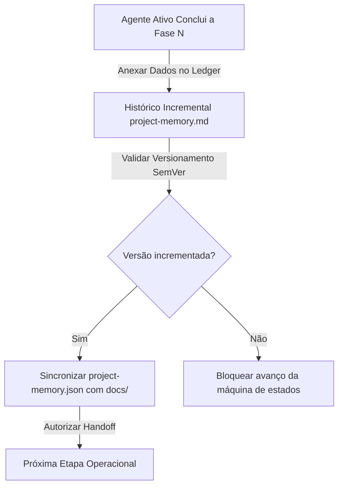
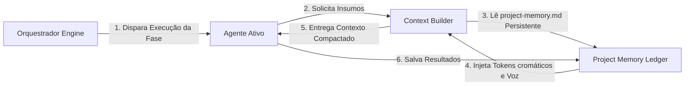

# Registro de Memória Permanente do Projeto (Project Memory)

> **KDL Landing Framework — Core Operacional**
> **Tipo:** Sistema de Ledger e Registro de Memória (Project Memory Engine)
> **Mandato:** Registrar, consolidar, versionar e auditar todas as decisões importantes de marca, estilo, copy, interações e infraestrutura de forma imutável e incremental.

---

## 1. Introdução

O **Project Memory** é o livro-razão (ledger) permanente de decisões do KDL Landing Framework. Sua finalidade é assegurar que nenhuma decisão estratégica aprovada em portões de qualidade anteriores seja perdida ou ignorada pelos agentes durante o desenvolvimento físico da landing page. Funcionando como a memória de longo prazo do projeto, este documento registra a evolução de ideias, o histórico de alterações (rollbacks e refatorações), a integridade geométrica de assets e a parametrização técnica, garantindo consistência criativa e arquitetural total.

---

## 2. Conceitos Fundamentais

A arquitetura de memória do KDL Landing Framework baseia-se nas seguintes classificações e escopos de dados:

* **Memória (Memory):** O registro permanente de fatos, decisões criativas e dados de configuração de um projeto salvos no disco rígido.
* **Memória Permanente (Permanent Memory):** Informações imutáveis após a aprovação de seus respectivos gates (ex: a paleta 60-30-10 do Design System, a Big Idea da Direção Criativa e o tom verbal do Brand Strategy).
* **Memória Temporária (Temporary Context):** Estados e rascunhos de código locais gerados durante as sessões de desenvolvimento que não afetam a estrutura global.
* **Memória Compartilhada (Shared Memory):** Variáveis e estados acessíveis por todos os agentes em tempo real durante a execução da esteira (ex: o score DFII).
* **Memória do Projeto (Project Memory):** O arquivo de dados consolidado em formato Markdown/JSON (`docs/projects/project-memory.json` ou equivalente).
* **Memória Histórica (Historic Memory):** O log sequencial de versões de alteração contendo a data, o agente responsável e o impacto de cada refatoração.
* **Memória de Execução (Execution Memory):** Logs operacionais gerados durante os builds (avisos, tempos de compilação, bugs resolvidos).
* **Memória Arquivada (Archived Memory):** Registros de ideias descartadas, direções de arte rejeitadas pelo índice DFII e versões legadas de código para fins de auditoria de histórico.

---

## 3. Descoberta Dinâmica de Skills (Orquestração de Memória)

Para gerenciar, versionar e pesquisar de forma eficiente a base de conhecimento do projeto, o Project Memory utiliza-se das seguintes capacidades detectadas no ambiente:

* **Skills de Gestão de Memória e Estados (`context-management-context-save`, `context-management-context-restore`):**
  * *Justificativa:* Salvam o estado semântico de decisões e as restauram de forma limpa a cada passagem de fase do projeto.
* **Skills de Versionamento e Automação Git (`smart-git-automation`):**
  * *Justificativa:* Automatizam o versionamento do histórico de alterações, registrando a autoria e os commits correspondentes às revisões da memória.
* **Skills de Otimização e Compactação de Tokens (`zipai-optimizer`, `zipai-optimizer`):**
  * *Justificativa:* Minificam a base de logs em JSON, garantindo que a memória persistente consuma o mínimo possível de espaço na janela do prompt da IA.
* **Skills de Auditoria e Qualidade (`vibe-code-auditor`, `code-reviewer`):**
  * *Justificativa:* Inspecionam se a memória apresenta inconsistências cromáticas ou conflitos conceituais entre agentes.

---

## 4. Objetivos da Memória Permanente

A imposição de um diário de bordo estruturado busca salvaguardar:

1. **Coerência Conceitual:** Garantir que o programador implemente exatamente a Big Idea visual aprovada pelo Art Director na Fase 05.
2. **Consistência Estética:** Impedir que fontes ou cores ad-hoc sejam injetadas nas seções Bento da interface.
3. **Continuidade de Processamento:** Permitir que uma IA de desenvolvimento retome o trabalho de outra IA de planejamento sem precisar ler dezenas de páginas de briefing bruto do Discovery.
4. **Justificativa de Decisões:** Manter o registro do porquê certas direções visuais complexas foram descartadas (ex: reprovação de efeito parallax 3D pesado devido a estouro do orçamento de performance de LCP).

---

## 5. Estrutura de Dados do Project Memory

O arquivo de memória do projeto deve ser mantido de forma híbrida: um documento de resumo visual em Markdown para leitura rápida humana, e um payload JSON estruturado de dados estritos para leitura/escrita automatizada de agentes de IA.

### Schema de Dados JSON (Modelo de Memória)

```json
{
  "projectMeta": {
    "clientId": "premium-burger",
    "clientName": "Premium Burger House",
    "segment": "Gastronomia / Hamburgueria Artesanal",
    "projectVersion": "1.1.0",
    "lastUpdate": "2026-07-29T11:12:00Z",
    "status": "IMPLEMENTATION",
    "kdlFrameworkVersion": "1.2.0"
  },
  "branding": {
    "brandName": "Premium Burger House",
    "brandArchetypes": ["O Criador", "O Rebelde"],
    "brandTone": "Sóbrio, sensorial, focado na brasa e na fumaça",
    "brandUVP": "Hambúrgueres artesanais de carne Angus certificada grelhados a ferro e fogo",
    "brandGoldenCircle": {
      "why": "Criar experiências gastronômicas rústicas e inesquecíveis",
      "how": "Utilizando grelha a carvão e blends de carne fresca moída diariamente",
      "what": "Burgers premium com insumos artesanais locais"
    }
  },
  "designTokens": {
    "visualDirection": "Industrial Utilitarian",
    "colorSystem": {
      "bgPrimary_60": "#0c0c0e",
      "bgSecondary": "#141418",
      "textPrimary_30": "#f5f5f7",
      "textMuted": "#a1a1aa",
      "accent_10": "#d35400",
      "accentHover": "#e67e22",
      "contrastRatio": "6.2:1"
    },
    "typography": {
      "displayFont": "Oswald",
      "displaySource": "Google Fonts",
      "bodyFont": "Plus Jakarta Sans",
      "bodySource": "Google Fonts",
      "fontScaleClamp": {
        "textHero": "clamp(2.8rem, 6vw, 5.5rem)",
        "textH2": "clamp(2rem, 4vw, 3.2rem)",
        "textBody": "clamp(0.95rem, 1.2vw, 1.15rem)"
      }
    },
    "geometry": {
      "baseUnit": 8,
      "containerMax": 1200,
      "borderRadius": {
        "card": 16,
        "button": 8
      }
    }
  },
  "motionAndCinematic": {
    "scrollSmoothing": {
      "library": "Lenis",
      "lerp": 0.1,
      "duration": 1.2
    },
    "parallaxLayers": {
      "bgSpeed": 0.2,
      "fgSpeed": 1.4
    },
    "lensEffects": {
      "dollyScale": 1.25,
      "blurScrubbing": true
    },
    "logoIntroDuration": 2000
  },
  "assetsInventory": {
    "logoSVGPath": "src/assets/images/logo-vetorial.svg",
    "logoSafeArea": 24,
    "images": [
      {
        "fileName": "burger-hero.webp",
        "sizeBytes": 115000,
        "aspectRatio": "16:9",
        "alt": "Hambúrguer de costela bovina grelhado na brasa com queijo derretido e fumaça de fundo"
      }
    ]
  },
  "uiArchitecture": {
    "sectionsSequence": [
      "Hero Dobra de Entrada",
      "Conceito de Blends (Storytelling)",
      "Bento Grid Diferenciais",
      "Depoimentos e Provas Sociais",
      "Formulário de Conversão e Contato",
      "FAQ & Rodapé"
    ],
    "bentoGeometry": {
      "cardsCount": 4,
      "gap": 24
    }
  },
  "seoAndMetadata": {
    "metaTitle": "Premium Burger House | Burgers Artesanais Grelhados a Ferro e Fogo",
    "metaDescription": "Experimente blends de carne Angus certificada grelhados na brasa com molhos autorais. Faça seu pedido em Curitiba.",
    "jsonLdSchemaType": "LocalBusiness",
    "sitemapActive": true
  },
  "performanceBudgets": {
    "lighthousePerformanceTarget": 90,
    "lighthouseOthersTarget": 95,
    "maxDomNodes": 800,
    "maxImagesCount": 10
  },
  "publication": {
    "vercelUrl": "https://premium-burger.vercel.app",
    "githubRepo": "kdl-system/premium-burger-landing",
    "deployDate": "2026-07-29T11:12:00Z"
  }
}
```

---

## 6. Histórico Incremental de Alterações (Ledger Protocol)

Toda alteração de escopo, design ou copy realizada durante o projeto deve ser anexada de forma cronológica no diário de bordo. O Project Memory proíbe a substituição simples de dados sem o registro da mudança.

### Estrutura de Log de Revisão
```json
{
  "revisionHistory": [
    {
      "date": "2026-07-29T11:00:00Z",
      "phase": "07-implementation",
      "agent": "Implementation Agent",
      "fileModified": "docs/03-design-system.md",
      "reason": "Queda de framerate (38fps) em dispositivos de baixo desempenho devido a gradientes em mesh animados via CSS",
      "changeDescription": "Substituição do gradiente animado por gradiente de cor estático linear escuro",
      "impact": "Desempenho visual de animação estabilizado em 60fps constantes",
      "result": "Aprovado no Development Gate com score DFII recalculado para 10"
    }
  ]
}
```

---

## 7. Protocolo de Consulta e Sincronização

Durante a execução da landing page, os agentes devem interagir com a memória seguindo as seguintes regras de sincronia:

```
                  ┌──────────────────────┐
                  │ framework-loader.md  │
                  └──────────┬───────────┘
                             │
                             ▼
     [Agente ativo lê project-memory.md e handoff matrix]
                             │
                             ▼
                [Executa a fase de trabalho]
                             │
                             ▼
        [Grava novos dados gerados no project-memory.md]
                             │
                             ▼
           [Atualiza CHANGELOG.md e task.md]
```

1. **Fase de Ingestão (Leitura):** No início da fase, o agente lê `core/project-memory.md` para entender as restrições da marca e os tokens cromáticos antes de escrever especificações ou códigos.
2. **Fase de Gravação (Escrita):** Ao gerar os entregáveis da fase, o agente anexa seus dados no JSON de memória do projeto, gerando um commit incremental no repositório.
3. **Fase de Sincronia (Validação):** O orquestrador central verifica se os dados persistidos no JSON de memória de projeto são condizentes com os arquivos Markdown físicos presentes na pasta `docs/`.

---

## 8. Resolução de Conflitos Conceituais e Visuais

Quando ocorrerem alterações em etapas avançadas que colidam com decisões estéticas anteriores (ex: o programador quer trocar a tipografia Display para Inter devido a atrasos de renderização de CDN), o orquestrador impõe a seguinte matriz de resolução:

* **Conflito de Branding (Copy vs Design):** A proposta de valor e aBig Idea dominam. A estilização visual do design system deve se adequar para dar contraste de leitura ao texto da copy, nunca o contrário.
* **Conflito de Motion (Experiência vs Performance):** O orçamento de desempenho do Manifesto KDL domina. Se o efeito parallax 3D planejado no Experience Design violar as metas de Lighthouse Performance (score < 90), o efeito deve ser simplificado e a alteração registrada no histórico da memória.
* **Procedimento de Alteração Autorizada:**
  1. A IA desenvolvedora não pode alterar as variáveis do `tokens.css` diretamente.
  2. Ela deve disparar uma requisição de re-avaliação, atualizando o arquivo de design system (`design-system.md`).
  3. Registra o conflito e o ajuste no JSON do `project-memory.md`.
  4. O Orquestrador homologa o novo token e libera a implementação do código físico.

---

## 9. Diagramas Mermaid de Integração

### A. Fluxo de Atualização da Memória



### B. Integração de Memória com Orquestrador e Context Builder



---

## 10. Boas Práticas de Gestão de Memória

* **Imutabilidade de Histórico:** Nunca apague ou sobrescreva logs antigos de revisões (`revisionHistory`). Eles são necessários para rastrear a estabilidade do código.
* **Justificativas Factuais:** Ao registrar uma mudança no diário de bordo, indique a causa física da alteração (ex: trocar WebP por AVIF devido a aviso de carregamento de imagem na auditoria Lighthouse).

---

## 11. Anti-Patterns de Memória

* ❌ **Apagar Memória (Ledger Purging):** Limpar o histórico de rollbacks e revisões anteriores para diminuir o tamanho do arquivo no final do projeto.
* ❌ **Ignorar Histórico de Decisões:** Permitir que o copywriter crie títulos sem verificar os limites de caracteres que foram travados nas restrições tipográficas do Design System.

---

## 12. Conclusão

O **Project Memory** é a garantia de continuidade de visão e coerência do KDL Landing Framework. Ao registrar de forma imutável as decisões de design, interações de motion, assets originais e o log de correções de bugs, ele atua como a única fonte de verdade semântica e técnica do projeto, blindando a entrega final contra desvios visuais ou quedas de performance técnica.

---

*KDL Landing Framework — A memória permanente da excelência web.*
