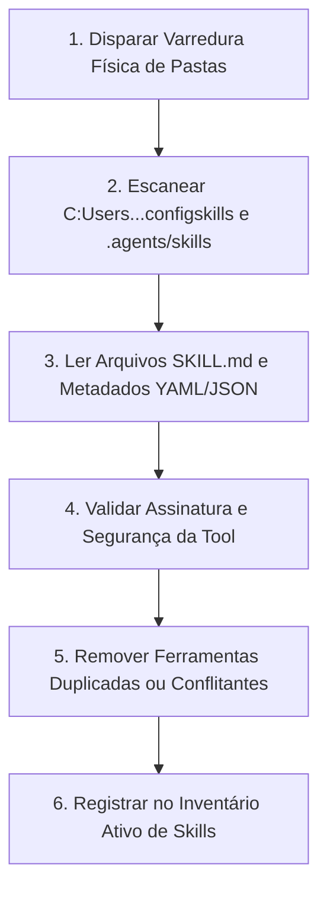
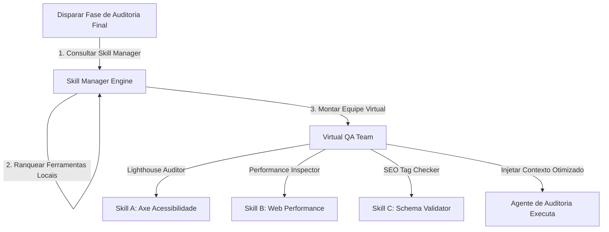
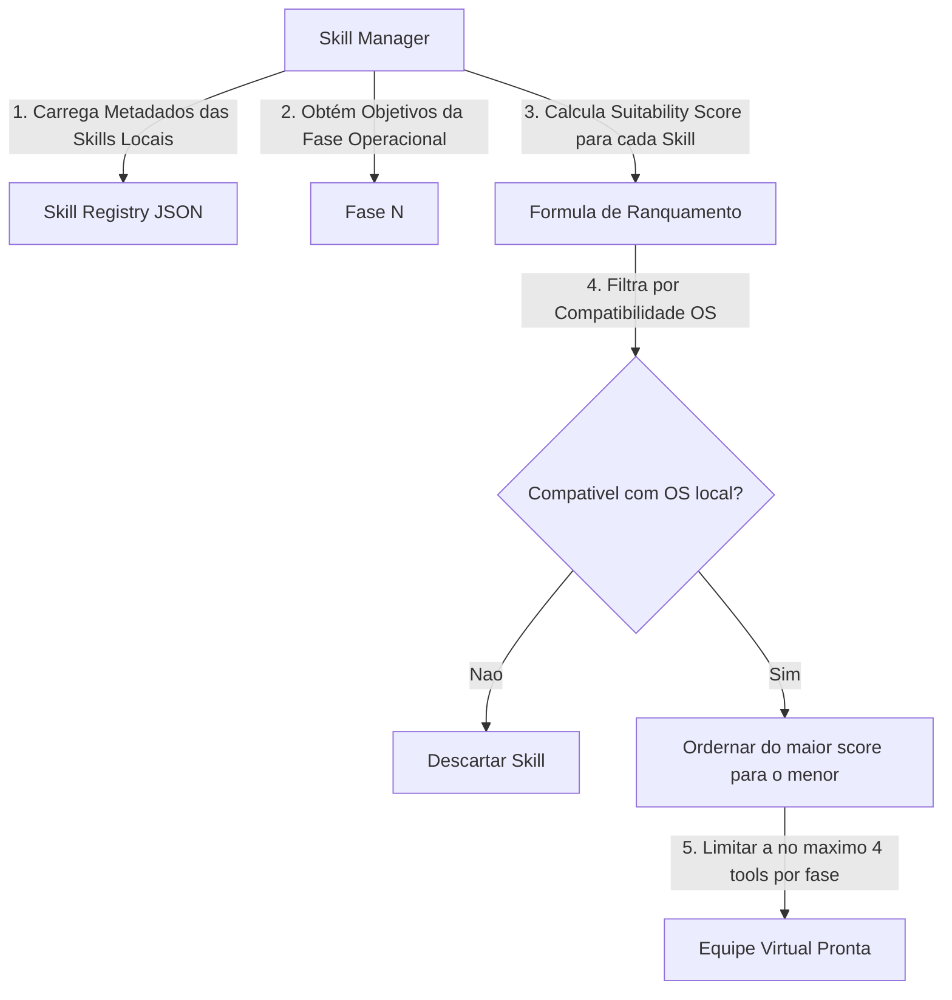

# Gerenciador de Skills do Framework (Skill Manager)

> **KDL Landing Framework — Core Operacional**
> **Tipo:** Motor de Descoberta e Orquestração de Capacidades (Skill Manager Engine)
> **Mandato:** Escanear o ambiente, indexar metadados, classificar, ranquear e distribuir dinamicamente as ferramentas (skills) locais necessárias para os agentes de execução, sem dependência de nomes de ferramentas fixos.

---

## 1. Introdução

O **Skill Manager** é o componente responsável pelo gerenciamento de ferramentas e capacidades no **KDL Landing Framework**. Sua missão é atuar como o catalogador e distribuidor de inteligências do ambiente operacional. Em vez de acoplar o framework a nomes estáticos de ferramentas, o Skill Manager implementa o **Protocolo de Descoberta Dinâmica**, analisando as configurações ativas locais no momento do boot para selecionar e justificar automaticamente o melhor conjunto de skills (Equipes Virtuais) para cada etapa do desenvolvimento.

---

## 2. Conceitos Fundamentais

A gestão de capacidades cognitivas e ferramentas no ecossistema KDL obedece às seguintes definições estruturais:

* **Skill (Habilidade / Ferramenta):** Um plugin de software ou script executável exposto pelo ambiente local que estende o poder de processamento do agente (ex: um script CLI local de testes Axe).
* **Capability (Capacidade):** O potencial de ação de um agente derivado de suas skills ativas (ex: a capacidade de auditar acessibilidade).
* **Especialização:** O nicho de atuação altamente específico de uma skill (ex: minificação de imagens WebP vs. compressão genérica).
* **Competência:** O nível de assertividade e confiabilidade de uma skill em determinado domínio com base em testes e logs.
* **Pipeline Cognitivo:** O arranjo ordenado de agentes e suas respectivas equipes de ferramentas para processar uma fase.
* **Cadeia de Especialistas:** O fluxo de handoff onde uma especialidade de inteligência entrega o bastão de dados para a próxima.
* **Skill Primária:** A ferramenta principal indispensável para a conclusão da fase (ex: compilador de código na fase de implementação).
* **Skill Secundária:** Ferramentas de suporte técnico que auxiliam a primária (ex: analisador de nós DOM).
* **Skill Complementar:** Plugins estéticos ou auxiliares não-críticos para o andamento geral (ex: buscador de paletas).
* **Skill de Auditoria:** Ferramentas dedicadas exclusivamente à verificação de regras e qualidade em portões de validação.

---

## 3. Protocolo de Descoberta Dinâmica de Skills

O Skill Manager executa uma varredura sistêmica de ferramentas baseando-se no seguinte fluxo de quatro passos de isolamento técnico:



### Regras de Compatibilidade e Conflito
* **Detecção de Duplicação:** Se duas ferramentas possuírem descrições de funcionalidade idênticas (ex: dois scrapers), o Skill Manager seleciona a ferramenta com a versão mais recente e maior índice de confiabilidade histórica no ledger.
* **Detecção de Conflitos:** Se duas skills ativas utilizarem recursos de hardware incompatíveis (ex: duas ferramentas tentando monopolizar a porta padrão de testes do browser local), o gerenciador bloqueia a execução paralela e reconfigura uma delas para rodar de forma isolada.

---

## 4. Categorias Oficiais de Habilidades

O catálogo de competências do framework é distribuído nas seguintes divisões técnicas:

1. **Arquitetura:** Planejamento e modelagem de pastas, fluxos de código e dados.
2. **UX:** Modelagem de jornada de scroll, CTAs e escaneabilidade ocular.
3. **UI:** Bento Grids, proporções de containers e geometrias.
4. **Design:** Declaração de tokens cromáticos, tipográficos e geométricos.
5. **Branding:** Definições arquetípicas e análise verbal de marcas.
6. **Copywriting:** Redação persuasiva AIDA e expurgo de AI-isms.
7. **Motion:** Timelines GSAP, ScrollTrigger e transições.
8. **SEO:** Metadados, indexabilidade e schemas JSON-LD.
9. **Performance:** Análise de repaints de GPU e minificação de bundles.
10. **Accessibility:** Auditoria WCAG 2.2 AA e navegação por teclado.
11. **Front-end:** Compilação de código HTML/CSS modular e JS nativo.
12. **Testing:** Verificações automáticas de links e validações locais de formulários.
13. **Documentation:** Geração de wikis e históricos do projeto.
14. **Automation:** Deploy seguro de produção e orquestração de infraestrutura.

---

## 5. Schema de Metadados da Habilidade (Skill Metadata JSON)

Para ser integrada e indexada pelo Skill Manager, toda ferramenta no ambiente de desenvolvimento deve possuir um arquivo de declaração de metadados em conformidade com o seguinte schema:

```json
{
  "skillId": "kdl-seo-analyzer",
  "name": "KDL SEO & Indexing Analyzer",
  "description": "Analisa tags de cabeçalho, caminhos canonical e metadados de mídias sociais locais contra regras de SEO do Google.",
  "objective": "Garantir pontuação SEO mínima de 95 no Lighthouse.",
  "category": "SEO",
  "specialty": "Indexabilidade e Tagging On-page",
  "priorityLevel": 1,
  "dependencies": ["kdl-framework-loader"],
  "compatibility": {
    "supportedOS": ["windows", "macos", "linux"],
    "requiresNodeVersion": ">=18.0.0"
  },
  "limitations": "Não realiza análises de links quebrados externos fora do domínio do projeto.",
  "cases": ["Fase 08.1 - Final Audit", "Fase 09 - Publication"],
  "rules": {
    "activePhases": ["08.1-final-audit", "09-publication"],
    "prohibitedPhases": ["01-discovery", "02-brand-strategy", "03-design-system"]
  }
}
```

---

## 6. Algoritmo de Ranking de Adequação (Skill Suitability Score)

Para selecionar automaticamente o melhor conjunto de ferramentas para uma etapa operacional, o Skill Manager aplica a **Fórmula de Ranquamento de Adequação**:

$$\text{Suitability Score} = (\text{Relevance} \times 3) + (\text{Specialization} \times 2.5) + \text{Coverage} + \text{Compatibility} - \text{Overlap Risk}$$

### Detalhamento das Variáveis do Algoritmo
* **Relevance (Relevância: 1 a 5):** Mede quão relacionada a funcionalidade da skill está com o objetivo da fase operacional ativa (ex: Relevance de compressor de imagem na fase de copy é 1; na fase de publicação é 5).
* **Specialization (Especialização: 1 a 5):** Mede se a ferramenta é focada no nicho exato (ex: compressor WebP especializado vs. minificador de arquivos zip genérico).
* **Coverage (Cobertura: 1 a 5):** Mede quantos requisitos da checklist da fase a ferramenta consegue validar ou automatizar de forma nativa.
* **Compatibility (Compatibilidade: 0 ou 1):** Flag de ambiente. Se a ferramenta não puder rodar no sistema operacional local, o valor é zero, forçando o descarte imediato.
* **Overlap Risk (Risco de Sobreposição: 0 a 5):** Penalidade aplicada se a skill tentar realizar tarefas que já estão cobertas por outra ferramenta de maior prioridade na equipe.

---

## 7. Pipeline Cognitivo ("Virtual Team" por Fase)

O orquestrador central consulta o Skill Manager antes do disparo de cada etapa para montar a **Equipe Virtual de Especialistas** ideal para o processamento:



### Composição Clássica das Equipes Virtuais

#### A. Equipe Virtual de Discovery & Branding (Fases 01 a 02)
* **UX Researcher (Skill Primária):** Para processar dores do público-alvo no briefing do cliente.
* **Market Analyst (Skill Secundária):** Analisa sites de concorrentes em tempo real.
* **Brand Strategist (Skill Primária):** Define arquétipo e travas de voz.

#### B. Equipe Virtual de Implementation & Motion (Fase 08)
* **Senior Front-end Engineer (Skill Primária):** Para a escrita de marcação semântica HTML e estruturação de grid.
* **Motion Designer (Skill Primária):** Parametriza timelines GSAP e scroll Lenis.
* **Performance Engineer (Skill Secundária):** Limita DOM nodes e otimiza repaint.
* **SEO Engineer (Skill Complementar):** Injeta schemas de LocalBusiness.

#### C. Equipe Virtual de Auditoria & QA (Fase 08.1)
* **Accessibility Auditor (Skill Primária):** Valida contraste e navegação por teclado.
* **Performance Auditor (Skill Primária):** Mede LCP, CLS e FPS.
* **Visual Reviewer (Skill Secundária):** Compara o layout físico final com o wireframe.

---

## 8. Tratamento de Conflitos e Protocolo de Fallback

Se uma skill crítica falhar ou apresentar incompatibilidade no momento do boot (ex: o auditor de acessibilidade CLI local retornou erro de execução por falta de dependência interna), o Skill Manager executa o seguinte protocolo de Fallback:

```
[Falha de Skill Primária no Boot]
               │
               ▼
[Buscar no Catálogo por Habilidade com Categoria Semelhante]
               │
               ▼
[Ranquear Alternativas] ──► [Selecionar a de maior Suitability Score]
               │
               ▼
[Reconfigurar a Equipe Virtual] ──► [Registrar na Memória do Projeto]
               │
               ▼
[Prosseguir sem Interromper a Esteira]
```

---

## 9. Diagramas Mermaid de Integração

### A. Fluxo de Seleção e Ranquamento de Skills



### B. Integração de Sistemas do Core KDL

```mermaid
graph LR
    Orch[Orquestrador Central] -->|1. Iniciar Fase| SM[Skill Manager]
    SM -->|2. Descobrir e Ranquear| VR[Virtual Team JSON]
    VR -->|3. Justificar Escolhas| CB[Context Builder]
    CB -->|4. Grava Selecao na Memoria| PM[Project Memory Ledger]
    PM -->|5. Autoriza Execucao| Agent[Agente Ativo da Fase]
```



---

## 10. Boas Práticas de Gestão de Ferramentas

* **Descobrir Sempre Dinamicamente:** Nunca declare no código do programador comandos estáticos de ferramentas específicas. Permita que a IA selecione localmente a skill adequada no momento da execução.
* **Justificar Escolhas:** Exija que o relatório de inicialização (Handoff Matrix) do Loader detalhe o motivo pelo qual a equipe virtual foi montada com as ferramentas indicadas.

---

## 11. Anti-Patterns de Skills

* ❌ **Acoplamento Rígido de Fornecedor (Vendor Lock-in):** Projetar o framework de tal forma que ele se recuse a rodar caso um plugin específico de IA não seja localizado no ambiente.
* ❌ **Monopolização de Funções:** Utilizar uma skill especializada em copywriting para tomar decisões sobre layouts geométricos ou compilação de código.

---

## 12. Exemplo Prático de Inicialização de Equipe (Fase de Auditoria)

Abaixo está exemplificada a resposta estruturada gerada pelo Skill Manager no console durante o boot da Fase 08.1:

```markdown
# Relatório de Inicialização de Equipe Virtual (KDL-RUN-90218)

## 1. Fase Operacional: 08.1-final-audit
* **Sistema Operacional Detectado:** Windows (PowerShell Shell)
* **Skills Totais Identificadas no Diretório Local:** 45 tools

## 2. Equipe Virtual de Especialistas Montada
* **Lighthouse Auditor (Skill Primária):**
  * *Ferramenta Selecionada:* `local-axe-core-scanner`
  * *Justificativa:* Identificada compatibilidade total com o motor local. Conseguirá validar 100% dos portões de acessibilidade.
  * *Suitability Score:* 14.5
* **Performance Inspector (Skill Primária):**
  * *Ferramenta Selecionada:* `local-lighthouse-cli`
  * *Justificativa:* Fornece a leitura exata de CWV em conexão simulada de celular de forma assíncrona.
  * *Suitability Score:* 13.0

## 3. Conflitos e Exclusões Registradas
* *Skill Excluída:* `generic-link-verifier` -> Omitida devido a overlap de função (Axe Core já executa auditoria de links de forma nativa).
```

---

## 13. Conclusão

O **Skill Manager** é a peça que confere universalidade e independência técnica ao KDL Landing Framework. Ao escanear dinamicamente o ambiente do desenvolvedor, classificar metadados de forma lógica e distribuir ferramentas baseando-se em algoritmos de ranqueamento matemático e regras de compatibilidade, ele assegura que o ecossistema opere com máxima eficiência técnica, mantendo-se agnóstico a plataformas ou pacotes de software estáticos.

---

*KDL Landing Framework — Inteligência dinâmica a serviço da flexibilidade.*
