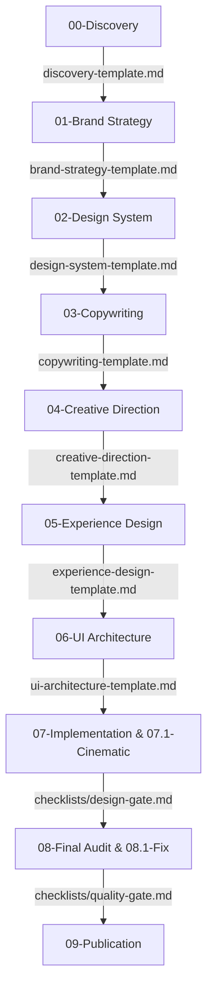

# Fluxo Operacional de Projetos (Workflow)

> **KDL Landing Framework — Guia Operacional**
> Este documento descreve as etapas de execução de ponta a ponta e a cadeia de dependências entre documentos que governam a produção de Landing Pages.

---

## 1. Visão Geral do Fluxo de Trabalho

A produção de Landing Pages sob o **KDL Landing Framework** segue um processo linear de qualidade estrita. Diferente do desenvolvimento convencional, onde design e código ocorrem de forma solta, a metodologia KDL exige que cada etapa alimente matematicamente e textualmente a próxima.

---

## 2. Cadeia de Alimentação e Dependências

Nenhum documento é independente. A tabela abaixo especifica como a saída de uma etapa atua como entrada obrigatória (alimentação) da fase seguinte:

| Fase Origem | Documento Gerado | Fase Destino | Como alimenta a próxima fase? |
| :--- | :--- | :--- | :--- |
| **00: Discovery** | `discovery.md` | **01: Brand Strategy** | Fornece as dores do público-alvo e os diferenciais comerciais do cliente. |
| **01: Brand Strategy** | `brand-strategy.md` | **02: Design System** | Determina o tom de voz da marca, definindo a escolha tipográfica e paleta cromática. |
| **02: Design System** | `design-system.md` | **03: Copywriting** | As restrições tipográficas e limites de tamanho ditam o tamanho máximo de caracteres dos títulos. |
| **03: Copywriting** | `copywriting.md` | **04: Creative Direction** | A narrativa AIDA e a proposta de valor inspiram o conceito visual da âncora de design. |
| **04: Creative Direction**| `creative-direction.md`| **05: Experience Design** | A âncora estética e o score DFII validam as transições de scroll viáveis de animação. |
| **05: Experience Design** | `experience-design.md` | **06: UI Architecture** | O roteiro cinematográfico orienta a montagem das linhas e colunas do Grid Bento. |
| **06: UI Architecture** | `ui-architecture.md` | **07: Implementation** | O wireframe e as especificações geométricas guiam a codificação de CSS Grid/Flexbox sem ad-hocs. |
| **07: Implementation** | `index.html` / `style.css` | **08: Final Audit** | O código pronto é submetido aos testes de Core Web Vitals, WCAG e SEO. |

---

## 3. Gestão e Evolução da Documentação

A documentação do projeto cresce de forma incremental durante a execução. Ela deve ser atualizada em tempo real para evitar que o código de produção desvie do planejado.

### Protocolo de Alterações Visuais ou de Engenharia
1. **Inspeção de Vias:** Caso durante a fase de código (Fase 07) a IA executora note um problema de performance com uma transição planejada, ela não deve simplesmente alterar o CSS diretamente.
2. **Atualização do Plano:** Primeiro, a IA deve atualizar o Memorial de Direção Criativa (`creative-direction.md`) reduzindo a complexidade de transição, recalculando o score DFII.
3. **Validação do Portão:** Em seguida, atualiza o arquivo de especificações da UI (`ui-architecture.md`) antes de alterar o código de fato, registrando o motivo no histórico de mudanças local.

---

## 4. Portões de Validação e Publicação

A transição entre blocos de fases ocorre através de portões de qualidade rígidos:
* **Fases 00 a 03:** Finalizam com a aprovação da Cópia Mestre (Copy Check).
* **Fases 04 a 06:** Exigem a aprovação do [design-gate.md](file:///c:/Framework/checklists/design-gate.md).
* **Fase 07:** Exige a aprovação do [development-gate.md](file:///c:/Framework/checklists/development-gate.md).
* **Fase 08:** Exige a aprovação do [quality-gate.md](file:///c:/Framework/checklists/quality-gate.md) e auditoria de performance.
* **Fase 09:** Exige a aprovação do [publication-gate.md](file:///c:/Framework/checklists/publication-gate.md) para liberação final do deploy HTTPS.

---

## 5. Boas Práticas vs. Anti-Patterns (Más Práticas)

### Boas Práticas
* **Versionamento Semântico da Documentação:** Cada alteração estrutural no projeto deve incrementar a versão local da landing page no cabeçalho do arquivo de auditoria.
* **Revisão de Pares (Human-in-the-loop):** A IA deve parar e solicitar feedback do operador humano sempre que um portão de qualidade apresentar score de viabilidade de design (DFII) limítrofe.

### Anti-Patterns
* ❌ **Executar Código sem Mockups:** Escrever classes CSS antes de preencher a folha de Design Tokens e especificar a grade Bento.
* ❌ **Ignorar Histórico de Auditorias:** Deixar de salvar as pontuações e erros de acessibilidade corrigidos, impossibilitando a manutenção futura do site.

---

## 6. Referências Cruzadas
* Consulte [docs/methodology.md](file:///c:/Framework/docs/methodology.md) para entender a cognição de raciocínio de cada fase.
* Consulte [docs/development-lifecycle.md](file:///c:/Framework/docs/development-lifecycle.md) para obter o mapeamento cronológico completo.
* Consulte [MANIFESTO.md](file:///c:/Framework/MANIFESTO.md) para alinhar a execução do projeto com os valores morais KDL.
