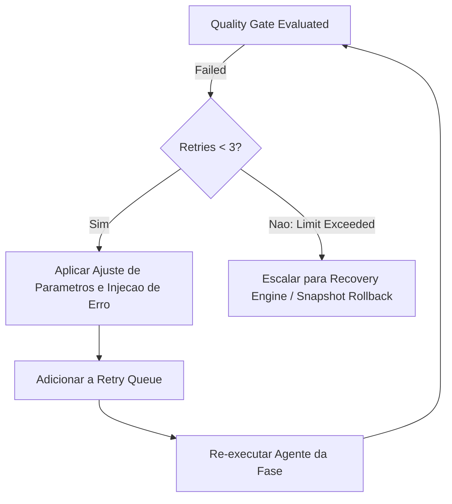
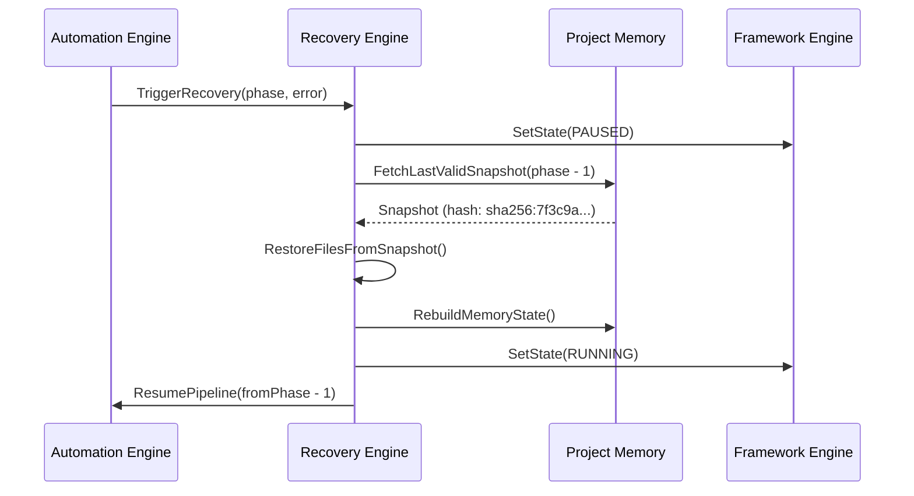
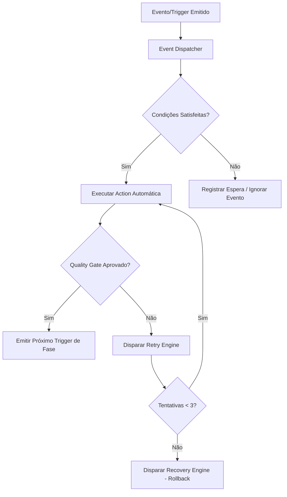
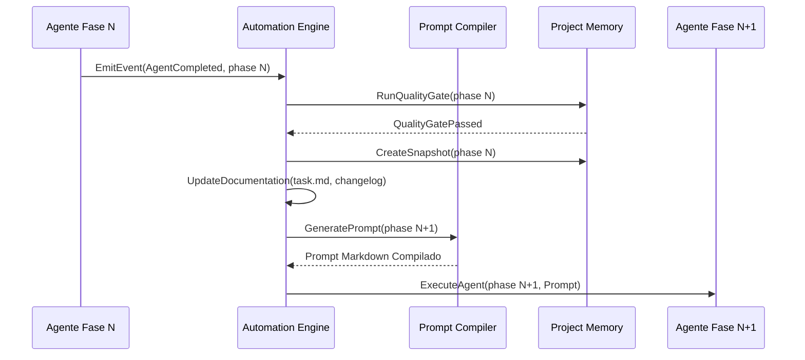

# Motor de Automação do Framework (Automation Engine)

> **KDL Landing Framework — Camada de Automação (Engine Layer)**
> **Tipo:** Sistema de Automação Reativa, Disparo de Eventos e Orquestração Sem Intervenção Manual (Automation Engine)
> **Mandato:** Garantir que o KDL Landing Framework opere de maneira 100% autônoma e determinística a partir da emissão dos insumos iniciais. Nenhum processo reutilizável ou encadeamento de agentes exigirá intervenção humana manual quando puder ser automatizado por regras de eventos, validação de portões e recuperação contra falhas.

---

## 1. Introdução

O **Automation Engine** é a camada de inteligência operacional e automação reativa do **KDL Landing Framework**. Enquanto o **Framework Engine** estabelece o runtime, o estado global e o pipeline de execução, o Automation Engine atua como o sistema nervoso central que reage a eventos em tempo real, avalia condições lógicas, aciona ações automáticas (como disparo de agentes, compilação de prompts, auditoria e retentativas) e gerencia filas assíncronas sem necessidade de intervenção humana desnecessária.

Com o Automation Engine:
* Cada etapa concluída dispara automaticamente a compilação do contexto e do prompt da próxima etapa.
* Falhas em Quality Gates disparam protocolos automáticos de Retry com backoff inteligente e reajustes de parâmetros.
* Falhas críticas despoletam rotinas autônomas de Recovery via restauração de Snapshots e reconstrução de contexto/memória.
* Toda ação, decisão e transição é 100% rastreável, reproduzível e auditável por meio de logs de eventos.

---

## 2. Conceitos Fundamentais de Automação

O Automation Engine baseia-se nas seguintes abstrações atômicas:

| Conceito | Definição |
|---|---|
| **Automation** | O princípio de executar pipelines de trabalho sem dependência de intervenção humana em tarefas repetitivas ou previsíveis. |
| **Workflow Automation** | A automação do fluxo completo de ponta a ponta (do Discovery ao Deploy). |
| **Task Automation** | A automação de tarefas individuais dentro de cada fase (ex: geração de prompts, salvamento de metadados). |
| **Execution Automation** | A invocação automática de Agentes e scripts de processamento sob o runtime. |
| **Decision Automation** | A tomada de decisões lógicas baseada no cumprimento rigoroso de regras e checagens estritas do Project Memory e Quality Gates. |
| **Validation Automation** | A execução autônoma de suítes de validação visual, WCAG 2.2 AA, Lighthouse e testes de integridade de código. |
| **Pipeline Automation** | A transição fluida e encadeada entre todas as 12 fases do KDL Landing Framework. |
| **Retry Automation** | O reagendamento autônomo de fases reprovadas com aplicação de correções direcionadas. |
| **Recovery Automation** | A recuperação automática de estados anteriores válidos (Snapshots) em casos de inconsistência de contexto ou erro não-recuperável. |
| **Deployment Automation** | O empacotamento e publicação autônoma do build validado em infraestrutura de produção com checagem HTTP 200. |
| **Audit Automation** | A geração autônoma de relatórios de auditoria, walkthroughs, changelogs e inventários de tasks. |

---

## 3. Descoberta Dinâmica de Skills (Orquestração de Automação)

O Automation Engine consulta dinamicamente o **Skill Manager** para carregar a equipe virtual de automação e monitoramento:

* **Skills de Automação de Tarefas e Workflows (`workflow-automation`, `task-management`):**
  * *Justificativa:* Gerenciam a fila de execução, despachamento de triggers e encadeamento assíncrono de eventos.
* **Skills de Engenharia de Estado e Raciocínio (`reasoning`, `state-machine`):**
  * *Justificativa:* Avaliam a satisfação de condições complexas antes de liberar ações automáticas.
* **Skills de Auditoria e Qualidade (`quality-assurance`, `code-reviewer`):**
  * *Justificativa:* Disparam validações automáticas e aplicam correções no Retry Engine.
* **Skills de Documentação e Rastreabilidade (`documentation-generation`, `changelog-automation`):**
  * *Justificativa:* Atualizam os arquivos de inventário (`task.md`, `walkthrough.md`, `CHANGELOG.md`) de forma 100% autônoma a cada marco superado.

---

## 4. Arquitetura Geral do Automation Engine

A arquitetura do Automation Engine é baseada no padrão **Event-Driven Architecture (EDA)** com circuito de controle fechado:

```
┌──────────────────────────────────────────────────────────────────────────┐
│                             EVENT DISPATCHER                             │
│       Captura Triggers do Framework Engine, Agentes e Quality Gates       │
└──────────────────────────────────────────────────────────────────────────┘
                                     │
                                     ▼
┌──────────────────────────────────────────────────────────────────────────┐
│                             AUTOMATION RULES                             │
│     Avalia Condições (Conditions) → Associa a Ações (Actions)            │
└──────────────────────────────────────────────────────────────────────────┘
                                     │
       ┌─────────────────────────────┼─────────────────────────────┐
       ▼                             ▼                             ▼
┌──────────────┐              ┌──────────────┐              ┌──────────────┐
│ EXECUTION    │              │ RETRY        │              │ RECOVERY     │
│ QUEUE        │              │ QUEUE        │              │ QUEUE        │
└──────────────┘              └──────────────┘              └──────────────┘
       │                             │                             │
       └─────────────────────────────┼─────────────────────────────┘
                                     ▼
┌──────────────────────────────────────────────────────────────────────────┐
│                   EXECUTION MONITOR & NOTIFIER                           │
│      Registra logs JSONL, atualiza project-memory e emite relatórios     │
└──────────────────────────────────────────────────────────────────────────┘
```

---

## 5. Biblioteca Oficial de Triggers (Eventos de Automação)

Os Triggers são os catalisadores de automação emitidos pelo runtime KDL:

| Trigger Event | Origem | Descrição |
|---|---|---|
| `ProjectCreated` | Framework Loader | Disparado quando um novo projeto é inicializado com a logo e o brief. |
| `DiscoveryCompleted` | Discovery Agent (Fase 01) | Emitido após a gravação de `docs/01-discovery.md`. |
| `BrandApproved` | Brand Agent (Fase 02) | Emitido após aprovação da marca e arquétipo no Gate 02. |
| `DesignApproved` | Design System Agent (Fase 03) | Emitido após validação dos tokens 60-30-10 e WCAG no Gate 03. |
| `MotionApproved` | Cinematic Agent (Fase 07.1) | Emitido após homologação do storyboard e timelines GSAP no Gate 07.1. |
| `AssetsUpdated` | Asset Manager | Disparado sempre que imagens são otimizadas/convertidas para WebP/AVIF. |
| `ContextUpdated` | Context Builder | Emitido ao compilar novo pacote de contexto para uma fase. |
| `MemoryUpdated` | Project Memory | Disparado após gravação imutável de decisões no ledger do projeto. |
| `AgentCompleted` | Agente Operacional | Emitido imediatamente após um Agente concluir seu artefato de saída. |
| `AuditFailed` | Final Audit Agent (Fase 08.1) | Disparado se o build final falhar em métricas de Lighthouse ou Core Web Vitals. |
| `AuditApproved` | Final Audit Agent (Fase 08.1) | Disparado quando Lighthouse ≥ 90, LCP ≤ 2.0s e CLS = 0.0 são confirmados. |
| `QualityGatePassed` | Gate Validator | Emitido quando um portão de qualidade de fase é 100% aprovado. |
| `QualityGateFailed` | Gate Validator | Emitido quando um portão de fase falha em um ou mais critérios estritos. |
| `DeploymentStarted` | Publication Agent (Fase 09) | Disparado ao iniciar a publicação do código de produção. |
| `DeploymentCompleted` | Publication Agent (Fase 09) | Disparado ao confirmar HTTP 200 e TTL da página de produção. |
| `ProjectFinished` | Framework Engine | Emitido ao finalizar todo o pipeline com publicação validada. |

---

## 6. Biblioteca de Conditions (Regras de Validação Logica)

As Conditions são predicados booleanos verificados antes da execução de qualquer Action:

```text
ConditionCheck:
  - FileExists("assets/logo/logo-light.svg") == TRUE
  - ProjectMemory.Get("memoryLocks.primaryColor") != NULL
  - QualityGate.Status(CurrentPhase - 1) == "PASSED"
  - DFII.Score >= 10.0
  - Lighthouse.Performance >= 90
  - Lighthouse.Accessibility >= 95
  - WCAG.ContrastRatio >= 4.5
  - OutputFile.Size > 0
```

### Principais Condições do Framework
1. `IsLogoValidated`: Confirma existência de SVG vetorizado e variações no diretório `assets/logo/`.
2. `IsPreviousStageApproved`: Garante que a fase imediatamente anterior possui status `QualityGatePassed`.
3. `IsMemoryLocked`: Verifica se arquétipo, cores 60-30-10 e Proposta Única de Valor (UVP) estão gravados no `project-memory.md`.
4. `IsDFIISuitable`: Confirma que o score de viabilidade estética e performance é maior ou igual a 10.
5. `IsBuildClean`: Garante a ausência de erros de sintaxe ou compilação em HTML/CSS/JS em `dist/`.
6. `IsAuditApproved`: Confirma aprovação total nos Core Web Vitals e acessibilidade antes da publicação.

---

## 7. Biblioteca de Actions (Ações Automáticas)

As Actions são os procedimentos executados automaticamente quando um Trigger ativa uma regra cujas Conditions são verdadeiras:

| Action | Parâmetros | Descrição |
|---|---|---|
| `LoadContext` | `(phase)` | Invocado pelo Context Builder para empacotar os documentos da fase. |
| `UpdateMemory` | `(key, value)` | Invocado pelo Project Memory para registrar decisões imutáveis. |
| `GeneratePrompt` | `(agentName, context)` | Invocado pelo Prompt Compiler para produzir o prompt em Markdown. |
| `ExecuteAgent` | `(agentName, prompt)` | Executa a IA especializada responsável pela fase. |
| `RunQualityGate` | `(phase, artifact)` | Avalia os critérios estritos de aprovação da fase. |
| `TriggerRetry` | `(phase, failedCriteria)` | Adiciona a fase à fila de retentativa com correções de parâmetros. |
| `TriggerRecovery` | `(phase, errorMsg)` | Dispara restauração de Snapshot e reconstrução de estado. |
| `UpdateDocumentation` | `(task, changelog, walkthrough)` | Atualiza os inventários de progresso do repositório automaticamente. |
| `CreateSnapshot` | `(phase, hash)` | Grava um ponto de verificação imutável no estado global. |
| `ExecuteDeploy` | `(buildPath, targetEnv)` | Publica os artefatos finais no servidor/CDN. |

---

## 8. Scheduler & Filas de Execução de Automação

O Scheduler do Automation Engine gerencia a distribuição das ações por meio de quatro filas dedicadas:

```
┌────────────────────────────────────────────────────────────────────────┐
│                        MAIN EXECUTION QUEUE                            │
│  Agenda fases do pipeline de 00 a 09 em ordem sequencial estrita       │
└────────────────────────────────────────────────────────────────────────┘
                                     │
                                     ▼
┌────────────────────────────────────────────────────────────────────────┐
│                          ASYNC PROCESS QUEUE                           │
│  Converte imagens em WebP/AVIF e gera favicons/OG Cards em background  │
└────────────────────────────────────────────────────────────────────────┘
                                     │
                                     ▼
┌────────────────────────────────────────────────────────────────────────┐
│                            RETRY QUEUE                                 │
│  Prioridade 1: Re-executa fases reprovadas com parâmetros corrigidos  │
└────────────────────────────────────────────────────────────────────────┘
                                     │
                                     ▼
┌────────────────────────────────────────────────────────────────────────┐
│                           RECOVERY QUEUE                               │
│  Prioridade Máxima: Reativa Snapshots em falhas críticas do sistema    │
└────────────────────────────────────────────────────────────────────────┘
```

### Regras do Scheduler:
* **Execução Sequencial Obrigatória:** Nenhuma fase do pipeline principal pode furar a fila sem ter satisfeito o Quality Gate da fase anterior.
* **Execução Assíncrona de Assets:** O processamento de imagens (upscaling, compressão WebP/AVIF pelo Asset Manager) ocorre em paralelo sem bloquear a elaboração de Copywriting ou Design System.
* **Fila de Prioridades:** `RECOVERY QUEUE` > `RETRY QUEUE` > `MAIN EXECUTION QUEUE` > `ASYNC PROCESS QUEUE`.

---

## 9. Retry Engine & Protocolos de Re-tentativas

O **Retry Engine** é o subsistema responsável por recuperar fases reprovadas por Quality Gates sem interromper o pipeline bruscamente:

### Regras do Retry Engine
* **Limite Máximo de Retentativas (`maxRetries`):** 3 tentativas por fase.
* **Estratégia de Backoff:**
  * Tentativa 1: Ajuste fino de prompt com injeção direta da falha específica (imediato).
  * Tentativa 2: Re-compilação do contexto com inclusão de referências adicionais de apoio (espera de 5s).
  * Tentativa 3: Redução da temperatura do modelo e simplificação das restrições visuais/copy (espera de 15s).
* **Retry Inteligente (Parcial vs Completo):**
  * **Parcial:** Se o erro for de contraste em CSS, re-executa apenas a atribuição cromática do Design System Agent.
  * **Completo:** Se a copy falhar nos requisitos do arquétipo de marca, re-executa a geração completa da fase de Copywriting.



---

## 10. Recovery Engine & Restauração de Estado

Quando o limite de retentativas é atingido ou um erro crítico de sistema ocorre (ex: corrupção de memória ou inconsistência de branding), o **Recovery Engine** assume o controle automaticamente:

### Passos da Recuperação Autônoma:
1. **Pausa do Pipeline:** O estado do runtime é alterado para `PAUSED`.
2. **Identificação do Último Snapshot Válido:** Busca o hash do snapshot imediatamente anterior à fase corrompida.
3. **Rollback de Arquivos:** Restaura os documentos em `docs/` e `assets/` correspondentes àquele snapshot.
4. **Reconstrução de Contexto e Memória:** Limpa variáveis inconsistentes no `project-memory.md` mantendo as travas validadas.
5. **Re-inicialização Segura:** Altera o estado do runtime para `RUNNING` e reinicia o pipeline a partir da fase restaurada com um prompt corrigido de salvaguarda.



---

## 11. Observabilidade e Monitoramento de Automação

O Automation Engine mantém visibilidade total de cada evento e métrica de execução em tempo real:

* **Log de Automação (`logs/automation.jsonl`):**
```json
{"timestamp":"2026-07-29T09:40:00Z","event":"TriggerFired","trigger":"DesignApproved","phase":"03-design-system","action":"LoadContext","status":"SUCCESS"}
{"timestamp":"2026-07-29T09:40:05Z","event":"ConditionVerified","condition":"IsDFIISuitable","value":true,"details":"DFII score 14.5 >= 10.0"}
{"timestamp":"2026-07-29T09:40:10Z","event":"ActionExecuted","action":"ExecuteAgent","agent":"05-creative-direction-agent","status":"RUNNING"}
```

* **Métricas Monitoradas:**
  * Tempo de resposta por Trigger (ms).
  * Taxa de sucesso de ações automáticas sem retry (target ≥ 85%).
  * Número de retentativas automáticas disparadas por fase.
  * Consumo cumulativo de tokens de IA por ciclo automatizado.

---

## 12. Regras de Automação por Etapa do Pipeline

| Fase | Trigger de Entrada | Condição de Disparo | Ações Automáticas Disparadas | Trigger de Saída |
|---|---|---|---|---|
| **00. Loader** | `ProjectCreated` | Logo SVG e brief em disco | Auditar arquivos físicos, criar inventário inicial | `QualityGatePassed(00)` |
| **01. Discovery** | `QualityGatePassed(00)` | Brief preenchido | Compilar contexto, gerar prompt 01, disparar Discovery Agent | `DiscoveryCompleted` |
| **02. Brand** | `DiscoveryCompleted` | `01-discovery.md` criado | Injetar dores do ICP, compilar prompt 02, disparar Brand Agent | `BrandApproved` |
| **03. Design System** | `BrandApproved` | UVP e arquétipo travados | Validar logo SVG, compilar prompt 03, calcular cores 60-30-10 | `DesignApproved` |
| **04. Copywriting** | `DesignApproved` | Tokens WCAG aprovados | Compilar contexto verbal, disparar Copywriting Agent, auditar clichês | `AgentCompleted(04)` |
| **05. Creative Dir.** | `QualityGatePassed(04)` | Copy mestre aprovada | Calcular DFII score, validar conceito 3D, disparar Creative Agent | `AgentCompleted(05)` |
| **06. UX Design** | `AgentCompleted(05)` | DFII ≥ 10.0 | Compilar storyboard de scroll, disparar Experience Design Agent | `AgentCompleted(06)` |
| **07. UI Arch.** | `AgentCompleted(06)` | Motion pacing definido | Validar Bento Grid, checar responsividade 320px, disparar UI Agent | `AgentCompleted(07)` |
| **07.1. Motion** | `AgentCompleted(07)` | Grid responsivo OK | Compilar timelines GSAP/Lenis, auditar scroll hijacking | `MotionApproved` |
| **08. Implementation**| `MotionApproved` | Todas as especificações OK | Otimizar mídias (Asset Manager), compilar código HTML/CSS/JS | `AgentCompleted(08)` |
| **08.1. Final Audit** | `AgentCompleted(08)` | Build em `dist/` limpo | Rodar suíte Lighthouse, testar WCAG 2.2 AA, checar Core Web Vitals | `AuditApproved` |
| **09. Publication** | `AuditApproved` | Lighthouse ≥ 90, LCP ≤ 2.0s | Realizar deploy de produção, verificar HTTP 200, finalizar projeto | `DeploymentCompleted` |

---

## 13. Integração com Componentes do Core e Engines

```
┌──────────────────────────────────────────────────────────────────────┐
│                          AUTOMATION ENGINE                           │
└──────────────────────────────────────────────────────────────────────┘
     │            │             │            │            │
     ▼            ▼             ▼            ▼            ▼
┌──────────┐ ┌──────────┐ ┌──────────┐ ┌──────────┐ ┌──────────┐
│Framework │ │Framework │ │Prompt    │ │Project   │ │Asset     │
│Engine    │ │Orchestr. │ │Compiler  │ │Memory    │ │Manager   │
│(Runtime) │ │(State)   │ │(Prompts) │ │(Ledger)  │ │(Media)   │
└──────────┘ └──────────┘ └──────────┘ └──────────┘ └──────────┘
```

* **Framework Engine:** Recebe comandos de atualização de estado, emissão de eventos e execução de fases.
* **Framework Orchestrator:** Consultado para validar a matriz de dependências de transição entre estados.
* **Prompt Compiler:** Invocado automaticamente para gerar novos prompts Markdown à medida que novas fases iniciam.
* **Project Memory:** Atualizado automaticamente com snapshots, travas de decisão e hashes imutáveis.
* **Asset Manager:** Acionado de forma assíncrona para compressão WebP/AVIF e validação de SVG.
* **Design Intelligence:** Invocado para cálculo automático do DFII score antes de aprovar o Gate 05.

---

## 14. Diagramas Mermaid do Automation Engine

### A. Fluxo Geral de Automação Reativa (Event Loop)



### B. Ciclo de Automação Completo entre Fases



---

## 15. Boas Práticas de Automação

* **Automação Transparente:** Toda ação automática deve gerar uma entrada correspondente no log `logs/automation.jsonl`.
* **Idempotência de Ações:** Executar uma Action duas vezes com os mesmos parâmetros deve produzir exatamente o mesmo resultado sem corromper o estado do projeto.
* **Garantia de Checkpoints:** Jamais avance para a próxima fase automatizada sem antes salvar o Snapshot imutável no `project-memory.md`.
* **Fail-Safe Defaults:** Em caso de dúvida sobre a integridade de uma condição, a automação deve pausar com segurança e solicitar confirmação.

---

## 16. Anti-Patterns de Automação

* ❌ **Loops Infinitos de Retry:** Tentar re-executar uma fase sem alterar os parâmetros de contexto ou temperatura da IA.
* ❌ **Deploy Automático sem Auditoria:** Executar a publicação em produção sem passar pelo portão bloqueante da Fase 08.1 (Lighthouse / Core Web Vitals).
* ❌ **Decisões Ocultas:** Alterar variáveis de branding ou cores no Project Memory sem emitir o evento `MemoryUpdated`.
* ❌ **Execução Concorrente Conflitante:** Iniciar dois Agentes que alteram a mesma especificação de layout simultaneamente.

---

## 17. Exemplo Prático de Execução Automatizada

```
[2026-07-29T10:00:00Z] [AutomationEngine] EventReceived: ProjectCreated (Client: Premium Burger House)
[2026-07-29T10:00:01Z] [AutomationEngine] ConditionVerified: IsLogoValidated = TRUE (SVG encontrado)
[2026-07-29T10:00:02Z] [AutomationEngine] ActionExecuted: LoadContext("00-loader")
[2026-07-29T10:00:05Z] [AutomationEngine] ActionExecuted: GeneratePrompt("01-discovery-agent")
[2026-07-29T10:00:06Z] [AutomationEngine] ActionExecuted: ExecuteAgent("01-discovery-agent")
[2026-07-29T10:15:00Z] [AutomationEngine] EventReceived: DiscoveryCompleted (docs/01-discovery.md gerado)
[2026-07-29T10:15:02Z] [AutomationEngine] ActionExecuted: RunQualityGate("01-discovery") -> PASSED
[2026-07-29T10:15:03Z] [AutomationEngine] ActionExecuted: CreateSnapshot("01-discovery", hash: "sha256:8a1c3f...")
[2026-07-29T10:15:04Z] [AutomationEngine] ActionExecuted: UpdateDocumentation("task.md", "CHANGELOG.md")
[2026-07-29T10:15:05Z] [AutomationEngine] EventEmitted: QualityGatePassed("01-discovery") -> Auto-triggering Phase 02 (Brand Strategy)
```

---

## 18. Conclusão

O **Automation Engine** consolida a autonomia operacional do **KDL Landing Framework**. Ao transformar o encadeamento de agentes em um sistema totalmente orientado a eventos com validações estritas de regras, tratamento autônomo de retentativas e mecanismos de recuperação via snapshots, ele garante a produção de Landing Pages de alta conversão e estética cinemática com previsibilidade, velocidade e rastreabilidade total.

---

*KDL Landing Framework — A automação regida pelo determinismo e pela excelência.*
