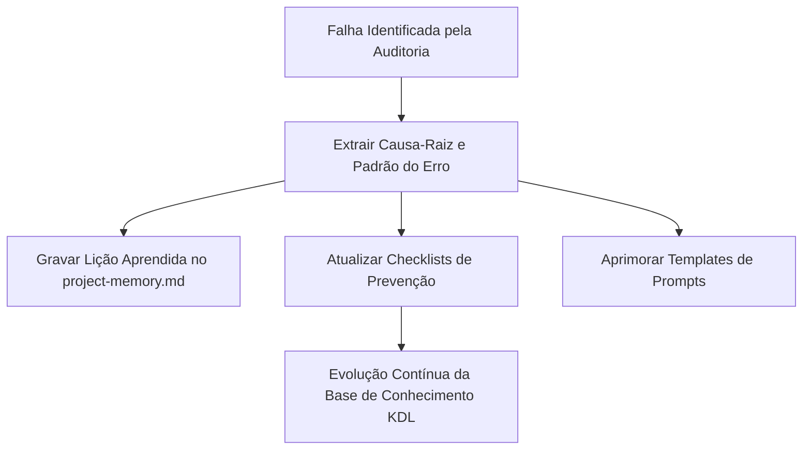
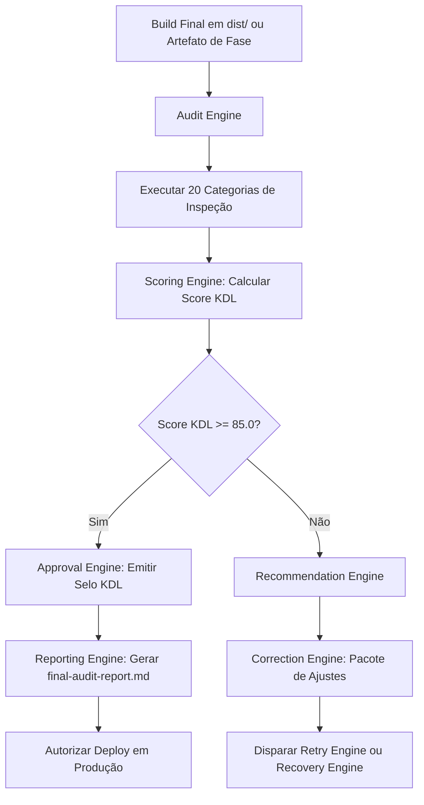
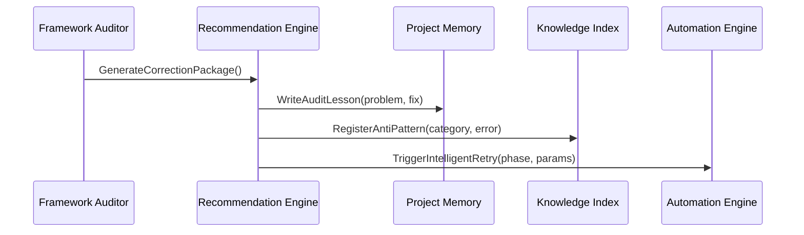

# Motor de Auditoria do Framework (Framework Auditor)

> **KDL Landing Framework — Camada de Auditoria e Qualidade (Engine Layer)**
> **Tipo:** Autoridade Suprema de Validação, Scoring de Projetos e Feedback Continuo (Framework Auditor)
> **Mandato:** Garantir que nenhuma Landing Page produzida pelo KDL Landing Framework seja publicada sem atingir o padrão de excelência internacional (Awwwards / FWA level). O Framework Auditor é a autoridade máxima de inspeção técnica, estética, estratégica e funcional de todo o framework.

---

## 1. Introdução

O **Framework Auditor** é o Diretor de Qualidade (Chief Quality Inspector) do **KDL Landing Framework**. Sua missão é submeter cada artefato, especificação de layout, linha de código HTML/CSS/JS, asset de mídia e métrica de performance a um escrutínio implacável antes de homologar a publicação em produção.

O Auditor atua em dois níveis simultâneos:
1. **Auditoria de Fase (Quality Gates):** Inspeções intermediárias ao final de cada uma das 12 fases do pipeline para liberar a transição.
2. **Auditoria Final de Produção (Final Gate 08.1):** Uma suíte de testes de 360 graus que avalia o produto final compilado contra padrões internacionais de usabilidade, acessibilidade (WCAG 2.2 AA), performance (Lighthouse ≥ 90, LCP ≤ 2.0s, CLS = 0.0), protagonismo de marca e SEO.

Nenhum deploy é efetuado sem a assinatura digital de aprovação emitida por este motor.

---

## 2. Conceitos Fundamentais

O Framework Auditor opera sob as seguintes abstrações de qualidade:

| Conceito | Definição |
|---|---|
| **Audit Engine** | O motor central de inspeção que executa as baterias de testes em cada camada do projeto. |
| **Validation Engine** | O módulo que verifica se as pré e pós-condições técnicas de cada fase foram satisfeitas. |
| **Quality Gates** | Portões de segurança com critérios bloqueantes posicionados entre cada etapa do pipeline. |
| **Scoring Engine** | O sistema de ponderação matemática que calcula o Score KDL (0 a 100) da Landing Page. |
| **Recommendation Engine** | O gerador de relatórios prescritivos que mapeia o problema, a causa, o impacto e a solução exata. |
| **Correction Engine** | O mecanismo que formata as requisições de correção para o Retry Engine do Automation Engine. |
| **Approval Engine** | O módulo emissor do certificado digital de publicação (Deploy Authorization). |
| **Reporting Engine** | O compilador de relatórios técnicos em Markdown/JSON (`reports/final-audit-report.md`). |
| **Knowledge Feedback Engine** | O circuito de retroalimentação que registra lições aprendidas no `project-memory.md` e `knowledge/index.md`. |

---

## 3. Descoberta Dinâmica de Skills (Orquestração de Auditoria)

O Framework Auditor recruta dinamicamente as seguintes habilidades locais via Skill Manager:

* **Skills de Garantia de Qualidade e Revisão de Arquitetura (`quality-assurance`, `architect-review`):**
  * *Justificativa:* Validam a integridade estrutural, ausência de acoplamento e resiliência das especificações.
* **Skills de Revisão de Código e Boas Práticas (`code-reviewer`, `vibe-code-auditor`):**
  * *Justificativa:* Inspecionam HTML5 semântico, CSS modular, JS limpo e ausência de código morto.
* **Skills de Auditoria Visual e Direção de Arte (`design-principles`, `visual-emotion-engineer`):**
  * *Justificativa:* Validam a Bento Grid, os contrastes WCAG 4.5:1, a paleta 60-30-10 e a inércia do motion.
* **Skills de Performance, Acessibilidade e SEO (`wcag-audit-patterns`, `seo-audit`, `performance-engineer`):**
  * *Justificativa:* Verificam os Core Web Vitals, estrutura de headings, alt text e navegabilidade por teclado.

---

## 4. Arquitetura do Framework Auditor

O motor de auditoria é estruturado em nove subsistemas integrados:

```
┌─────────────────────────────────────────────────────────────────────────────┐
│                                AUDIT ENGINE                                 │
│        Inicia a varredura completa do projeto (Fase N ou Build Final)       │
└─────────────────────────────────────────────────────────────────────────────┘
                                       │
                                       ▼
┌─────────────────────────────────────────────────────────────────────────────┐
│                             VALIDATION ENGINE                               │
│ Submete os artefatos às 20 Categorias de Inspeção e verifica Quality Gates  │
└─────────────────────────────────────────────────────────────────────────────┘
                                       │
                                       ▼
┌─────────────────────────────────────────────────────────────────────────────┐
│                              SCORING ENGINE                                 │
│        Calcula as notas ponderadas (0 a 10) e a Pontuação Geral KDL         │
└─────────────────────────────────────────────────────────────────────────────┘
                                       │
                 ┌─────────────────────┴─────────────────────┐
                 ▼                                           ▼
┌─────────────────────────────────┐         ┌─────────────────────────────────┐
│     APPROVAL ENGINE             │         │   RECOMMENDATION ENGINE         │
│ Emitido se Nota >= 85 (Aprovado)│         │ Invocado se Nota < 85 (Reprovado│
└─────────────────────────────────┘         └─────────────────────────────────┘
                 │                                           │
                 ▼                                           ▼
┌─────────────────────────────────┐         ┌─────────────────────────────────┐
│    REPORTING & PUBLICATION      │         │   CORRECTION ENGINE             │
│ Emite autorização de Deploy     │         │ Envia pacote para Retry Engine  │
└─────────────────────────────────┘         └─────────────────────────────────┘
                                       │
                                       ▼
┌─────────────────────────────────────────────────────────────────────────────┐
│                        KNOWLEDGE FEEDBACK ENGINE                            │
│        Atualiza Project Memory e Knowledge Index com aprendizados           │
└─────────────────────────────────────────────────────────────────────────────┘
```

---

## 5. Categorias Oficiais de Auditoria

O Framework Auditor inspeciona o projeto através de 20 categorias independentes e complementares:

### 1. Arquitetura & Estrutura de Código
* Conformidade com os padrões modulares do KDL Landing Framework.
* Ausência de arquivos temporários ou lixo no repositório.

### 2. Semântica HTML5
* Uso correto de tags `<main>`, `<header>`, `<nav>`, `<article>`, `<section>`, `<footer>`.
* Apenas um elemento `<h1>` por página, posicionado na dobra Hero.

### 3. Engenharia de CSS
* Uso de CSS Vanilla limpo com tokens nativos (variáveis `:root`).
* Ausência de seletores duplicados ou regras de `!important` desnecessárias.

### 4. Qualidade de JavaScript
* Scripts modulares sem poluição do escopo global (`window`).
* Execução sem erros no console do navegador.

### 5. Responsividade & Breakpoints
* Renderização fluida entre 320px (Mobile Small) e 3840px (Ultra-Wide 4K).
* Ausência de transbordamento horizontal (`overflow-x: hidden` sob controle).

### 6. Direção de Arte & Estética
* Alinhamento com a atmosfera cinemática e rústica prometida no Manifesto.
* Pontuação DFII score ≥ 10.0 confirmada.

### 7. Protagonismo da Marca (Branding)
* Logotipo em vetor `.svg` ativo e em lugar de destaque.
* Variantes claras (`logo-light.svg`), escuras (`logo-dark.svg`) e monocromáticas disponíveis.

### 8. Tipografia
* Escalas fluidas `clamp()` funcionando de 320px a 4K.
* Limite máximo de 2 famílias de fontes carregadas.

### 9. Harmonização Cromática
* Aplicação rigorosa da regra 60-30-10.
* Cor de destaque (10%) reservada exclusivamente para botões de conversão e elementos de altíssimo valor.

### 10. Espaçamento & Bento Grid
* Consistência de gutters e padding vertical entre seções.
* Grade Bento geometricamente equilibrada com cantos herdados da logo (R16).

### 11. Componentização UI
* Reutilização de primitivas de UI e botões coesos.
* Estados de hover, focus e active definidos para todos os elementos interativos.

### 12. Hero Dobra Review (Inspecção Crítica)
* Impacto nos primeiros 5 segundos.
* Presença da introdução cinematográfica do logotipo (1500-2000ms).
* Movie effect / focus desfoque inicial.

### 13. Motion & Animações
* Animações alimentadas por GSAP/Lenis sem atrito excessivo no scroll.
* Ausência de *scroll hijacking* ou timelines travantes.

### 14. Storytelling & Narrative Flow
* Progressão emocional clara (AIDA: Atenção -> Interesse -> Desejo -> Ação).
* Transição harmoniosa de seções.

### 15. Redação Persuasiva (Copywriting)
* Copy humana de alto impacto sem jargões corporativos genéricos.
* 100% livre de vícios e clichês conhecidos de escrita de IA.

### 16. SEO & Dados Estruturados
* Meta tags de título, descrição, canonical e Open Graph ativas.
* Marcação Schema.org (`Organization`, `WebPage`, `Product` ou `LocalBusiness`) em JSON-LD.

### 17. Performance & Core Web Vitals
* Lighthouse Performance Score ≥ 90.
* Largest Contentful Paint (LCP) ≤ 2.0s.
* Cumulative Layout Shift (CLS) = 0.0.
* Interaction to Next Paint (INP) ≤ 100ms.

### 18. Acessibilidade (WCAG 2.2 AA)
* Relação de contraste de cores ≥ 4.5:1 para textos normais e ≥ 3:1 para textos grandes.
* Navegação 100% funcional por teclado com outline visível (`:focus-visible`).
* Suporte nativo a `prefers-reduced-motion`.
* Atributos `alt` descritivos em todas as imagens.

### 19. UX & Conversão
* Botão de Call-to-Action (CTA) com comportamento magnético visível na primeira e última dobras.
* Formulário ou link de contato direto sem atrito ou passos desnecessários.

### 20. Validação de Assets de Mídia
* Todas as fotografias convertidas para WebP ou AVIF com compressão otimizada.
* Declaração explícita de `width` e `height` em todas as tags `` e `<picture>`.

---

## 6. Hero Dobra Review — Protocolo de Auditoria Crítica

Como a primeira dobra (Hero) define 80% do sucesso de conversão da Landing Page, o Framework Auditor aplica uma ficha de inspeção dedicada de 10 pontos:

- [ ] 1. O logotipo SVG da marca é o elemento visual soberano no cabeçalho?
- [ ] 2. A introdução cinematográfica (stroke draw / fade-in) carrega suavemente entre 1500ms e 2000ms?
- [ ] 3. A imagem ou vídeo do Hero representa fielmente o produto/serviço real do cliente?
- [ ] 4. A imagem do Hero utiliza a tag `<link rel="preload">` e atributo `fetchpriority="high"`?
- [ ] 5. A Proposta Única de Valor (UVP) está escrita com tipografia display de alto impacto visual?
- [ ] 6. Existe iluminação radial sutil (glow de 15% a 25% de opacidade) conferindo profundidade tridimensional?
- [ ] 7. O contraste entre o texto do título e a imagem/fundo satisfaz o mínimo de 4.5:1 da WCAG?
- [ ] 8. O botão de CTA primário utiliza a cor de destaque (10% de peso) e atrai o cursor de forma magnética?
- [ ] 9. O scroll suave (Lenis) inicia sem sobressaltos ou travamentos de quadros (60 FPS mantidos)?
- [ ] 10. A transição da primeira para a segunda dobra utiliza desfoque progressivo (focus blur scrubbing) ou parallax de camadas?

---

## 7. Sistema de Pontuação e Matriz de Pesos (Scoring Engine)

O Score Geral do Projeto ($S_{\text{KDL}}$) é calculado pela média ponderada das notas de 0 a 10 atribuídas a cada uma das 13 dimensões estratégicas:

$$S_{\text{KDL}} = \sum_{i=1}^{13} (W_i \times N_i)$$

Onde $W_i$ representa o peso de cada dimensão e $N_i$ a nota atribuída (0.0 a 10.0):

| Dimensão ($i$) | Peso ($W_i$) | Critério Principal |
|---|---|---|
| 1. Performance & Core Web Vitals | **0.12** | LCP ≤ 2.0s, CLS = 0.0, Lighthouse ≥ 90. |
| 2. Acessibilidade (WCAG 2.2 AA) | **0.10** | Contraste ≥ 4.5:1, suporte a teclado e leitores. |
| 3. Hero Experience & Protagonismo | **0.10** | Logo SVG, iluminação radial e primeira dobra de cinema. |
| 4. Direção de Arte & Estética | **0.09** | DFII score ≥ 10.0, Bento Grid e acabamento rústico. |
| 5. SEO & Dados Estruturados | **0.08** | Meta tags, Open Graph, Schema.org em JSON-LD. |
| 6. Copywriting Persuasivo | **0.08** | Efetividade AIDA, tom humano, zero clichês de IA. |
| 7. Responsividade Mobile | **0.08** | Adaptação perfeita a 320px sem overflow lateral. |
| 8. Motion & Animações | **0.07** | Easing Curves GSAP, scroll Lenis sem lag (60fps). |
| 9. Branding & Identidade | **0.06** | Aplicação da paleta 60-30-10 e cantos R16 herdados. |
| 10. Qualidade de Código | **0.06** | Semântica HTML5, CSS limpo, JS sem erros no console. |
| 11. Qualidade dos Assets | **0.06** | Fotos em WebP/AVIF, SVG otimizado, srcset. |
| 12. UX & Taxa de Conversão | **0.05** | CTAs magnéticos claros e caminho direto de contato. |
| 13. Arquitetura & Documentação | **0.05** | Registros e snapshots em `project-memory.md`. |
| **SOMA TOTAL** | **1.00** | **Nota Máxima Possível: 100 Pontos** |

---

## 8. Classificações Oficiais de Qualidade KDL

Após a computação do Score Geral ($S_{\text{KDL}}$), o projeto recebe um selo oficial de homologação:

| Score ($S_{\text{KDL}}$) | Selo Oficial | Status de Publicação | Ação do Framework Auditor |
|---|---|---|---|
| **95.0 a 100.0** | **Obra-Prima KDL (KDL Masterpiece)** | 🟢 APPROVED | Liberação imediata com destaque no portfólio. |
| **90.0 a 94.9** | **Excelência KDL (KDL Excellence)** | 🟢 APPROVED | Liberação imediata de deploy em produção. |
| **85.0 a 89.9** | **Aprovado (Passed)** | 🟢 APPROVED | Liberação de deploy em produção. |
| **75.0 a 84.9** | **Aprovado com Observações** | 🟡 CONDITIONAL | Liberação permitida sob agendamento de melhorias secundárias. |
| **60.0 a 74.9** | **Necessita Correções** | 🔴 REJECTED | Bloqueio de deploy. Disparo automático do Retry Engine. |
| **0.0 a 59.9** | **Reprovado (Failed)** | 🔴 CRITICAL REJECT | Bloqueio total. Disparo do Recovery Engine (Rollback de Snapshot). |

---

## 9. Formato Padrão do Relatório de Auditoria (`reports/final-audit-report.md`)

O Reporting Engine gera automaticamente o relatório de auditoria detalhado utilizando o seguinte template oficial:

```markdown
# Relatório de Auditoria de Qualidade (KDL Audit Report)

**Projeto:** [Nome do Cliente]
**Data da Auditoria:** [YYYY-MM-DD HH:MM:SS]
**Versão do Build:** [v2.0.0]
**Auditor Responsável:** Framework Auditor Engine v1.2.0

---

## 1. Resumo Executivo e Selo de Qualidade

* **Score Geral KDL:** `[94.5 / 100]`
* **Selo Concedido:** `[Excelência KDL]`
* **Status da Publicação:** `[🟢 APROVADO PARA PRODUÇÃO]`

---

## 2. Pontuação Detalhada por Categoria

| Categoria | Peso | Nota (0-10) | Pontos Contribuídos | Status |
|---|---|---|---|---|
| 1. Performance & Core Web Vitals | 0.12 | 9.5 | 1.14 | PASSED |
| 2. Acessibilidade (WCAG 2.2 AA) | 0.10 | 10.0 | 1.00 | PASSED |
| 3. Hero Experience & Protagonismo | 0.10 | 9.8 | 0.98 | PASSED |
| 4. Direção de Arte & Estética (DFII) | 0.09 | 9.2 | 0.828 | PASSED |
| 5. SEO & Dados Estruturados | 0.08 | 9.5 | 0.76 | PASSED |
| 6. Copywriting Persuasivo | 0.08 | 9.0 | 0.72 | PASSED |
| 7. Responsividade Mobile | 0.08 | 9.5 | 0.76 | PASSED |
| 8. Motion & Animações | 0.07 | 9.0 | 0.63 | PASSED |
| 9. Branding & Identidade | 0.06 | 9.5 | 0.57 | PASSED |
| 10. Qualidade de Código | 0.06 | 9.0 | 0.54 | PASSED |
| 11. Qualidade dos Assets | 0.06 | 9.5 | 0.57 | PASSED |
| 12. UX & Conversão | 0.05 | 9.0 | 0.45 | PASSED |
| 13. Arquitetura & Documentação | 0.05 | 9.8 | 0.49 | PASSED |
| **TOTAL** | **1.00** | — | **9.45 / 10** | **EXCELÊNCIA KDL** |

---

## 3. Principais Métricas de Performance

* **Lighthouse Performance:** `96 / 100`
* **Largest Contentful Paint (LCP):** `1.4s` (Meta: ≤ 2.0s)
* **Cumulative Layout Shift (CLS):** `0.00` (Meta: = 0.0)
* **Interaction to Next Paint (INP):** `45ms` (Meta: ≤ 100ms)
* **Score DFII:** `14.2` (Meta: ≥ 10.0)

---

## 4. Recomendações e Oportunidades de Melhoria

### Recomendações Secundárias (Sem Bloqueio de Deploy)
1. **[Assets] Otimização adicional de WebP em backgrounds:**
   * *Problema:* A imagem de fundo da seção de depoimentos possui 180KB.
   * *Motivo:* Compressão atual está em 85%.
   * *Impacto:* Redução potencial de 40KB no bundle.
   * *Correção:* Aplicar compressão WebP em 75% via Asset Manager.
   * *Prioridade:* Baixa.

---

## 5. Conclusão do Auditor

O projeto **[Nome do Cliente]** atende rigorosamente a todos os critérios de qualidade do KDL Landing Framework. O deploy em ambiente de produção está **AUTORIZADO**.
```

---

## 10. Estrutura Padrão de Recomendações

Toda recomendação técnica ou estética apontada pelo auditor deve conter obrigatoriamente seis campos estruturados:

1. **Problema:** A descrição objetiva e empírica da inconsistência encontrada.
2. **Motivo:** A causa-raiz identificada (ex: ausência de variável CSS, imagem sem srcset, fonte extra carregada).
3. **Impacto:** O efeito negativo no usuário ou nas métricas (ex: queda de 5 pontos no Lighthouse, quebra de leitura em telas 320px).
4. **Correção:** A instrução clara e acionável do que deve ser modificado no código/especificação.
5. **Benefício Esperado:** O ganho mensurável após a aplicação da correção.
6. **Prioridade:** `CRITICAL` (Bloqueia Deploy), `HIGH` (Exige Ajuste), `MEDIUM` (Recomendado), `LOW` (Melhoria Futura).

---

## 11. Circuito de Aprendizado (Knowledge Feedback Engine)

O Framework Auditor opera um sistema de aprendizagem contínua. Toda vez que uma auditoria encontra e corrige uma falha em qualquer projeto:



---

## 12. Diagramas Mermaid do Framework Auditor

### A. Pipeline Completo de Auditoria e Aprovação



### B. Fluxo de Retroalimentação de Conhecimento (Feedback Loop)



---

## 13. Boas Práticas de Auditoria

* **Seja Rigoroso e Objetivo:** Avalie cada projeto com base em dados empíricos de performance (Lighthouse, WCAG, LCP) e regras matemáticas (contraste 4.5:1, DFII ≥ 10.0), eliminando preferências subjetivas.
* **Justifique Toda Recomendação:** Toda apontamento deve vir acompanhado do motivo técnico, impacto no usuário e instrução exata de correção.
* **Exija Protagonismo da Marca:** Nunca aprove uma página onde a logo do cliente ou sua proposta de valor pareçam secundárias ou desconectadas da primeira dobra.

---

## 14. Anti-Patterns de Auditoria

* ❌ **Aprovar Projetos com CLS > 0.0:** Permitir a publicação de páginas que sofrem deslocamento de layout durante o carregamento.
* ❌ **Ignorar Erros de Console:** Considerar um build válido se houver exceções não tratadas no JavaScript.
* ❌ **Aceitar Fotos de Banco de Imagens Clichês:** Aprovar páginas que utilizam modelos corporativos plastificados sem identidade real da empresa.
* ❌ **Publicar sem Autorização Digital:** Realizar o deploy direto ignorando a validação final do Framework Auditor.

---

## 15. Conclusão

O **Framework Auditor** é o avalista supremo do **KDL Landing Framework**. Ele assegura que o rigor cinematográfico do Manifesto, o alinhamento estratégico do Brand Strategy Agent, a precisão matemática do Design System e os orçamentos rigorosos de performance dos Core Web Vitals sejam cumpridos com absoluta fidelidade em 100% das páginas produzidas.

Com a implementação do Framework Auditor, a infraestrutura do KDL Landing Framework atinge sua maturidade total na versão 1.0.

---

*KDL Landing Framework — A excelência garantida pela auditoria implacável.*
