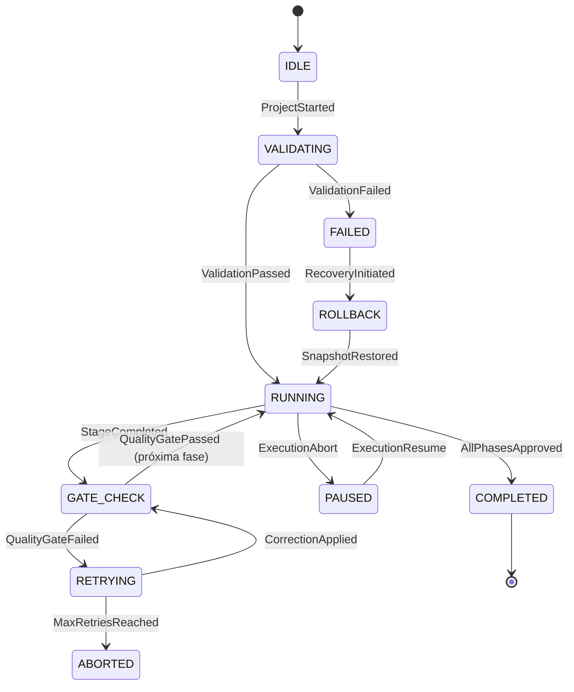
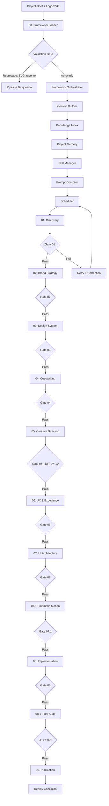
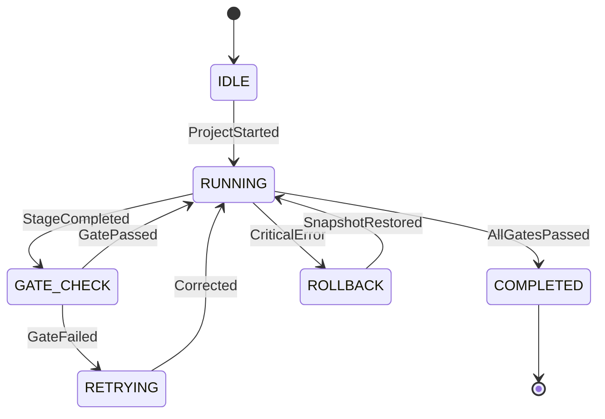
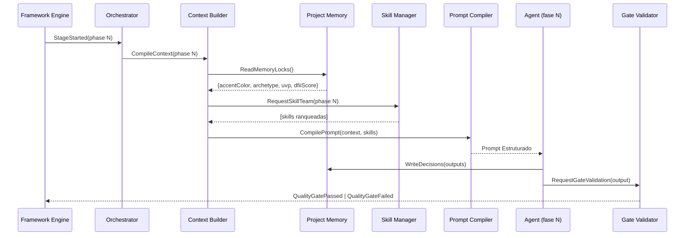

# Motor de Execução do Framework (Framework Engine)

> **KDL Landing Framework — Camada de Execução (Engine Layer)**
> **Tipo:** Runtime Oficial e Motor de Orquestração de Pipelines (Framework Engine)
> **Mandato:** Controlar toda a execução do KDL Landing Framework. Nenhum Agente, Pipeline, Template, Checklist ou componente Core poderá ser ativado fora do contexto gerenciado por este motor. O Framework Engine é o sistema operacional em tempo de execução do KDL Landing Framework.

---

## 1. Introdução

O **Framework Engine** é o runtime central do **KDL Landing Framework**. Enquanto o Orquestrador define os estados, o Context Builder compila o contexto, e o Prompt Compiler gera as instruções dos agentes, o Framework Engine é a camada responsável por **executar tudo isso em sequência controlada, rastreável, reversível e auditável**.

Toda execução de um projeto de Landing Page sob a metodologia KDL obrigatoriamente passa pelo Framework Engine. Ele gerencia:

* O ciclo de vida completo de execução (do Discovery até a Publicação).
* A máquina de estados de 12 fases.
* A fila de execução sequencial e paralela dos Agentes.
* O sistema de eventos, logs estruturados e snapshots de estado.
* Os portões de qualidade (Quality Gates) que impedem o avanço sem aprovação.
* Os protocolos de rollback, retry e recovery para falhas em qualquer fase.

---

## 2. Conceitos Fundamentais do Runtime

O Framework Engine opera com os seguintes conceitos atômicos:

| Conceito | Definição |
|---|---|
| **Engine** | O motor central de execução que processa o pipeline KDL de ponta a ponta. |
| **Execution Engine** | A instância ativa do motor para um projeto específico. |
| **Workflow Runtime** | O ambiente de tempo de execução que gerencia o estado vivo do pipeline. |
| **Pipeline Runtime** | A representação ativa do encadeamento sequencial de Agentes e Gates. |
| **State Machine** | A máquina de estados finitos com 12 fases de execução. |
| **Execution Context** | O pacote de dados dinâmicos carregados pelo Context Builder para uma fase. |
| **Execution Queue** | A fila de tarefas pendentes gerenciadas pelo Scheduler. |
| **Execution Flow** | A sequência de processos disparados durante uma fase de execução. |
| **Execution Graph** | O grafo de dependências que define a ordem de execução dos componentes. |
| **Execution History** | O registro imutável e versionado de todas as execuções anteriores. |
| **Execution Result** | O artefato de saída produzido por cada Agente ou componente Core. |
| **Execution Report** | O relatório consolidado de métricas, logs e status ao final do pipeline. |
| **Execution Validation** | A validação formal de entradas e saídas de cada fase pelo Quality Gate. |
| **Execution Recovery** | O protocolo de recuperação automática após falha detectada. |
| **Execution Rollback** | A reversão de estado para o snapshot anterior aprovado. |
| **Execution Retry** | A re-execução de uma fase reprovada com correções aplicadas. |
| **Execution Resume** | A retomada de uma execução pausada a partir do último checkpoint válido. |
| **Execution Abort** | O encerramento controlado e seguro de uma execução com salvamento de estado. |
| **Execution Snapshot** | A foto imutável do estado completo do projeto em um ponto específico. |

---

## 3. Descoberta Dinâmica de Skills (Orquestração do Runtime)

O Framework Engine consulta o Skill Manager para montar a equipe de inteligências adequadas antes de cada ciclo de execução:

* **Skills de Arquitetura de Workflows e Estado (`architect-review`, `planning`):**
  * *Justificativa:* Validam a coerência do grafo de dependências e a sequência de disparo dos Agentes.
* **Skills de Engenharia de Contexto e Memória (`context-management`, `conversation-memory`):**
  * *Justificativa:* Garantem que o contexto global não vaze entre fases e que as decisões persistidas no Project Memory sejam injetadas corretamente.
* **Skills de Garantia de Qualidade e Auditoria (`code-reviewer`, `vibe-code-auditor`):**
  * *Justificativa:* Executam as verificações automáticas nos portões de qualidade entre fases do pipeline.
* **Skills de Documentação e Rastreabilidade (`documentation-generation`, `changelog-automation`):**
  * *Justificativa:* Automatizam a geração de logs de execução, relatórios de fase e entradas de versão.

---

## 4. Arquitetura Geral do Engine

O Framework Engine opera em três camadas horizontais de abstração:

```
┌───────────────────────────────────────────────────────────────────┐
│                        CAMADA DE ENTRADA                          │
│   Project Brief → Framework Loader → Validation Gate de Entrada   │
└───────────────────────────────────────────────────────────────────┘
                               │
                               ▼
┌───────────────────────────────────────────────────────────────────┐
│                      CAMADA DE CONTROLE (CORE)                    │
│  Framework Orchestrator → Context Builder → Knowledge Index       │
│  → Project Memory → Skill Manager → Prompt Compiler               │
│  → Asset Manager → Design Intelligence                            │
└───────────────────────────────────────────────────────────────────┘
                               │
                               ▼
┌───────────────────────────────────────────────────────────────────┐
│                      CAMADA DE EXECUÇÃO                           │
│  Scheduler → Agent Queue → Quality Gates → Audit → Publication    │
└───────────────────────────────────────────────────────────────────┘
```

---

## 5. Pipeline Completo de Execução

O pipeline de produção do KDL Landing Framework segue a sequência abaixo. Cada fase é uma célula atômica com entradas, saídas e um portão de aprovação:

### Fase 00 — Loader & Validação de Entradas
* **Objetivo:** Verificar se todas as dependências físicas (logo SVG, brief do cliente, referências visuais) estão presentes no disco.
* **Entradas:** Diretório raiz do projeto, variáveis de configuração do cliente.
* **Saídas:** Relatório de prontidão (`handoff-ready.md`).
* **Quality Gate:** Bloqueia o pipeline se o arquivo vetorial SVG do logotipo estiver ausente.

### Fase 01 — Discovery Agent
* **Objetivo:** Pesquisa de ICP, auditoria de imagens e coleta de dados do cliente.
* **Entradas:** Brief do cliente, website atual, redes sociais.
* **Saídas:** `docs/01-discovery.md` com personas, dores e diferenciais.
* **Quality Gate:** Relatório com mínimo de 3 dores do ICP definidas.

### Fase 02 — Brand Strategy Agent
* **Objetivo:** Definir arquétipo de marca, Big Idea e tom de voz.
* **Entradas:** `docs/01-discovery.md`.
* **Saídas:** `docs/02-brand-strategy.md` com travas de posicionamento.
* **Quality Gate:** Aprovação do arquétipo e da Proposta Única de Valor (UVP) travada.

### Fase 03 — Design System Agent
* **Objetivo:** Arquitetura de tokens de design (cores, tipografia, espaçamento).
* **Entradas:** `docs/02-brand-strategy.md`, logo SVG do cliente.
* **Saídas:** `docs/03-design-system.md` com paleta 60-30-10 e clamp scales.
* **Quality Gate:** Contraste WCAG 4.5:1 validado matematicamente para todos os pares de cores.

### Fase 04 — Copywriting Agent
* **Objetivo:** Redação persuasiva AIDA da Landing Page, livre de clichês de IA.
* **Entradas:** `docs/02-brand-strategy.md`, `docs/03-design-system.md`.
* **Saídas:** `docs/04-copywriting.md` com copy mestre da página.
* **Quality Gate:** Copy revisado contra lista de anti-patterns de escrita de IA.

### Fase 05 — Creative Direction Agent
* **Objetivo:** Conceito visual, iluminação e score DFII.
* **Entradas:** `docs/03-design-system.md`, `docs/04-copywriting.md`.
* **Saídas:** `docs/05-creative-direction.md` com memorial tridimensional e DFII ≥ 10.
* **Quality Gate:** Score DFII aprovado pelo Design Intelligence.

### Fase 06 — Experience Design Agent
* **Objetivo:** Roteiro de scroll, pacing e micro-interações.
* **Entradas:** `docs/05-creative-direction.md`.
* **Saídas:** `docs/06-experience-design.md` com storyboard de scroll.
* **Quality Gate:** Timelines de animações com duração máxima de 1000ms por transição.

### Fase 07 — UI Architecture Agent
* **Objetivo:** Wireframe técnico, Bento Grid e layout responsivo.
* **Entradas:** `docs/06-experience-design.md`.
* **Saídas:** `docs/07-ui-architecture.md` com especificações de grade.
* **Quality Gate:** Layout mobile (320px) validado sem overflow de conteúdo.

### Fase 07.1 — Cinematic Experience Agent
* **Objetivo:** Configuração técnica do GSAP, Lenis e parallax.
* **Entradas:** `docs/07-ui-architecture.md`.
* **Saídas:** `docs/07.1-cinematic-experience.md` com easing curves e timelines.
* **Quality Gate:** Timelines GSAP revisadas contra anti-patterns de scroll hijacking.

### Fase 08 — Implementation Agent
* **Objetivo:** Codificação HTML, CSS e JavaScript da Landing Page.
* **Entradas:** Todos os `docs/0X-*.md` aprovados.
* **Saídas:** Código completo da Landing Page em `dist/`.
* **Quality Gate:** Build de produção gerado sem erros de compilação.

### Fase 08.1 — Final Audit Agent
* **Objetivo:** Auditoria Lighthouse, WCAG 2.2 AA e revisão de código.
* **Entradas:** Build de produção em `dist/`.
* **Saídas:** `audit/final-audit-report.md`.
* **Quality Gate:** Lighthouse ≥ 90 em Performance, ≥ 95 em Acessibilidade/SEO/BP. CLS = 0.0. LCP ≤ 2.0s.

### Fase 09 — Publication Agent
* **Objetivo:** Deploy em infraestrutura de produção.
* **Entradas:** Build aprovado em `dist/`, relatório de auditoria.
* **Saídas:** URL de produção, relatório de publicação.
* **Quality Gate:** Status HTTP 200 confirmado. TTL de cache configurado.

---

## 6. Runtime — Estrutura do Estado Global

O Framework Engine mantém um objeto de estado global persistido durante toda a execução:

```json
{
  "projectId": "kdl-cliente-2026-07-29",
  "version": "1.0.0",
  "status": "RUNNING",
  "currentPhase": "04-copywriting",
  "completedPhases": ["00-loader", "01-discovery", "02-brand", "03-design-system"],
  "pendingPhases": ["05-creative", "06-ux", "07-ui", "07.1-motion", "08-impl", "08.1-audit", "09-pub"],
  "executionContext": {
    "clientName": "Premium Burger House",
    "projectBrief": "Lanchonete artesanal de alta gastronomia com blend Angus.",
    "accentColor": "#D4A017",
    "borderRadius": "16px",
    "displayFont": "Fraunces",
    "bodyFont": "Inter"
  },
  "memoryLocks": {
    "archetype": "Criador",
    "uvp": "O sabor que transforma uma refeição em memória.",
    "primaryColor": "#D4A017",
    "dfiiScore": 14.5
  },
  "qualityGates": {
    "00": "PASSED",
    "01": "PASSED",
    "02": "PASSED",
    "03": "PASSED",
    "04": "PENDING"
  },
  "snapshots": [
    {"phase": "03-design-system", "timestamp": "2026-07-29T09:30:00Z", "hash": "sha256:abc123"}
  ],
  "executionLog": "logs/execution-2026-07-29.jsonl"
}
```

---

## 7. Máquina de Estados Completa

Cada fase do pipeline é um estado formal com as seguintes propriedades:



### Especificação de Estados

| Estado | Descrição | Transições de Saída |
|---|---|---|
| `IDLE` | Motor ocioso aguardando disparo. | `ProjectStarted` |
| `VALIDATING` | Verificação das dependências físicas do projeto. | `ValidationPassed`, `ValidationFailed` |
| `RUNNING` | Execução ativa de uma fase do pipeline. | `StageCompleted` |
| `GATE_CHECK` | Avaliação do Quality Gate da fase. | `QualityGatePassed`, `QualityGateFailed` |
| `RETRYING` | Re-execução de fase após correção. | `CorrectionApplied`, `MaxRetriesReached` |
| `PAUSED` | Execução suspensa com estado salvo em snapshot. | `ExecutionResume` |
| `COMPLETED` | Todas as fases aprovadas. Deploy liberado. | Encerramento. |
| `FAILED` | Falha crítica não recuperável. | `RecoveryInitiated` |
| `ROLLBACK` | Restauração de snapshot anterior válido. | `SnapshotRestored` |
| `ABORTED` | Encerramento forçado por falhas repetidas. | Log de encerramento. |

---

## 8. Scheduler — Fila e Prioridades de Execução

O Scheduler do Framework Engine gerencia a ordem e paralelismo dos processos internos:

* **Execução Sequencial (Default):** As 12 fases do pipeline executam em ordem linear estrita. Nenhuma fase pode iniciar sem a conclusão e aprovação da anterior.
* **Execução Paralela (Componentes Core):** Dentro de uma fase, os componentes Core (Context Builder, Skill Manager e Asset Manager) podem ser carregados em paralelo antes do disparo do Agente principal.
* **Execução Incremental:** Fases já aprovadas e com snapshots válidos não são re-executadas em reinicializações. O pipeline retoma a partir do último checkpoint.
* **Prioridades de Fila:**
  1. 🔴 **CRITICAL:** Quality Gate de reprovação (execução imediata de correção).
  2. 🟡 **HIGH:** Disparo de novo Agente de fase.
  3. 🟢 **NORMAL:** Atualização de memória e logs.

---

## 9. Sistema de Eventos

O Framework Engine emite eventos estruturados durante toda a execução:

| Evento | Disparado por | Payload |
|---|---|---|
| `ProjectStarted` | Framework Loader | `{projectId, timestamp, clientName}` |
| `StageStarted` | Scheduler | `{phase, agentName, timestamp}` |
| `StageCompleted` | Agente de fase | `{phase, outputDoc, duration}` |
| `ContextUpdated` | Context Builder | `{phase, tokensUsed, delta}` |
| `MemoryUpdated` | Project Memory | `{key, value, version}` |
| `AssetsUpdated` | Asset Manager | `{assetId, status, optimizedBytes}` |
| `QualityGatePassed` | Gate Validator | `{phase, score, criteria}` |
| `QualityGateFailed` | Gate Validator | `{phase, failedCriteria, retryCount}` |
| `AuditCompleted` | Final Audit Agent | `{lighthouseScore, cls, lcp}` |
| `DeploymentCompleted` | Publication Agent | `{url, statusCode, cachePolicy}` |
| `SnapshotCreated` | Engine | `{phase, hash, timestamp}` |
| `RollbackInitiated` | Engine | `{targetSnapshot, reason}` |

---

## 10. Sistema de Logs Estruturados

Toda execução gera um arquivo de log no formato JSON Lines (`*.jsonl`) em `logs/`:

```json
{"timestamp":"2026-07-29T09:30:45Z","level":"INFO","component":"ContextBuilder","event":"ContextCompiled","phase":"03-design-system","tokensUsed":1840,"details":"Contexto de 4 documentos compilado com sucesso."}
{"timestamp":"2026-07-29T09:31:12Z","level":"WARN","component":"AssetManager","event":"ImageResolutionLow","phase":"03-design-system","assetId":"logo-secondary.png","details":"Imagem rasterizada identificada. SVG recomendado."}
{"timestamp":"2026-07-29T09:32:00Z","level":"ERROR","component":"GateValidator","event":"QualityGateFailed","phase":"03-design-system","failedCriteria":"ContrastRatio","details":"Par de cores #FAFAFA/#E0E0E0 possui contraste de 1.8:1. Mínimo exigido: 4.5:1."}
```

**Campos de log:**
* `timestamp`: ISO 8601 com fuso horário.
* `level`: `DEBUG`, `INFO`, `WARN`, `ERROR`, `CRITICAL`.
* `component`: Componente Core emissor do evento.
* `event`: Nome do evento emitido.
* `phase`: Fase atual do pipeline.
* `details`: Descrição legível do evento.

---

## 11. Protocolo de Snapshots

O Framework Engine cria snapshots automáticos em momentos-chave:

* **Antes do disparo de cada Agente:** Garantia de reversão caso o Agente falhe.
* **Após cada Quality Gate aprovado:** Ponto de checkpoint seguro para retomada.
* **Antes de qualquer rollback:** Preservação do estado pré-rollback para análise forense.

### Estrutura de um Snapshot
```json
{
  "snapshotId": "snap-03-design-system-approved",
  "phase": "03-design-system",
  "status": "APPROVED",
  "timestamp": "2026-07-29T09:35:00Z",
  "hash": "sha256:7f3c9a...",
  "memoryState": { "...travas do project-memory..." },
  "outputDocuments": ["docs/03-design-system.md"],
  "qualityGate": { "contrastRatio": "PASSED", "fontCount": "PASSED" }
}
```

---

## 12. Tratamento de Falhas e Protocolos de Recuperação

| Tipo de Falha | Protocolo | Limite de Retentativas |
|---|---|---|
| Erro de Context (tokens insuficientes) | Compressão do contexto + retry. | 3 |
| Erro de Assets (logo ausente) | Bloquear pipeline + alerta crítico ao usuário. | 0 (bloqueante) |
| Erro de Quality Gate (contraste) | Ajuste de tokens cromáticos + retry. | 3 |
| Erro de SEO/Performance (LCP > 2.0s) | Auditoria de assets + recompressão + retry. | 2 |
| Erro de Publicação (HTTP ≠ 200) | Re-deploy + verificação de CDN. | 2 |
| Erro de Dependência (fase anterior não concluída) | Abortar fase atual + aguardar resolução. | 0 (bloqueante) |

---

## 13. Versionamento do Projeto

O Framework Engine mantém um sistema de versionamento semântico para os artefatos do projeto:

* **Versão 1.x.x:** Protótipos e fases iniciais (Discovery, Brand, Design System).
* **Versão 1.x.x → 2.0.0:** Build de produção aprovado e publicado.
* **Hotfix (x.x.1):** Correções de bugs pós-publicação sem reexecução de fases estratégicas.
* **Rollback:** Restauração de uma versão anterior a partir de snapshot aprovado.

---

## 14. Métricas de Execução

O Engine compila um relatório de métricas ao final de cada execução:

| Métrica | Objetivo | Limite |
|---|---|---|
| Tempo Total de Execução | Tempo do Discovery até a Publicação | ≤ 4 horas |
| Tokens de Contexto Consumidos | Eficiência de context windows | ≤ 120K tokens/projeto |
| DFII Score Médio | Qualidade estética aprovada pelo Design Intelligence | ≥ 10 |
| Lighthouse Performance | Core Web Vitals do build final | ≥ 90 |
| Taxa de Aprovação em Gates | % de fases que passaram sem retry | ≥ 80% |
| Taxa de Retrabalho | % de fases que exigiram retry | ≤ 20% |
| LCP (Largest Contentful Paint) | Velocidade de carregamento do Hero | ≤ 2.0s |
| CLS (Cumulative Layout Shift) | Estabilidade de layout | = 0.0 |

---

## 15. Diagramas Mermaid do Framework Engine

### A. Fluxo Principal de Execução (Pipeline Completo)



### B. Máquina de Estados Simplificada



### C. Comunicação entre Componentes Core



---

## 16. Integração com Componentes Core

| Componente | Papel no Engine | Momento de Ativação |
|---|---|---|
| **Framework Orchestrator** | Define a máquina de estados e controla transições. | Boot do projeto e em cada transição de fase. |
| **Context Builder** | Compila o contexto ativo para cada Agente. | Antes do disparo de cada fase. |
| **Project Memory** | Persiste e injeta travas de decisão inter-fases. | Leitura pré-fase; escrita pós-fase. |
| **Knowledge Index** | Resolve caminhos de documentos referenciados pelo pipeline. | Durante compilação de contexto. |
| **Skill Manager** | Monta equipe virtual de inteligências para cada fase. | Durante compilação de contexto. |
| **Prompt Compiler** | Gera o prompt estruturado final para o Agente. | Imediatamente antes do disparo. |
| **Asset Manager** | Audita e otimiza mídias antes da fase de Implementação. | Fases 01, 03 e 08. |
| **Design Intelligence** | Valida estética e calcula DFII antes da fase criativa. | Fase 05 e Gate 05. |

---

## 17. Boas Práticas do Runtime

* **Execução Previsível:** Nunca altere a sequência de fases do pipeline. A dependência entre fases é física e semântica.
* **Execução Reproduzível:** Um projeto com os mesmos insumos (brief, logo, referências) deve sempre gerar o mesmo pipeline de decisões.
* **Execução Auditável:** Todo evento, mudança de estado e decisão deve ser registrado no log `*.jsonl`.
* **Execução Incremental:** Use snapshots para retomar projetos sem re-executar fases já aprovadas.
* **Execução Resiliente:** Implemente protocolos de retry para falhas transitórias; bloqueie imediatamente para falhas críticas sem dados de entrada.
* **Execução Rastreável:** Cada artefato de saída (`docs/0X-*.md`) deve referenciar o Agente e o timestamp que o gerou.

---

## 18. Anti-Patterns do Runtime

* ❌ **Disparo Direto de Agente:** Jamais invocar um Agente diretamente sem passar pelo Context Builder e pelo Prompt Compiler. O agente receberá um contexto incompleto.
* ❌ **Ignorar Quality Gate:** Avançar de fase sem aprovação formal do Gate Validator resulta em inconsistência de código com o Design System ou erros de contraste.
* ❌ **Publicar sem Auditoria:** O deploy em produção sem aprovação do Final Audit Agent (Fase 08.1) é proibido. O Gate de Publicação é bloqueante.
* ❌ **Resetar Memória:** Limpar o Project Memory entre fases destrói as travas de decisão (cor, tipografia, arquétipo) construídas nas fases anteriores.

---

## 19. Exemplos de Execução

### Exemplo: Execução de Projeto Completo (Happy Path)
```
[2026-07-29T09:00:00Z] ProjectStarted - Premium Burger House
[2026-07-29T09:02:00Z] StageStarted - 00-loader
[2026-07-29T09:02:10Z] QualityGatePassed - 00-loader (logo-light.svg encontrado)
[2026-07-29T09:02:12Z] StageStarted - 01-discovery
[2026-07-29T09:25:00Z] StageCompleted - 01-discovery (docs/01-discovery.md)
[2026-07-29T09:25:30Z] QualityGatePassed - 01-discovery (3 dores do ICP definidas)
[2026-07-29T09:25:35Z] StageStarted - 02-brand-strategy
...
[2026-07-29T14:30:00Z] AuditCompleted - Lighthouse 94/96/97/98, LCP 1.4s, CLS 0.0
[2026-07-29T14:35:00Z] DeploymentCompleted - https://premiumburgerhouse.com.br (HTTP 200)
```

---

## 20. Conclusão

O **Framework Engine** representa a completude operacional do **KDL Landing Framework**. Ao centralizar a orquestração de estados, o controle de qualidade por portões formais, o sistema de logs estruturados e os protocolos de rollback e recovery, ele transforma um conjunto de documentos e agentes isolados em um **sistema coeso, previsível e rastreável de produção de Landing Pages de alto impacto**.

Nenhuma execução começa sem o Loader. Nenhuma fase avança sem o Gate. Nenhum deploy ocorre sem a auditoria. Essa é a garantia de qualidade matemática do runtime KDL.

---

*KDL Landing Framework — A execução controlada da arte.*
