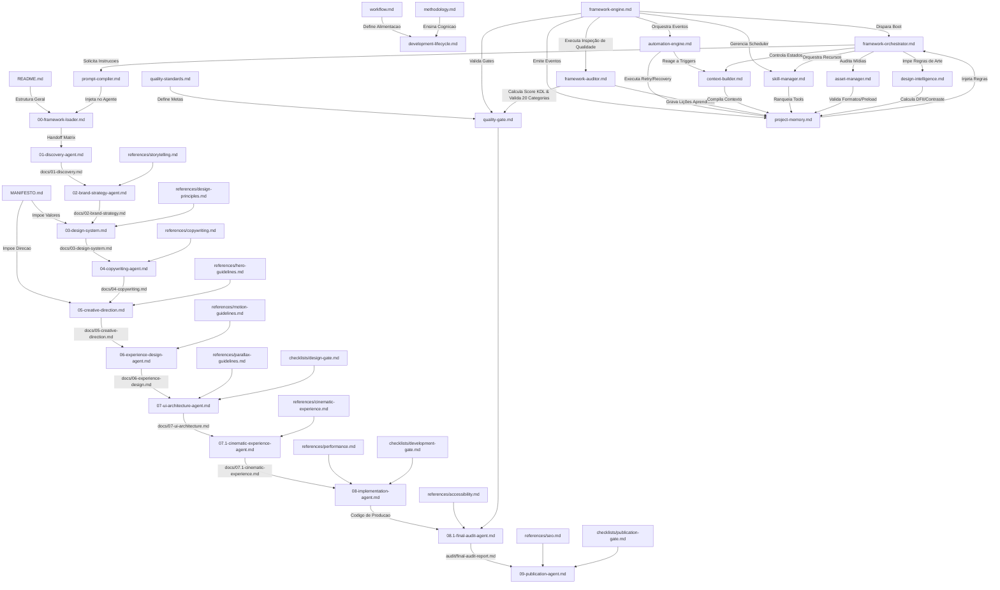
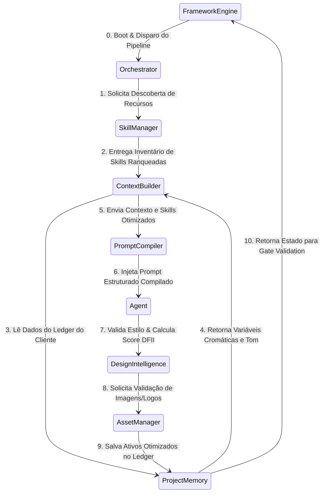
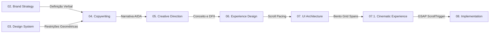
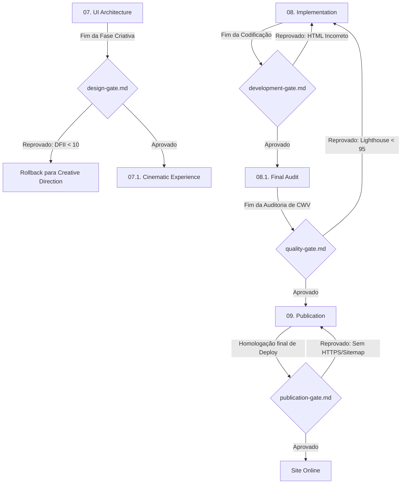
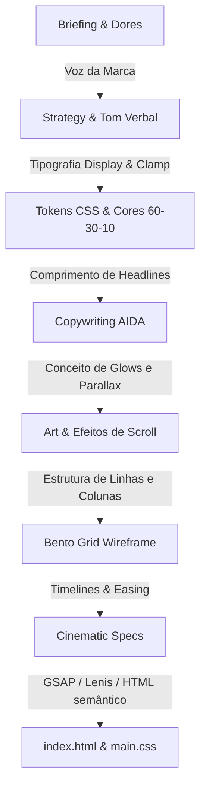

# Mapa de Relacionamento de Conhecimento (Knowledge Map)

> **KDL Landing Framework — Base de Conhecimento**
> **Tipo:** Grafo e Mapa de Dependências Físicas (Knowledge Map)
> **Mandato:** Mapear graficamente os fluxos de dados, a árvore hierárquica de arquivos e os relacionamentos de dependência de toda a base de conhecimento.

---

## 1. Mapa Geral de Conhecimento (Master Graph)

Abaixo está mapeado o grafo geral de dependências e caminhos de fluxo de dados de todos os arquivos do **KDL Landing Framework**:

---

## 2. Diagramas por Categoria

### A. Core Operacional (Engine Loop)
O loop operacional dos motores core do framework funciona em simbiose constante:

### B. Camada de Agentes de Execução (Prompts & Agents Chain)
O encadeamento de responsabilidade criativa e de código:

### C. Mapeamento de Templates
Cada fase possui um template obrigatório de relatório salvo na pasta `templates/`:

```mermaid
graph TD
    T01[templates/discovery-template.md] -->|Preenchido por| A01[01-discovery-agent.md]
    T02[templates/brand-strategy-template.md] -->|Preenchido por| A02[02-brand-strategy-agent.md]
    T03[templates/design-system-template.md] -->|Preenchido por| A03[03-design-system-agent.md]
    T04[templates/copywriting-template.md] -->|Preenchido por| A04[04-copywriting-agent.md]
    T05[templates/creative-direction-template.md] -->|Preenchido por| A05[05-creative-direction-agent.md]
    T06[templates/experience-design-template.md] -->|Preenchido por| A06[06-experience-design-agent.md]
    T07[templates/ui-architecture-template.md] -->|Preenchido por| A07[07-ui-architecture-agent.md]
    T08[templates/cinematic-experience-template.md] -->|Preenchido por| A071[07.1-cinematic-experience-agent.md]
    T09[templates/audit-template.md] -->|Preenchido por| A081[08.1-final-audit-agent.md]
    T10[templates/publication-template.md] -->|Preenchido por| A09[09-publication-agent.md]
```

### D. Checklists e Portões de Qualidade (Gates)
O controle de qualidade inegociável protege as transições críticas de desenvolvimento:

---

## 3. Roteiros de Navegação Inteligente (Descoberta Automática)

Sempre que um agente precisar de insumos conceituais ou técnicos, ele deve executar a descoberta através dos seguintes caminhos:

1. **Como encontrar uma diretriz de Motion (GSAP):**
   * *Origem:* Agente de Cinematic Experience.
   * *Rota:* `knowledge/index.md` -> Tópico: Estética Hero -> Abre [motion-guidelines.md](file:///c:/Framework/references/motion-guidelines.md).
2. **Como encontrar a folha de Design Tokens do Projeto:**
   * *Origem:* Agente de Implementação.
   * *Rota:* `core/project-memory.md` -> Objeto JSON: `designTokens` -> Carrega variáveis semânticas.
3. **Como encontrar as restrições de rejeição de deploy:**
   * *Origem:* Agente de Auditoria Final.
   * *Rota:* `docs/quality-standards.md` -> Seção: Hard Gates -> Compara com resultados de Lighthouse e Acessibilidade.

---

## 4. Integração de Fluxos de Dados

O fluxo de dados da esteira de desenvolvimento KDL consolida-se através da passagem ordenada de especificações conceituais para códigos compilados:

---

## 5. Conclusão

O **Knowledge Map** é a representação visual da rigidez e consistência metodológica do KDL Landing Framework. Ao mapear em grafos interdependentes todas as conexões de dados entre os agentes, os portões de validação e as folhas de referências técnicas, ele atua como o mapa de navegação indispensável para manter a esteira linear de produção fluida, performática e livre de erros.

---

*KDL Landing Framework — O mapa para a excelência em engenharia de design.*
